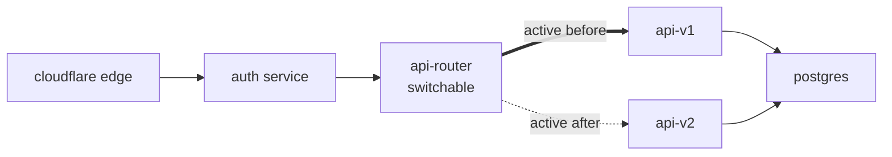
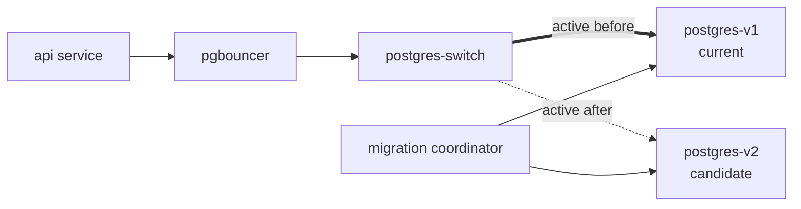

# control-plane-kit

`control-plane-kit` is a small Python toolkit for describing, comparing, and
operating service topologies as explicit graphs.

It is motivated by a simple frustration: most small systems begin as scripts
and environment variables, then eventually need deployment behavior that is
topological. A service points at a database. A public edge points at an auth
gateway. A router points at one API instance today and another one tomorrow. A
Postgres switch points at one database during ordinary operation, then points at
another after a migration. Those relationships are real architecture, but they
often live as shell commands, copied URLs, or tribal memory.

This kit makes those relationships visible.

```python
from control_plane_kit import (
    DeploymentGraph,
    Edge,
    Endpoint,
    Node,
    diff_graphs,
    plan_migration,
)

v1 = (
    DeploymentGraph("shop-v1")
    .add_node(Node("auth", kind="fastapi", endpoints={"http": Endpoint("http://auth:8010")}))
    .add_node(Node("api-v1", kind="fastapi", endpoints={"http": Endpoint("http://api-v1:8000")}))
    .add_node(Node("api-router", kind="http-router", endpoints={"http": Endpoint("http://api-router:8080")}))
    .add_edge(Edge("auth-to-api", "auth", "api-router", protocol="http"))
    .add_edge(Edge("api-router-active", "api-router", "api-v1", protocol="http", mutable=True))
)

v2 = (
    v1
    .add_node(Node("api-v2", kind="fastapi", endpoints={"http": Endpoint("http://api-v2:8000")}))
    .replace_edge(Edge("api-router-active", "api-router", "api-v2", protocol="http", mutable=True))
)

print(diff_graphs(v1, v2).summary())
print(plan_migration(v1, v2).to_text())
```

Output:

```text
added nodes: api-v2
changed edges: api-router-active

1. StartNode(api-v2)
2. SwitchEdge(api-router-active: api-v1 -> api-v2)
3. StopNode(api-v1, policy=after_verification)
```

The goal is not to replace Kubernetes, Terraform, Nomad, Docker Compose, AWS,
Cloudflare, or your existing deployment tooling. The goal is to provide a small
language for topology: the graph you intend to run, the graph you are running,
and the activity plan that moves one toward the other.

## Why This Exists

Infrastructure tools are excellent at many things, but they often make it hard
to talk about application topology directly:

- Which node is the public edge?
- Which service currently receives API traffic?
- Which database is active?
- Which nodes can be health checked?
- Which routers can be switched without restarting application code?
- Which old nodes are retained for rollback?
- Which changes require a data migration rather than a simple route flip?

Those are graph questions.

`control-plane-kit` treats them as graph questions first. A deployment is a
value. A migration is a comparison between two values. An executor is an
interpreter for the resulting activity graph.

That gives the system a useful separation:

```text
graph description -> graph diff -> activity plan -> runtime interpreter
```

The same graph can be interpreted by a dry-run planner, a local Docker runtime,
a Cloudflare connector runtime, a Kubernetes runtime, or a future AWS runtime.

## Design Principles

### Application Code Should Not Know

Application services should not be rewritten just because the operator wants
topological control. A FastAPI service should remain a FastAPI service. A
Postgres database should remain a Postgres database. The control plane should
live around the application, not inside it.

When mutability is needed, put it in explicit infrastructure nodes:

- HTTP routers
- load balancers
- rate limiters
- circuit breakers
- TCP switches
- Postgres connection pools
- migration coordinators
- observability adapters

The application can keep calling a stable URL.

### Capabilities Are Explicit

Not every node can do every thing. An external RDS instance may be observable
but not startable. A Docker container may be startable and stoppable. An HTTP
router may be switchable. A migration coordinator may expose phases.

The UI and executor should derive available actions from capabilities:

```python
Node(
    "api-router",
    kind="http-router",
    capabilities={"health", "logs", "switch-target"},
)
```

### Protocol, Behavior, Implementation

Proxy-like nodes are modeled as a product type:

```text
Proxy = Protocol x Behavior x Implementation
```

That avoids a subclass explosion.

```python
from control_plane_kit.proxies import (
    ActiveTarget,
    HAProxyImplementation,
    HttpProtocol,
    ProxyNode,
    RoundRobin,
)

api_router = ProxyNode(
    node_id="api-router",
    protocol=HttpProtocol(),
    behavior=ActiveTarget(target="api-v1"),
    implementation=HAProxyImplementation(),
)

api_lb = ProxyNode(
    node_id="api-load-balancer",
    protocol=HttpProtocol(),
    behavior=RoundRobin(targets=["api-a", "api-b"]),
    implementation=HAProxyImplementation(),
)
```

For database-side topology, use safe TCP/Postgres primitives:

```python
from control_plane_kit.proxies import (
    ActiveTarget,
    HAProxyImplementation,
    PostgresProtocol,
    ProxyNode,
)

postgres_switch = ProxyNode(
    node_id="postgres-switch",
    protocol=PostgresProtocol(),
    behavior=ActiveTarget(target="postgres-v1"),
    implementation=HAProxyImplementation(),
)
```

This can switch which database receives new connections. It does not inspect SQL
and does not pretend to understand transactions. More sophisticated migrations
should add explicit activity nodes such as `SnapshotDatabase`, `RestoreDatabase`,
`VerifyDatabase`, and `SwitchEdge`.

## Graph Example



The important thing is that `Auth -> Router` stays stable. The migration starts
`api-v2`, switches the router, verifies the public route, then drains `api-v1`.

## Database Migration Shape



This graph does not magically make database migrations safe. It makes the
places where safety matters explicit. A serious database migration plan should
include activities like:

```text
1. StartNode(postgres-v2)
2. SnapshotDatabase(postgres-v1)
3. RestoreDatabase(snapshot, postgres-v2)
4. VerifyDatabase(source=postgres-v1, target=postgres-v2)
5. QuiesceWrites(api-router)
6. SwitchEdge(postgres-switch: postgres-v1 -> postgres-v2)
7. SmokeTest(public-edge)
8. RetainNode(postgres-v1, rollback_window="24h")
```

## Package Layout

```text
control_plane_kit/
  core/
    graph.py          graph values: nodes, edges, endpoints
    diff.py           graph comparison
    activities.py     activity AST
    planner.py        graph diff -> activity graph
    descriptor.py     JSON-serializable descriptors
  proxies/
    protocols.py      HTTP, TCP, Postgres protocol descriptors
    behaviors.py      active target, round-robin, pooling, mirroring
    implementations.py implementation descriptors: Python, HAProxy, PgBouncer
    nodes.py          composable proxy nodes
  runtimes/
    base.py           runtime protocol
    dry_run.py        no-side-effect interpreter
    docker.py         intentionally small Docker sketch
  control_plane/
    capabilities.py   health/log/switch capability descriptors
    protocol.py       control-plane route contract
  examples/
    local_cloudflare_auth.py
    api_blue_green.py
    postgres_switch.py
```

## Current Status

This repository begins as a public-facing extraction scaffold. It is deliberately
small. The first version focuses on:

- graph values,
- deterministic diffs,
- readable migration plans,
- composable proxy descriptions,
- dry-run execution,
- examples that explain the intended shape.

It does not yet include a production Docker executor, Cloudflare executor,
Kubernetes executor, AWS executor, persistent state store, web UI, or iPad app.

Those are natural next layers.

## iPad / Operator UI Direction

The long-term operator interface should feel like a graph workbench:

- left palette: nodes, protocols, behaviors, runtimes,
- center canvas: deployment graph,
- right inspector: selected node, capabilities, endpoints, health,
- bottom timeline: activity plan and execution events.

The UI should not hard-code actions. It should ask nodes what they can do.

```python
if "switch-target" in node.capabilities:
    show_switch_target_control(node)

if "logs" in node.capabilities:
    show_logs_tab(node)

if "health" in node.capabilities:
    show_health_badge(node)
```

That gives the control plane room to grow without turning every new deployment
lego into a one-off screen.

## Development

```bash
python3 -m unittest
python3 examples/api_blue_green.py
python3 examples/postgres_switch.py
```

No network or Docker daemon is required for the default test suite.

## License

MIT, unless a consuming project chooses otherwise before publication.
