# CPK Operations Table Atlas

<!-- current-schema-contract: sha256=84e794142366fa6214016f1ee5106f14ff0c6a774ddad5e9063595542e7be08d relations=32 columns=431 constraints=314 indexes=106 foreign-keys=65 -->

This atlas explains the durable operational truth owned by CPK. The frozen
contract header, foreign-key ledger, and dependency graph below are checked
against the same current-schema contract used by the installer. The prose adds
ownership, transaction, lifecycle, and security meaning that cannot be learned
from catalog facts alone.

The installer creates these objects only in an **object-free owned namespace**.
An existing namespace must already be the **exact current schema**; any other
shape receives a bounded **reset-required** installation error and no DDL. This
document has **no runtime behavior changes** and does not authorize schema
repair, data conversion, or inference from an older layout.

## Reading The Atlas

- A foreign key is described as a proof obligation, not merely a join hint.
- Restrictive deletion is intentional unless a table section says otherwise.
- JSON columns hold validated domain documents at store boundaries; the
  database does not replace their domain codecs.
- Credential and secret references are durable identifiers, never authority to
  disclose or resolve private material.
- Writers run through caller-owned units of work unless a section identifies a
  single-statement append or compare-and-set operation.

## Dependency Shape

<!-- multi-table-scc: cpk_graph_versions,cpk_realized_graph_projections,cpk_workspaces -->
<!-- self-reference: cpk_activity_runs,cpk_effect_attempts,cpk_secret_providers,cpk_secret_references -->
<!-- outcome-aggregate: cpk_effect_attempt_outcomes,cpk_effect_attempt_outcome_observations -->
<!-- future-impact: 1553,1554,1555,1556,1243,1244 -->

The only multi-table strongly connected component is the workspace lineage
aggregate. A graph version belongs to a workspace; a realized projection pins
its source graph and workspace; and the workspace selects current and desired
projections while pinning both their source graph and workspace. This is an
accepted aggregate invariant, not an accidental defect. It makes selected
lineage resistant to direct projection rebinding and keeps the current/desired
pair plus desired revision under one workspace-row lock and compare-and-set.

Restore that aggregate in phases: create the workspace with nullable lineage
heads, restore authored graphs, restore realized projections, then select the
current and desired heads. Physical deletion reverses that order or clears the
heads first. The public stores do not expose a general physical workspace
delete operation.

Self-references express retry ancestry for activity runs, immediate retry
ancestry for effect attempts, and supersession chains for provider and
secret-reference registrations. Restore roots before their descendants and
reject missing or cyclic application-level histories.

## Deterministic Assembly And Logical Restore

### Fresh install

The installer serializes installation, proves the owned namespace contains no
objects, executes the checked-in current SQL in its fixed statement order, and
verifies the complete current contract before commit. Table creation, indexes,
and the later `ALTER TABLE ... ADD CONSTRAINT` statements are one atomic
assembly. A failed statement or failed verification rolls the entire assembly
back. An existing exact schema is verification-only; any other existing shape
is reset-required and receives no DDL.

### Logical data restore

The deterministic whole-database restore order is staged to respect every
foreign key and the accepted lineage cycle:

1. Insert bare `cpk_workspaces` rows with both graph/projection heads null.
2. Restore workspace-owned roots: `cpk_graph_versions`,
   `cpk_registered_products`, `cpk_image_pull_authorities`,
   `cpk_ingress_authorities`, `cpk_runtime_authorities`,
   `cpk_runtime_authority_deliveries`, `cpk_delegation_signing_keys`,
   `cpk_gateway_key_rotations`, `cpk_observations`,
   `cpk_operation_sessions`, and root `cpk_secret_providers`.
3. Restore `cpk_realized_graph_projections`, provider supersession descendants,
   then root and descendant `cpk_secret_references`.
4. Set each workspace's paired current/desired graph and projection heads and
   desired revision after every selected projection exists.
5. Restore session actions and plans; gateway probe attempts; rotation
   transitions and revocations; and approval requests.
6. Restore approval decisions, then execution requests.
7. Restore root activity runs before retry descendants, then restore activity
   events in run/ordinal order and effect attempts in attempt order after all
   of their original/latest event coordinates exist. Restore direct effect
   outcomes after their attempts and both referenced event coordinates, then
   restore ordered outcome membership after its observation rows.
8. Restore secret-use authorizations, rotation deployments,
   `cpk_cloudflare_ingress_resources`, and
   `cpk_generated_ingress_secret_references` after any optional
   operation/session/run/activity/effect/probe or graph/approval/execution
   provenance they retain, even where only aggregate ownership is enforced by
   foreign key.
9. Restore `cpk_node_control_attempts` only after its exact graph projection,
   transit and workload signing-key registrations, and transit and workload
   secret-use authorizations exist.

Within each phase, preserve primary, candidate, ordinal, revision, and
supersession identities exactly. This is a logical ordering account, not a
database import command: validation and one caller-controlled transaction are
still required, and externally held custody or provider state is not recreated
from these rows.

## Aggregate Views

### Workspace-centered truth

`cpk_workspaces` is the ownership root for almost every durable aggregate. Its
row directly owns lifecycle and the current/desired lineage heads. Authored
graphs and realized projections form the lineage aggregate around it. Product,
authority, ingress, secret-reference, delegation-key, probe, rotation,
observation, and operation-session rows are independently identified children,
not fields of the workspace document. Activity events and runs are indirect
workspace descendants through requests, plans, and sessions; their lack of a
repeated workspace FK is deliberate because that path already has composite
workspace/session/plan proofs.

### Activity, operation, and history

The main intent-to-evidence chain is:

`workspace -> operation session -> action and plan -> approval request ->`
`approval decision -> execution request -> activity run -> activity event`.

Plans additionally pin base and desired graph projections. Execution requests
use composite candidate keys to prove that workspace, session, plan, approval
request, and decision agree. Runs append retry attempts; events append ordered
evidence. `cpk_observations` is a separate observed-state stream because it
describes runtime subjects and freshness, not execution history. Gateway probe
attempts are likewise a dedicated authorization/result aggregate with their
own request and JTI replay boundaries.

### Authority, policy, key, secret-reference, and rotation truth

Authority declarations are separated by domain: image pull, ingress, runtime,
runtime delivery, delegation signing, secret provider, and secret reference.
The tables persist registrations and opaque references, never resolved private
material. `cpk_secret_use_authorizations` binds one workspace, provider,
reference, intent, and correlation before provider I/O. Delegation keys retain
public verification material plus an opaque private-key reference. Compact
grants and signatures are not durable operations-table truth.

Gateway rotation is its own aggregate: `cpk_gateway_key_rotations` owns current
state and compare-and-set version; deployments and revocation rows are exact
phase evidence; transitions are the append-only lifecycle log. Approval rows
may point at a rotation, but provider custody remains external and secret use
still requires a separate committed authorization.

### Graph, projection, plan, runtime, and descriptor truth

`cpk_registered_products` preserves admitted descriptor artifacts. Authored
`cpk_graph_versions` compose those declarations into immutable workspace
topology. `cpk_realized_graph_projections` preserve exact realized forms of an
authored graph and may legitimately be non-identity projections. Workspaces
select current and desired projections; plans snapshot base and desired
lineage. Runtime and ingress authority/delivery registrations tell
interpreters which admitted public declarations and opaque references may be
used, while actual provider/runtime resources remain outside this database.

## Factoring Review

The schema is substantially factored around durable identities and
relationships. Separate tables exist where facts have independent lifecycle,
cardinality, concurrency, retention, or audit meaning. The following apparent
duplication is intentional:

- Workspace IDs recur on independently owned aggregates to enforce tenant
  ownership without decoding JSON. Composite candidate keys such as
  `(session_id, workspace_id)`, `(projection_id, workspace_id)`, and
  `(registration_id, workspace_id)` let FKs prove cross-table agreement.
- Graph/projection pairs recur on workspaces and plans as lineage witnesses.
  They pin the projection's authored source and workspace, preventing coherent
  source rebinding through direct SQL and preserving one-row workspace CAS.
- Request/decision, request/plan, and plan/session pairs are repeated witnesses
  whose composite keys and FKs make substitution errors relationally
  impossible. They are not independently editable copies of the same fact.
- Correlation, idempotency, JTI, ordinal, version, and semantic descriptor keys
  are candidate identities. Their unique constraints define replay,
  sequencing, or content identity in the owning aggregate; primary keys alone
  would not express those laws.

JSONB remains an intentional leaf where one closed algebra value is validated
and consumed atomically:

- topology and descriptor leaves: workspace metadata, authored/realized graph
  descriptors, product reference/source/descriptor documents, and metadata;
- authority leaves: image-pull, ingress, runtime, and runtime-delivery
  declarations, credential/secret-reference lists, and metadata;
- intent and evidence leaves: session metadata, action and plan payloads, run
  metadata, activity-event payloads, approval subject payloads, observations,
  gateway-probe evidence, ingress metadata, and secret allowed-intent/prefix
  policy.

Relational decomposition stops at those leaves because their inner fields are
versioned domain-language structure with no independently mutable row identity.
Extracting them would duplicate domain codecs, fragment atomic values, and turn
descriptor evolution into table ownership. Fields that participate in joins,
ownership, lifecycle, replay, or concurrency remain relational instead.

The genuine normalization questions are visible rather than hidden:

- The workspace/graph/projection cycle is deliberate denormalization for
  pinned lineage and one-row CAS. #1564/#1565 evaluated extracting it and were
  closed without changes because the alternatives weakened the source pin or
  moved the same aggregate complexity elsewhere.
- Rotation phase rows repeat graph, approval, plan, request, run, provider, and
  secret-reference witnesses but do not FK every witness. Their identity
  witnesses are stable while guarded status/acceptance fields may advance.
  Ingress and generated secret provenance, observations' graph identity, and
  authority-reference columns make similar retention-decoupled references.
  These are immutable evidence snapshots or cross-domain opaque identities,
  but direct SQL could make them semantically inconsistent. A future issue
  should add an FK only if stronger database enforcement outweighs tighter
  retention coupling; the atlas does not claim constraints that do not exist.
- Secret-use authorizations retain both provider and reference registrations.
  Independent composite FKs prove that each exact registration exists in the
  same workspace, but no composite FK proves that the selected reference names
  the selected provider. `_authorize_secret_use` verifies that association
  before insert. This is a service-enforced witness and a genuine future
  normalization question, not a relational impossibility claim.
- JSON leaves are not efficiently relationally queryable below their typed
  boundary. That is accepted while stores read whole values; a real need for
  independently indexed subfacts would justify a new table and owner, not an
  ad hoc projection of every JSON field.

No unresolved defect is inferred from this review. The current shape favors
explicit aggregate invariants and immutable evidence over maximal normal form,
and the exact contract makes every future factoring change visible.

## Future Impact Map

- **#1564 and #1565:** closed not planned. The proposed workspace graph-state
  extraction and its proof child made no table, store, record, or API change;
  the accepted lineage aggregate remains documented here.
- **Rewritten #1553:** adds closed node-control scopes, signing purpose, and
  secret-use intent to the direct current constraints. It adds no table and
  must leave approval scopes independently owned.
- **#1554:** adds pure transit grant language and verification. It adds no
  operations table and persists no compact grant or signature.
- **Rewritten #1555:** adds one insert-only durable node-control intended-attempt
  table. It reuses workspace lineage, delegation-key registration, and
  secret-use authorization truth without adding result, status, completion, or
  mutable-workspace-head ownership.
- **#1556:** composes graph-bound authorization and operations workflow. No new
  table is expected beyond the accepted #1555 persistence shape.
- **#1243:** interprets gateway transit and relay outside operations
  persistence; no operations table is expected.
- **#1244:** may fold terminal attempt/result evidence into the #1555-owned
  persistence, but must not invent a second activity or command-history system.
- **Secrets-provider admission/provisioning child:** the unnumbered pre-#1244
  handoff recorded on #1242 owns provider contract, key provisioning, and
  custody. That truth remains outside operations; these tables may retain only
  opaque registrations, references, and committed use authorization.

```mermaid
flowchart LR
cpk_activity_events -->|cpk_activity_events_run_id_fkey| cpk_activity_runs
cpk_activity_plans -->|cpk_activity_plans_base_projection_source_fk| cpk_realized_graph_projections
cpk_activity_plans -->|cpk_activity_plans_desired_projection_source_fk| cpk_realized_graph_projections
cpk_activity_plans -->|cpk_activity_plans_session_id_fkey| cpk_operation_sessions
cpk_activity_runs -->|cpk_activity_runs_prior_run_id_fkey| cpk_activity_runs
cpk_activity_runs -->|cpk_activity_runs_request_plan_fk| cpk_execution_requests
cpk_approval_decisions -->|cpk_approval_decisions_request_id_fkey| cpk_approval_requests
cpk_approval_requests -->|cpk_approval_requests_plan_id_fkey| cpk_activity_plans
cpk_approval_requests -->|cpk_approval_requests_rotation_fk| cpk_gateway_key_rotations
cpk_approval_requests -->|cpk_approval_requests_session_id_fkey| cpk_operation_sessions
cpk_cloudflare_ingress_resources -->|cpk_cloudflare_ingress_resources_workspace_id_fkey| cpk_workspaces
cpk_delegation_signing_keys -->|cpk_delegation_signing_keys_workspace_id_fkey| cpk_workspaces
cpk_effect_attempt_outcome_observations -->|cpk_effect_attempt_outcome_observations_observation_fk| cpk_observations
cpk_effect_attempt_outcome_observations -->|cpk_effect_attempt_outcome_observations_outcome_fk| cpk_effect_attempt_outcomes
cpk_effect_attempt_outcomes -->|cpk_effect_attempt_outcomes_attempt_fk| cpk_effect_attempts
cpk_effect_attempt_outcomes -->|cpk_effect_attempt_outcomes_direct_event_fk| cpk_activity_events
cpk_effect_attempt_outcomes -->|cpk_effect_attempt_outcomes_original_event_fk| cpk_activity_events
cpk_effect_attempt_outcomes -->|cpk_effect_attempt_outcomes_request_workspace_fk| cpk_execution_requests
cpk_effect_attempt_outcomes -->|cpk_effect_attempt_outcomes_run_request_fk| cpk_activity_runs
cpk_effect_attempts -->|cpk_effect_attempts_latest_event_fk| cpk_activity_events
cpk_effect_attempts -->|cpk_effect_attempts_original_event_fk| cpk_activity_events
cpk_effect_attempts -->|cpk_effect_attempts_prior_fkey| cpk_effect_attempts
cpk_effect_attempts -->|cpk_effect_attempts_run_id_fkey| cpk_activity_runs
cpk_execution_requests -->|cpk_execution_requests_approval_identity_fk| cpk_approval_decisions
cpk_execution_requests -->|cpk_execution_requests_approval_request_id_fkey| cpk_approval_requests
cpk_execution_requests -->|cpk_execution_requests_plan_session_fk| cpk_activity_plans
cpk_execution_requests -->|cpk_execution_requests_workspace_id_fkey| cpk_workspaces
cpk_execution_requests -->|cpk_execution_requests_workspace_session_fk| cpk_operation_sessions
cpk_gateway_key_rotation_deployments -->|cpk_gateway_key_rotation_deployments_rotation_id_fkey| cpk_gateway_key_rotations
cpk_gateway_key_rotation_revocations -->|cpk_gateway_key_rotation_revocations_rotation_id_fkey| cpk_gateway_key_rotations
cpk_gateway_key_rotation_transitions -->|cpk_gateway_key_rotation_transitions_rotation_id_fkey| cpk_gateway_key_rotations
cpk_gateway_key_rotations -->|cpk_gateway_key_rotations_workspace_id_fkey| cpk_workspaces
cpk_gateway_probe_attempts -->|cpk_gateway_probe_attempts_current_graph_id_fkey| cpk_graph_versions
cpk_gateway_probe_attempts -->|cpk_gateway_probe_attempts_workspace_id_fkey| cpk_workspaces
cpk_generated_ingress_secret_references -->|cpk_generated_ingress_secret_references_workspace_id_fkey| cpk_workspaces
cpk_graph_versions -->|cpk_graph_versions_workspace_id_fkey| cpk_workspaces
cpk_image_pull_authorities -->|cpk_image_pull_authorities_workspace_id_fkey| cpk_workspaces
cpk_ingress_authorities -->|cpk_ingress_authorities_workspace_id_fkey| cpk_workspaces
cpk_node_control_attempts -->|cpk_node_control_attempts_projection_source_fk| cpk_realized_graph_projections
cpk_node_control_attempts -->|cpk_node_control_attempts_projection_workspace_fk| cpk_realized_graph_projections
cpk_node_control_attempts -->|cpk_node_control_attempts_transit_authorization_workspace_fk| cpk_secret_use_authorizations
cpk_node_control_attempts -->|cpk_node_control_attempts_transit_key_workspace_fk| cpk_delegation_signing_keys
cpk_node_control_attempts -->|cpk_node_control_attempts_workload_authorization_workspace_fk| cpk_secret_use_authorizations
cpk_node_control_attempts -->|cpk_node_control_attempts_workload_key_workspace_fk| cpk_delegation_signing_keys
cpk_node_control_attempts -->|cpk_node_control_attempts_workspace_id_fkey| cpk_workspaces
cpk_observations -->|cpk_observations_workspace_id_fkey| cpk_workspaces
cpk_operation_actions -->|cpk_operation_actions_session_id_fkey| cpk_operation_sessions
cpk_operation_sessions -->|cpk_operation_sessions_workspace_id_fkey| cpk_workspaces
cpk_realized_graph_projections -->|cpk_realized_graph_projection_source| cpk_graph_versions
cpk_realized_graph_projections -->|cpk_realized_graph_projections_workspace_id_fkey| cpk_workspaces
cpk_registered_products -->|cpk_registered_products_workspace_id_fkey| cpk_workspaces
cpk_runtime_authorities -->|cpk_runtime_authorities_workspace_id_fkey| cpk_workspaces
cpk_runtime_authority_deliveries -->|cpk_runtime_authority_deliveries_workspace_id_fkey| cpk_workspaces
cpk_secret_providers -->|cpk_secret_providers_supersedes_fk| cpk_secret_providers
cpk_secret_providers -->|cpk_secret_providers_workspace_id_fkey| cpk_workspaces
cpk_secret_references -->|cpk_secret_references_provider_fk| cpk_secret_providers
cpk_secret_references -->|cpk_secret_references_supersedes_fk| cpk_secret_references
cpk_secret_references -->|cpk_secret_references_workspace_id_fkey| cpk_workspaces
cpk_secret_use_authorizations -->|cpk_secret_use_authorizations_provider_fk| cpk_secret_providers
cpk_secret_use_authorizations -->|cpk_secret_use_authorizations_reference_fk| cpk_secret_references
cpk_secret_use_authorizations -->|cpk_secret_use_authorizations_workspace_id_fkey| cpk_workspaces
cpk_workspaces -->|cpk_workspaces_current_projection_source_fk| cpk_realized_graph_projections
cpk_workspaces -->|cpk_workspaces_current_realized_projection_fk| cpk_realized_graph_projections
cpk_workspaces -->|cpk_workspaces_desired_projection_source_fk| cpk_realized_graph_projections
cpk_workspaces -->|cpk_workspaces_desired_realized_projection_fk| cpk_realized_graph_projections
```

<!-- foreign-key-graph:start -->

<!-- foreign-key-graph:end -->

## Exact Foreign-Key Ledger

The row order follows the current schema contract. Local and referenced column
order is semantically significant for every composite identity.

<!-- foreign-key-ledger:start -->
| Constraint | Local relation | Local columns | Referenced relation | Referenced columns | Meaning |
| --- | --- | --- | --- | --- | --- |
| `cpk_activity_events_run_id_fkey` | `cpk_activity_events` | `run_id` | `cpk_activity_runs` | `run_id` | Every event belongs to one durable execution attempt. |
| `cpk_activity_plans_base_projection_source_fk` | `cpk_activity_plans` | `base_realized_projection_id, base_graph_id` | `cpk_realized_graph_projections` | `projection_id, source_authored_graph_id` | The base projection must realize the plan's named base graph. |
| `cpk_activity_plans_desired_projection_source_fk` | `cpk_activity_plans` | `desired_realized_projection_id, desired_graph_id` | `cpk_realized_graph_projections` | `projection_id, source_authored_graph_id` | The desired projection must realize the plan's named desired graph. |
| `cpk_activity_plans_session_id_fkey` | `cpk_activity_plans` | `session_id` | `cpk_operation_sessions` | `session_id` | Every plan belongs to one operator-intent session. |
| `cpk_activity_runs_prior_run_id_fkey` | `cpk_activity_runs` | `prior_run_id` | `cpk_activity_runs` | `run_id` | A retry names its prior execution attempt. |
| `cpk_activity_runs_request_plan_fk` | `cpk_activity_runs` | `request_id, plan_id` | `cpk_execution_requests` | `request_id, plan_id` | A run executes the same plan named by its request. |
| `cpk_approval_decisions_request_id_fkey` | `cpk_approval_decisions` | `request_id` | `cpk_approval_requests` | `request_id` | A decision resolves one existing approval request. |
| `cpk_approval_requests_plan_id_fkey` | `cpk_approval_requests` | `plan_id` | `cpk_activity_plans` | `plan_id` | A plan approval remains attached to its inspected plan. |
| `cpk_approval_requests_rotation_fk` | `cpk_approval_requests` | `rotation_id` | `cpk_gateway_key_rotations` | `rotation_id` | A rotation approval remains attached to its rotation intent. |
| `cpk_approval_requests_session_id_fkey` | `cpk_approval_requests` | `session_id` | `cpk_operation_sessions` | `session_id` | Every approval request belongs to an operation session. |
| `cpk_cloudflare_ingress_resources_workspace_id_fkey` | `cpk_cloudflare_ingress_resources` | `workspace_id` | `cpk_workspaces` | `workspace_id` | Observed ingress resources are owned by a workspace. |
| `cpk_delegation_signing_keys_workspace_id_fkey` | `cpk_delegation_signing_keys` | `workspace_id` | `cpk_workspaces` | `workspace_id` | Delegation signing-key registrations are workspace scoped. |
| `cpk_effect_attempt_outcome_observations_observation_fk` | `cpk_effect_attempt_outcome_observations` | `observation_id, workspace_id` | `cpk_observations` | `observation_id, workspace_id` | Every ordered member names an immutable observation in the same workspace. |
| `cpk_effect_attempt_outcome_observations_outcome_fk` | `cpk_effect_attempt_outcome_observations` | `run_id, activity_id, attempt, workspace_id, observation_count` | `cpk_effect_attempt_outcomes` | `run_id, activity_id, attempt, workspace_id, observation_count` | Membership belongs to one exact outcome and copies its bounded expected count. |
| `cpk_effect_attempt_outcomes_attempt_fk` | `cpk_effect_attempt_outcomes` | `run_id, activity_id, attempt` | `cpk_effect_attempts` | `run_id, activity_id, attempt` | Every historical direct outcome belongs to an existing effect attempt. |
| `cpk_effect_attempt_outcomes_direct_event_fk` | `cpk_effect_attempt_outcomes` | `direct_event_id, direct_event_run_id, direct_event_ordinal` | `cpk_activity_events` | `event_id, run_id, ordinal` | The copied direct post-transition state is committed by one immutable event. |
| `cpk_effect_attempt_outcomes_original_event_fk` | `cpk_effect_attempt_outcomes` | `original_event_id, original_event_run_id, original_event_ordinal` | `cpk_activity_events` | `event_id, run_id, ordinal` | The historical snapshot retains its exact immutable start event. |
| `cpk_effect_attempt_outcomes_request_workspace_fk` | `cpk_effect_attempt_outcomes` | `request_id, workspace_id` | `cpk_execution_requests` | `request_id, workspace_id` | Outcome workspace ownership is derived from the run's execution request. |
| `cpk_effect_attempt_outcomes_run_request_fk` | `cpk_effect_attempt_outcomes` | `run_id, request_id` | `cpk_activity_runs` | `run_id, request_id` | Outcome run and request coordinates must name the same durable run. |
| `cpk_effect_attempts_latest_event_fk` | `cpk_effect_attempts` | `latest_event_id, latest_event_run_id, latest_event_ordinal` | `cpk_activity_events` | `event_id, run_id, ordinal` | The retained state is committed by one exact latest activity event. |
| `cpk_effect_attempts_original_event_fk` | `cpk_effect_attempts` | `original_event_id, original_event_run_id, original_event_ordinal` | `cpk_activity_events` | `event_id, run_id, ordinal` | Every attempt retains its exact immutable start event. |
| `cpk_effect_attempts_prior_fkey` | `cpk_effect_attempts` | `prior_run_id, prior_activity_id, prior_attempt` | `cpk_effect_attempts` | `run_id, activity_id, attempt` | A retry names the immediately preceding attempt for the same run and activity. |
| `cpk_effect_attempts_run_id_fkey` | `cpk_effect_attempts` | `run_id` | `cpk_activity_runs` | `run_id` | Every effect attempt belongs to one durable activity run. |
| `cpk_execution_requests_approval_identity_fk` | `cpk_execution_requests` | `approval_decision_id, approval_request_id` | `cpk_approval_decisions` | `decision_id, request_id` | The selected decision must resolve the selected request. |
| `cpk_execution_requests_approval_request_id_fkey` | `cpk_execution_requests` | `approval_request_id` | `cpk_approval_requests` | `request_id` | An approved execution names an existing request. |
| `cpk_execution_requests_plan_session_fk` | `cpk_execution_requests` | `plan_id, session_id` | `cpk_activity_plans` | `plan_id, session_id` | The execution request and plan share one session. |
| `cpk_execution_requests_workspace_id_fkey` | `cpk_execution_requests` | `workspace_id` | `cpk_workspaces` | `workspace_id` | Every execution request is workspace scoped. |
| `cpk_execution_requests_workspace_session_fk` | `cpk_execution_requests` | `session_id, workspace_id` | `cpk_operation_sessions` | `session_id, workspace_id` | The request workspace must match its session workspace. |
| `cpk_gateway_key_rotation_deployments_rotation_id_fkey` | `cpk_gateway_key_rotation_deployments` | `rotation_id` | `cpk_gateway_key_rotations` | `rotation_id` | Deployment-phase evidence belongs to one key rotation. |
| `cpk_gateway_key_rotation_revocations_rotation_id_fkey` | `cpk_gateway_key_rotation_revocations` | `rotation_id` | `cpk_gateway_key_rotations` | `rotation_id` | Old-secret revocation evidence belongs to one key rotation. |
| `cpk_gateway_key_rotation_transitions_rotation_id_fkey` | `cpk_gateway_key_rotation_transitions` | `rotation_id` | `cpk_gateway_key_rotations` | `rotation_id` | Every lifecycle transition belongs to one key rotation. |
| `cpk_gateway_key_rotations_workspace_id_fkey` | `cpk_gateway_key_rotations` | `workspace_id` | `cpk_workspaces` | `workspace_id` | A key rotation is scoped to one workspace. |
| `cpk_gateway_probe_attempts_current_graph_id_fkey` | `cpk_gateway_probe_attempts` | `current_graph_id` | `cpk_graph_versions` | `graph_id` | A probe records the exact accepted current graph. |
| `cpk_gateway_probe_attempts_workspace_id_fkey` | `cpk_gateway_probe_attempts` | `workspace_id` | `cpk_workspaces` | `workspace_id` | A gateway probe is scoped to one workspace. |
| `cpk_generated_ingress_secret_references_workspace_id_fkey` | `cpk_generated_ingress_secret_references` | `workspace_id` | `cpk_workspaces` | `workspace_id` | Generated ingress secret references are workspace scoped. |
| `cpk_graph_versions_workspace_id_fkey` | `cpk_graph_versions` | `workspace_id` | `cpk_workspaces` | `workspace_id` | Every authored graph belongs to one workspace. |
| `cpk_image_pull_authorities_workspace_id_fkey` | `cpk_image_pull_authorities` | `workspace_id` | `cpk_workspaces` | `workspace_id` | Image-pull authority registrations are workspace scoped. |
| `cpk_ingress_authorities_workspace_id_fkey` | `cpk_ingress_authorities` | `workspace_id` | `cpk_workspaces` | `workspace_id` | Ingress authority registrations are workspace scoped. |
| `cpk_node_control_attempts_projection_source_fk` | `cpk_node_control_attempts` | `current_realized_projection_id, current_graph_id` | `cpk_realized_graph_projections` | `projection_id, source_authored_graph_id` | The intended command is pinned to the exact accepted graph realized by its projection. |
| `cpk_node_control_attempts_projection_workspace_fk` | `cpk_node_control_attempts` | `current_realized_projection_id, workspace_id` | `cpk_realized_graph_projections` | `projection_id, workspace_id` | The selected projection belongs to the intended command's workspace. |
| `cpk_node_control_attempts_transit_authorization_workspace_fk` | `cpk_node_control_attempts` | `transit_authorization_id, workspace_id` | `cpk_secret_use_authorizations` | `authorization_id, workspace_id` | Transit signing custody was authorized in the same workspace before intent became durable. |
| `cpk_node_control_attempts_transit_key_workspace_fk` | `cpk_node_control_attempts` | `transit_key_registration_id, workspace_id` | `cpk_delegation_signing_keys` | `registration_id, workspace_id` | The exact transit signing-key registration belongs to the intended command's workspace. |
| `cpk_node_control_attempts_workload_authorization_workspace_fk` | `cpk_node_control_attempts` | `workload_authorization_id, workspace_id` | `cpk_secret_use_authorizations` | `authorization_id, workspace_id` | Workload signing custody was authorized in the same workspace before intent became durable. |
| `cpk_node_control_attempts_workload_key_workspace_fk` | `cpk_node_control_attempts` | `workload_key_registration_id, workspace_id` | `cpk_delegation_signing_keys` | `registration_id, workspace_id` | The exact workload signing-key registration belongs to the intended command's workspace. |
| `cpk_node_control_attempts_workspace_id_fkey` | `cpk_node_control_attempts` | `workspace_id` | `cpk_workspaces` | `workspace_id` | Every intended node-control command belongs to one durable workspace. |
| `cpk_observations_workspace_id_fkey` | `cpk_observations` | `workspace_id` | `cpk_workspaces` | `workspace_id` | Runtime observations are workspace scoped. |
| `cpk_operation_actions_session_id_fkey` | `cpk_operation_actions` | `session_id` | `cpk_operation_sessions` | `session_id` | Every recorded action belongs to an operation session. |
| `cpk_operation_sessions_workspace_id_fkey` | `cpk_operation_sessions` | `workspace_id` | `cpk_workspaces` | `workspace_id` | Every operation session belongs to one workspace. |
| `cpk_realized_graph_projection_source` | `cpk_realized_graph_projections` | `source_authored_graph_id, workspace_id` | `cpk_graph_versions` | `graph_id, workspace_id` | A projection's authored source belongs to the same workspace. |
| `cpk_realized_graph_projections_workspace_id_fkey` | `cpk_realized_graph_projections` | `workspace_id` | `cpk_workspaces` | `workspace_id` | Every realized projection belongs to one workspace. |
| `cpk_registered_products_workspace_id_fkey` | `cpk_registered_products` | `workspace_id` | `cpk_workspaces` | `workspace_id` | Product descriptor registrations are workspace scoped. |
| `cpk_runtime_authorities_workspace_id_fkey` | `cpk_runtime_authorities` | `workspace_id` | `cpk_workspaces` | `workspace_id` | Runtime authority registrations are workspace scoped. |
| `cpk_runtime_authority_deliveries_workspace_id_fkey` | `cpk_runtime_authority_deliveries` | `workspace_id` | `cpk_workspaces` | `workspace_id` | Runtime authority delivery records are workspace scoped. |
| `cpk_secret_providers_supersedes_fk` | `cpk_secret_providers` | `supersedes_registration_id, workspace_id` | `cpk_secret_providers` | `registration_id, workspace_id` | A provider replacement can supersede only a same-workspace registration. |
| `cpk_secret_providers_workspace_id_fkey` | `cpk_secret_providers` | `workspace_id` | `cpk_workspaces` | `workspace_id` | Secret-provider registrations are workspace scoped. |
| `cpk_secret_references_provider_fk` | `cpk_secret_references` | `provider_registration_id, workspace_id` | `cpk_secret_providers` | `registration_id, workspace_id` | A secret reference names a provider in the same workspace. |
| `cpk_secret_references_supersedes_fk` | `cpk_secret_references` | `supersedes_registration_id, workspace_id` | `cpk_secret_references` | `registration_id, workspace_id` | A reference replacement can supersede only a same-workspace registration. |
| `cpk_secret_references_workspace_id_fkey` | `cpk_secret_references` | `workspace_id` | `cpk_workspaces` | `workspace_id` | Secret-reference registrations are workspace scoped. |
| `cpk_secret_use_authorizations_provider_fk` | `cpk_secret_use_authorizations` | `provider_registration_id, workspace_id` | `cpk_secret_providers` | `registration_id, workspace_id` | A use authorization binds the exact same-workspace provider registration. |
| `cpk_secret_use_authorizations_reference_fk` | `cpk_secret_use_authorizations` | `reference_registration_id, workspace_id` | `cpk_secret_references` | `registration_id, workspace_id` | A use authorization binds the exact same-workspace secret reference. |
| `cpk_secret_use_authorizations_workspace_id_fkey` | `cpk_secret_use_authorizations` | `workspace_id` | `cpk_workspaces` | `workspace_id` | Secret use is authorized within one workspace. |
| `cpk_workspaces_current_projection_source_fk` | `cpk_workspaces` | `current_realized_projection_id, current_graph_id` | `cpk_realized_graph_projections` | `projection_id, source_authored_graph_id` | The current projection realizes the workspace's current graph. |
| `cpk_workspaces_current_realized_projection_fk` | `cpk_workspaces` | `current_realized_projection_id, workspace_id` | `cpk_realized_graph_projections` | `projection_id, workspace_id` | The current projection belongs to the selected workspace. |
| `cpk_workspaces_desired_projection_source_fk` | `cpk_workspaces` | `desired_realized_projection_id, desired_graph_id` | `cpk_realized_graph_projections` | `projection_id, source_authored_graph_id` | The desired projection realizes the workspace's desired graph. |
| `cpk_workspaces_desired_realized_projection_fk` | `cpk_workspaces` | `desired_realized_projection_id, workspace_id` | `cpk_realized_graph_projections` | `projection_id, workspace_id` | The desired projection belongs to the selected workspace. |
<!-- foreign-key-ledger:end -->

## Table Atlas

### `cpk_activity_events`
- **Durable meaning and owner:** `PostgresExecutionStore` owns the ordered, bounded event stream emitted by one activity run.
- **Identity and cardinality:** `event_id` is primary; `(run_id, ordinal)` permits exactly one event at each run position, and the validated immediate run foreign key derives the canonical run-identity law from `cpk_activity_runs`.
- **Outgoing foreign keys:** `run_id` requires the owning `cpk_activity_runs` row.
- **Inbound dependents:** Effect-attempt rows bind exact original and latest event triples. Generated ingress-secret records may also cite event identifiers as provenance without a database foreign key.
- **Writers and transactions:** `PostgresExecutionStore.add_event` performs one direct insert in the caller's run transaction; it does not compare an existing event for replay equivalence.
- **Readers and projections:** Activity-history queries read events by run and ordinal for operator-facing execution narratives.
- **Mutation, locks, retries, and idempotency:** Inserts are append-only; duplicate `event_id` or `(run_id, ordinal)` is rejected by PostgreSQL, while command/workflow idempotency is owned outside this row.
- **Lifecycle, retention, deletion, and restore:** Restore runs before events and preserve ordinal order; restrictive ownership prevents deleting a run with events.
- **JSON boundary:** `_activity_event` requires an object and reconstructs `ActivityEventRecord`, `BoundedEvidence`, and optional `FailureEvidence` directly from `payload`.
- **Sensitive material:** Payloads must remain bounded and redacted; they may describe effects but must not contain private keys, credentials, or secret values.
- **Future impact:** Node-control dispatch in #1555 and #1556 may add event kinds, but must preserve ordered secret-free history.

### `cpk_activity_plans`
- **Durable meaning and owner:** `PostgresActivityHistoryStore` owns the inspectable plan connecting operator intent to exact base and desired graph realizations.
- **Identity and cardinality:** `plan_id` is primary and `(plan_id, session_id)` is the composite identity consumed by execution requests.
- **Outgoing foreign keys:** The session must exist, and both base and desired `(projection_id, graph_id)` pairs must name projections of the stated authored graphs.
- **Inbound dependents:** Approval requests and execution requests retain plan identity; activity runs reach the plan through their execution request.
- **Writers and transactions:** Planning inserts one immutable plan inside the operation unit of work after graph lineage validation.
- **Readers and projections:** Approval, execution, history, and planner services read the plan payload and exact graph pointers.
- **Mutation, locks, retries, and idempotency:** `add_plan` directly inserts immutable plan material; duplicate primary/composite identity is rejected, while session/workflow idempotency is owned outside this table.
- **Lifecycle, retention, deletion, and restore:** Restore sessions and graph projections before plans, then approvals and execution records; retained plans prevent removal of their lineage.
- **JSON boundary:** `payload` is the canonical activity plan document; graph pointers remain relational rather than inferred from it.
- **Sensitive material:** Plans expose intended operational actions, so payloads are bounded and secret-free even when they reference later protected effects.
- **Future impact:** #1555 may create node-control attempt plans or adjacent durable intent, but must preserve exact graph and session binding.

### `cpk_activity_runs`
- **Durable meaning and owner:** `PostgresExecutionStore` owns each execution attempt, its status, timing, retry ancestry, and bounded metadata.
- **Identity and cardinality:** Canonical ASCII `run_id` is primary and constrained directly; `attempt` and the self-FK-derived `prior_run_id` describe a retry chain without replacing earlier attempts.
- **Outgoing foreign keys:** `(request_id, plan_id)` binds the run to the exact execution request, and `prior_run_id` may bind a predecessor run.
- **Inbound dependents:** Activity events belong to runs; generated ingress and rotation evidence may cite run identifiers as durable provenance.
- **Writers and transactions:** Claiming and settling a run occur in explicit execution transactions with status predicates.
- **Readers and projections:** Execution workers, activity history, ingress workflows, and retry logic inspect run status and ancestry.
- **Mutation, locks, retries, and idempotency:** Status transitions use guarded updates; a retry appends a new row and never rewrites its predecessor's identity.
- **Lifecycle, retention, deletion, and restore:** Restore retry roots before descendants and runs before events; self-reference and dependent events make deletion restrictive.
- **JSON boundary:** `metadata` carries bounded run context and is not the source of request, plan, or approval identity.
- **Sensitive material:** Metadata and failure summaries must omit credentials, private material, raw provider responses, and unbounded logs.
- **Future impact:** #1556 may execute committed node-control attempts and attach bounded run evidence while retaining the same retry model.

### `cpk_approval_decisions`
- **Durable meaning and owner:** `PostgresActivityHistoryStore` owns the single actor decision that resolves an approval request.
- **Identity and cardinality:** `decision_id` is primary; `request_id` is unique; `(decision_id, request_id)` supports exact execution authorization.
- **Outgoing foreign keys:** `request_id` must name the approval request being resolved.
- **Inbound dependents:** Execution requests bind both decision and request so a decision cannot be substituted across requests.
- **Writers and transactions:** Approval policy records one decision per request in the caller's unit of work.
- **Readers and projections:** Execution admission and activity-history views read the decision, actor, scope, and decision timestamp.
- **Mutation, locks, retries, and idempotency:** Repeated decision intent must match the stored fingerprint and outcome; a conflicting second decision is rejected.
- **Lifecycle, retention, deletion, and restore:** Restore requests before decisions and decisions before execution requests; accepted history is retained rather than edited.
- **JSON boundary:** None; the decision contract is represented by bounded typed scalar columns.
- **Sensitive material:** Comments and actor identifiers are operationally sensitive and must be bounded; no credential or secret material belongs here.
- **Future impact:** Node-control command scopes are not approval scopes, so #1553 must not widen this table's accepted scope contract implicitly.

### `cpk_approval_requests`
- **Durable meaning and owner:** `PostgresActivityHistoryStore` owns requests for human or policy approval over a plan or gateway-key rotation subject.
- **Identity and cardinality:** `request_id` is primary; idempotency and intent fingerprints distinguish same intent from conflict.
- **Outgoing foreign keys:** The request belongs to a session and may point to one plan or one key rotation according to its subject kind.
- **Inbound dependents:** One approval decision resolves the request, and approved execution requests retain its identity.
- **Writers and transactions:** Approval-request creation is committed with the subject's operation history before any approved effect.
- **Readers and projections:** Approval queues, history views, and execution admission read request risk, subject, digest, and required scope.
- **Mutation, locks, retries, and idempotency:** Requests are immutable after creation; repeated idempotency keys must reproduce the same subject fingerprint.
- **Lifecycle, retention, deletion, and restore:** Restore sessions and subject rows before requests, then decisions and executions; unresolved and resolved requests remain historical truth.
- **JSON boundary:** `subject_payload` is a strict subject-specific document whose digest is checked independently.
- **Sensitive material:** Subject payloads and comments are bounded and redacted; references may identify protected objects but never contain their private values.
- **Future impact:** #1553 introduces command authority outside this approval vocabulary; any future approval subject requires its own explicit schema decision.

### `cpk_cloudflare_ingress_resources`
- **Durable meaning and owner:** `IngressResourceStore` owns observed Cloudflare ingress resource identity and lifecycle evidence for a workspace.
- **Identity and cardinality:** `(workspace_id, ingress_id, epoch)` is primary, preserving successive observed epochs without identity collapse; independent `source_run_id` and optional `removed_by_run_id` provenance obey the canonical ASCII run grammar through direct checks.
- **Outgoing foreign keys:** `workspace_id` must name the owning workspace.
- **Inbound dependents:** No current table references these rows; workflows correlate source run, activity, and event identifiers as provenance values.
- **Writers and transactions:** Ingress effects record observations and removals after provider outcomes in explicit operations transactions.
- **Readers and projections:** Ingress reconciliation, cleanup, and operational projections read status, lifecycle, provider identifiers, and source provenance.
- **Mutation, locks, retries, and idempotency:** Epoch identity and lifecycle predicates make repeated observation or removal deterministic; conflicting provider facts fail.
- **Lifecycle, retention, deletion, and restore:** Rows are retained across observed lifecycle changes; restore the workspace first and preserve provider epoch order.
- **JSON boundary:** `metadata` contains bounded provider metadata that supplements, but does not replace, typed resource identifiers.
- **Sensitive material:** Hostnames, authority references, tunnel and DNS identifiers are protected network metadata; credentials and tokens are never stored.
- **Future impact:** Gateway relay work in #1243 and #1244 may consume ingress identity but must not turn this table into caller-supplied routing authority.

### `cpk_delegation_signing_keys`
- **Durable meaning and owner:** `DelegationSigningKeyStore` owns workspace-scoped public signing-key registrations and lifecycle state.
- **Identity and cardinality:** `registration_id` is primary; `(workspace_id, purpose, issuer, key_id)` uniquely identifies one authority key.
- **Outgoing foreign keys:** `workspace_id` binds the registration to its workspace.
- **Inbound dependents:** No table foreign key points here; signed grants carry issuer and key identifiers that services resolve through this store.
- **Writers and transactions:** Admission, activation, retirement, and revocation use explicit guarded store operations in caller-owned transactions.
- **Readers and projections:** Grant admission and key-rotation workflows read immutable public key snapshots and lifecycle status.
- **Mutation, locks, retries, and idempotency:** Lifecycle changes are compare-and-set; registration identity prevents cross-purpose or cross-issuer substitution.
- **Lifecycle, retention, deletion, and restore:** Retired and revoked registrations remain for audit and verification; restore workspaces before registrations.
- **JSON boundary:** None; public key material and references use bounded typed text columns.
- **Sensitive material:** `public_key_pem` and its fingerprint are public material; `private_key_reference` is a sensitive locator, never a private key or signing result.
- **Future impact:** #1553 and #1554 add transit authority language but must preserve exact purpose separation and defer private-key resolution to immediate I/O.

### `cpk_effect_attempt_outcome_observations`
- **Durable meaning and owner:** `EffectAttemptOutcomeStore` owns ordered membership between one direct outcome and its exact immutable endpoint observations.
- **Identity and cardinality:** `(run_id, activity_id, attempt, position)` is primary; `observation_id` is relation-wide unique, and every row copies the aggregate's bounded observation count.
- **Outgoing foreign keys:** The aggregate identity, workspace, and copied count bind one outcome; observation identity plus workspace bind one immutable observation row.
- **Inbound dependents:** No current relation references membership rows.
- **Writers and transactions:** `EffectAttemptOutcomeStore.insert` appends membership after its outcome in the same caller-owned transaction and never commits independently.
- **Readers and projections:** Exact restart reads order by position with `LIMIT observation_count + 1`; current verification performs the same bounded completeness check for each outcome.
- **Mutation, locks, retries, and idempotency:** Rows are immutable, never locked or upserted, and relation-wide observation uniqueness rejects reuse across outcomes.
- **Lifecycle, retention, deletion, and restore:** Restrictive references retain both outcome and observation; restore outcomes and observations before their ordered membership.
- **JSON boundary:** None; membership contains only normalized identity, count, ordinal, and observation coordinates.
- **Sensitive material:** No endpoint body is duplicated here; only bounded observation identifiers and workspace ownership are retained.
- **Future impact:** #1699 may append this membership atomically with a direct fold, while #1107 must define distinct recovery evidence rather than reuse direct membership authority.

### `cpk_effect_attempt_outcomes`
- **Durable meaning and owner:** `EffectAttemptOutcomeStore` owns one immutable direct post-transition outcome and a copied historical effect-attempt state snapshot for exact restart reconstruction.
- **Identity and cardinality:** `(run_id, activity_id, attempt)` permits zero or one direct outcome per attempt; the direct event triple is independently unique, and a candidate key binds workspace plus copied observation count.
- **Outgoing foreign keys:** The row binds its attempt, run/request, request/workspace, and exact original/direct immutable activity-event triples through restrictive composite references.
- **Inbound dependents:** Ordered outcome-observation membership cites the aggregate identity, workspace, and copied count.
- **Writers and transactions:** `EffectAttemptOutcomeStore.insert` derives request/workspace ownership from durable run truth and inserts on the caller connection without commit, rollback, lock, update, delete, or upsert authority.
- **Readers and projections:** Exact attempt-plus-direct-event lookup reconstructs strict Core preimage values, copied state, immutable events, and ordered observations; current verification scans identity keyset pages of at most 64 rows.
- **Mutation, locks, retries, and idempotency:** The aggregate is immutable and uniqueness exposes conflicting direct outcomes as raw database integrity diagnostics; replay selection belongs to #1699.
- **Lifecycle, retention, deletion, and restore:** Restore requests, runs, events, attempts, and observations first; later recovery may change current attempt truth without changing this historical direct snapshot.
- **JSON boundary:** `preimage` stores only exact canonical RFC 8785 bytes for the inner Core result or observation, bounded to 1..8192 octets and decoded, re-encoded, fingerprinted, and reconstructed through public constructors.
- **Sensitive material:** Stored preimages use the accepted bounded and redacted Core language; errors do not disclose candidate bytes, fingerprints, endpoint material, or driver parameters.
- **Future impact:** #1699 owns atomic direct fold plus append order. Recovery selection and exact recovery evidence remain #1107 and cannot mutate or reinterpret this direct row.

### `cpk_effect_attempts`
- **Durable meaning and owner:** `EffectAttemptStore` owns the exact retained Operations representation of one Core effect-attempt state and the activity events that commit its beginning and latest transition.
- **Identity and cardinality:** `(run_id, activity_id, attempt)` is primary. Original and latest event triples are independently unique, so one event cannot silently commit two attempt roles.
- **Outgoing foreign keys:** `run_id` names the activity run; an optional predecessor triple names the immediately prior same-run/activity attempt; original and latest event triples name exact activity events.
- **Inbound dependents:** Retry descendants may cite a row through the self-reference. No other current relation consumes effect-attempt identity.
- **Writers and transactions:** `insert_absent` and complete-prior `compare_and_set` execute within the caller's transaction after the caller has appended the referenced event; the store never commits or appends events itself.
- **Readers and projections:** Exact reads and row-locking reads reconstruct typed Core state plus authoritative event records. Current-schema verification scans every row in bounded deterministic primary-key pages.
- **Mutation, locks, retries, and idempotency:** Identity-targeted insert is first-write-wins. Compare-and-set matches the complete physical prior row with null-safe equality; retry appends a new attempt linked to its immediate predecessor.
- **Lifecycle, retention, deletion, and restore:** Restore runs and events first, then attempts in ascending attempt order. Restrictive event, run, and predecessor references retain the evidence chain.
- **JSON boundary:** None; state, fence, recovery, predecessor, and event coordinates are represented as bounded typed columns and reconstructed through the existing record algebra.
- **Sensitive material:** Only fingerprints, bounded worker/decision identifiers, and event coordinates are retained. Provider payloads, exception text, credentials, addresses, and secret values are excluded.
- **Future impact:** #1684 and #1685 may read and mutate this representation through explicit transaction programs; they must preserve store-owned exact decoding, complete-prior CAS, and caller-owned effect authority.

### `cpk_execution_requests`
- **Durable meaning and owner:** `PostgresExecutionStore` owns durable requests to execute an approved activity plan, including database-timed, generation-fenced claim leases.
- **Identity and cardinality:** `request_id` is primary; workspace idempotency is unique; `(request_id, plan_id)` binds downstream runs.
- **Outgoing foreign keys:** The workspace, session, plan, approval request, and approval decision must all agree through composite identities.
- **Inbound dependents:** Activity runs bind the exact `(request_id, plan_id)` pair.
- **Writers and transactions:** Request creation and the guarded queued-to-claimed transition run in explicit short transactions; run settlement belongs to `cpk_activity_runs`.
- **Readers and projections:** Workers query claimable requests; history projections expose bounded status and ownership facts.
- **Mutation, locks, retries, and idempotency:** Workspace idempotency distinguishes replay from conflict; request-row locks serialize claim and lease observation, and generation one gives the initial claim an exact fence identity. #1656 owns monotonic generation changes during renewal or takeover.
- **Lifecycle, retention, deletion, and restore:** Restore workspace, session, plan, request, decision, then execution request and runs; settled requests remain durable history.
- **JSON boundary:** None; intent identity is a digest and all relationships are relational.
- **Sensitive material:** Worker and actor identifiers are bounded operational metadata; no effect payload, credential, or secret value is stored.
- **Future impact:** #1555 must decide whether node-control attempts reuse this approved-plan queue or own a distinct intent table without weakening approval identity.

### `cpk_gateway_key_rotation_deployments`
- **Durable meaning and owner:** `GatewayKeyRotationStore` owns prepared and accepted graph-deployment evidence for each rotation phase.
- **Identity and cardinality:** `(rotation_id, phase)` is primary, allowing one exact record per lifecycle phase; its independent deployment `run_id` obeys the canonical ASCII run grammar through a direct check.
- **Outgoing foreign keys:** `rotation_id` must name the owning gateway-key rotation.
- **Inbound dependents:** No current relation references deployments; rotation workflows read them as phase evidence.
- **Writers and transactions:** Preparation and acceptance evidence is committed atomically with the corresponding rotation transition.
- **Readers and projections:** Rotation orchestration and status projections compare authored graphs, realized projections, revision, approvals, requests, and runs.
- **Mutation, locks, retries, and idempotency:** Identity witnesses remain fixed; a guarded upsert may advance prepared status to accepted and add accepted graph/time evidence, while changed identity rejects conflict.
- **Lifecycle, retention, deletion, and restore:** Restore rotations before phase evidence and retain records after completion or failure.
- **JSON boundary:** None; graph and operation identities are explicit bounded scalar columns.
- **Sensitive material:** Approval and execution identifiers are operationally sensitive; no graph document, credential, or private key is stored.
- **Future impact:** The node-control chain does not own rotation deployment evidence and must not repurpose it for command transit.

### `cpk_gateway_key_rotation_revocations`
- **Durable meaning and owner:** `GatewayKeyRotationStore` owns prepared evidence for revoking the old provider secret after rotation.
- **Identity and cardinality:** `rotation_id` is the primary key, permitting one revocation record per rotation.
- **Outgoing foreign keys:** `rotation_id` must name the owning rotation.
- **Inbound dependents:** No current relation references the row; the rotation workflow consumes it directly.
- **Writers and transactions:** Revocation preparation is recorded before external revocation and coordinated with lifecycle transitions.
- **Readers and projections:** Rotation orchestration reads provider registration, version, action digest, and correlation evidence.
- **Mutation, locks, retries, and idempotency:** The row is immutable once prepared; correlation and action digest distinguish replay from a different revocation intent.
- **Lifecycle, retention, deletion, and restore:** Restore rotations before revocation evidence; retain after old-secret revocation for audit.
- **JSON boundary:** None; provider and secret references are bounded typed strings.
- **Sensitive material:** `secret_reference` and provider version identifiers are sensitive locators, never secret values or provider responses.
- **Future impact:** #1554 and #1556 must keep signing-resolution references similarly opaque and immediate to I/O.

### `cpk_gateway_key_rotation_transitions`
- **Durable meaning and owner:** `GatewayKeyRotationStore` owns the append-only lifecycle transition log for a rotation aggregate.
- **Identity and cardinality:** `(rotation_id, transition_id)` is primary and `(rotation_id, to_version)` prevents duplicate version advances.
- **Outgoing foreign keys:** `rotation_id` must name the aggregate being advanced.
- **Inbound dependents:** No current relation points to transitions; rotation readers reconstruct lifecycle from the aggregate plus ordered transitions.
- **Writers and transactions:** Each transition is inserted in the same transaction as the guarded aggregate status/version update.
- **Readers and projections:** Rotation status and audit projections read from/to states, versions, actor, failure code, and fingerprint.
- **Mutation, locks, retries, and idempotency:** Transitions are immutable; aggregate version compare-and-set plus transition fingerprint serializes concurrent advancement.
- **Lifecycle, retention, deletion, and restore:** Restore the rotation before transitions and preserve ascending target version; completed history is retained.
- **JSON boundary:** None; transition facts are normalized scalar values.
- **Sensitive material:** Failure codes are categorical and bounded; no provider error body, credential, or secret material is retained.
- **Future impact:** #1555 may need an analogous attempt lifecycle but must not couple command replay to rotation versions.

### `cpk_gateway_key_rotations`
- **Durable meaning and owner:** `GatewayKeyRotationStore` owns each workspace gateway signing-key rotation aggregate and its current lifecycle state.
- **Identity and cardinality:** `rotation_id` is primary and `(workspace_id, correlation_id)` makes command replay workspace-local.
- **Outgoing foreign keys:** `workspace_id` binds the rotation to the workspace.
- **Inbound dependents:** Approval requests, deployments, revocations, and transitions retain rotation identity.
- **Writers and transactions:** Creation and lifecycle compare-and-set updates occur with related transition or evidence writes in one unit of work.
- **Readers and projections:** Rotation services and operational status views read lifecycle, graph/key references, timing, and bounded failure facts.
- **Mutation, locks, retries, and idempotency:** `version`, status predicates, intent fingerprint, and correlation identity serialize concurrent work and reject conflicting replay.
- **Lifecycle, retention, deletion, and restore:** Restore workspace then rotation, followed by approval and phase evidence; terminal aggregates remain for audit.
- **JSON boundary:** None; the aggregate deliberately stores typed references and digests rather than provider documents.
- **Sensitive material:** Secret references, provider registrations, key identifiers, and issuer are protected metadata; private keys and compact grants are never stored.
- **Future impact:** #1553 may extend purpose vocabulary in the direct schema, while #1554-#1556 must keep command signing distinct from rotation execution.

### `cpk_gateway_probe_attempts`
- **Durable meaning and owner:** `GatewayProbeStore` owns authorized gateway probe intent, replay identity, status, and bounded result evidence.
- **Identity and cardinality:** `probe_id` is primary; `grant_jti` and `(workspace_id, request_id)` are each unique replay boundaries.
- **Outgoing foreign keys:** The workspace and accepted `current_graph_id` must exist.
- **Inbound dependents:** No current relation references probe attempts; secret-use authorizations may retain a probe identifier as provenance without a database FK.
- **Writers and transactions:** Admission records the attempt before network I/O; completion updates status and evidence in a later explicit transaction.
- **Readers and projections:** Probe services and history views inspect exact target, gateway, graph, grant, timing, and result category.
- **Mutation, locks, retries, and idempotency:** Unique request and JTI identities distinguish same-intent observation from conflict and prevent double admission.
- **Lifecycle, retention, deletion, and restore:** Restore workspace and graph before attempts; intended, completed, and failed attempts remain durable audit facts.
- **JSON boundary:** `_row_to_attempt` reconstructs `GatewayProbeAttempt` directly and validates `evidence` with `BoundedEvidence.from_mapping`.
- **Sensitive material:** Access path, authority identifiers, and evidence are protected; no raw response body, token, credential, or private address disclosure is allowed.
- **Future impact:** #1244 owns gateway ambiguity and relay outcomes; #1555 should reuse the durable-before-I/O posture without conflating probe and command replay.

### `cpk_generated_ingress_secret_references`
- **Durable meaning and owner:** `GeneratedIngressSecretReferenceStore` owns references to secrets created by ingress activity and their exact source provenance.
- **Identity and cardinality:** `(workspace_id, purpose, source_run_id, source_activity_id, source_event_id)` is the primary provenance identity, with `source_run_id` independently constrained to the canonical ASCII run grammar.
- **Outgoing foreign keys:** `workspace_id` must name the owning workspace.
- **Inbound dependents:** No current relation references these rows; ingress reconciliation resolves them through store APIs.
- **Writers and transactions:** Effects record the opaque reference after successful generation, with source provenance in the caller's unit of work.
- **Readers and projections:** Ingress cleanup and composition read references by workspace and purpose without resolving secret contents.
- **Mutation, locks, retries, and idempotency:** The composite source identity makes repeated recording deterministic; an existing row must match exactly.
- **Lifecycle, retention, deletion, and restore:** Restore workspaces before references and preserve source provenance even when external secret lifecycle later changes.
- **JSON boundary:** `metadata` is bounded effect metadata and is not authority to resolve the referenced secret.
- **Sensitive material:** `secret_ref` and metadata are sensitive locators; secret values and provider credentials are forbidden.
- **Future impact:** #1556 should use the same reference-only discipline when requesting immediate signing effects.

### `cpk_graph_versions`
- **Durable meaning and owner:** `PostgresGraphTopologyStore` owns immutable authored graph versions for each workspace.
- **Identity and cardinality:** `graph_id` is primary; `(workspace_id, version)` orders authored history; `(graph_id, workspace_id)` supports lineage proof.
- **Outgoing foreign keys:** `workspace_id` binds every graph to its workspace.
- **Inbound dependents:** Projections cite source graph and workspace; workspaces select graph heads indirectly through projections; plans and probes retain accepted graph identities.
- **Writers and transactions:** Authoring appends a validated graph document and advances workspace desired lineage in a coordinated transaction.
- **Readers and projections:** Graph stores, planners, topology queries, and node-control authorization decode exact authored graph documents.
- **Mutation, locks, retries, and idempotency:** Authored rows are immutable; workspace version uniqueness and graph digest validation reject conflicting identity reuse.
- **Lifecycle, retention, deletion, and restore:** Create the workspace first, restore graph versions before projections, then select workspace heads; selected lineage prevents premature deletion.
- **JSON boundary:** `graph_descriptor` is canonical graph language; `metadata` is bounded workspace authoring context.
- **Sensitive material:** Graph topology can expose provider sockets and operational structure; codecs enforce public-material rules and exclude credentials and secret values.
- **Future impact:** #1555 authorizes node-control only against the accepted current graph and selected gateway identity; it must not infer routing from metadata.

### `cpk_image_pull_authorities`
- **Durable meaning and owner:** `ImagePullAuthorityStore` owns admitted registry/repository authority declarations for workspace image pulls.
- **Identity and cardinality:** `authority_id` is primary; domain validation governs any stronger semantic uniqueness.
- **Outgoing foreign keys:** `workspace_id` binds the authority to its workspace.
- **Inbound dependents:** No current relation references these registrations; planners and effects resolve them through the store.
- **Writers and transactions:** Admission records a validated authority and credential reference before image-pull planning or effects.
- **Readers and projections:** Product planning and runtime composition read active authority declarations by workspace and image scope.
- **Mutation, locks, retries, and idempotency:** Registrations are immutable except guarded status changes; duplicate semantic authority is rejected by store policy.
- **Lifecycle, retention, deletion, and restore:** Restore workspaces before registrations; revoked registrations remain for operational history.
- **JSON boundary:** `authority` is the canonical authority document and `metadata` is bounded admission context.
- **Sensitive material:** `credential_reference` is sensitive but opaque; registry and repository names are protected topology, and credential values are never stored.
- **Future impact:** Node-control issues do not own image-pull authority and must not treat it as command or signing authority.

### `cpk_ingress_authorities`
- **Durable meaning and owner:** `IngressAuthorityStore` owns admitted provider authority and hostname policy for workspace ingress.
- **Identity and cardinality:** `registration_id` is primary; authority identity and status are validated by the ingress domain.
- **Outgoing foreign keys:** `workspace_id` binds the registration to its workspace.
- **Inbound dependents:** No current relation points here; ingress planning resolves registrations by authority reference.
- **Writers and transactions:** Admission and status change are explicit store operations before provider mutation.
- **Readers and projections:** Ingress planners and effects read provider kind, allowed hostname policy, authority document, and credential references.
- **Mutation, locks, retries, and idempotency:** Registration identity and validated authority references make replay deterministic; conflicting replacement requires a new registration.
- **Lifecycle, retention, deletion, and restore:** Restore workspaces before authority rows; inactive history remains available for audit.
- **JSON boundary:** `authority`, `credential_references`, and `metadata` are strict bounded documents.
- **Sensitive material:** Credential references and allowed hostnames are protected routing metadata; no credential body or provider token is persisted.
- **Future impact:** #1243 may interpret an accepted ingress authority for gateway relay but cannot accept caller-selected host, path, or URL truth.

### `cpk_node_control_attempts`
- **Durable meaning and owner:** `NodeControlAttemptStore` owns the immutable statement that one exact graph-bound node-control request, transit grant, workload grant, and custody authorization set became intended before external relay.
- **Identity and cardinality:** `attempt_id` is primary; `(workspace_id, request_id)`, transit `(issuer, jti)`, and workload `(issuer, jti)` are independently unique. Row membership means only INTENDED; it does not mean relayed, accepted, applied, observed, completed, or failed.
- **Outgoing foreign keys:** The workspace, exact `(projection, source graph)`, exact `(projection, workspace)`, both same-workspace signing-key registrations, and both same-workspace secret-use authorizations must already exist. No foreign key points at mutable workspace heads.
- **Inbound dependents:** No current relation references an intended attempt. #1556 may use `attempt_id` as the durable handoff into orchestration; #1244 owns any later terminal result or ambiguity evidence.
- **Writers and transactions:** `NodeControlAttemptStore.add` performs one insert in the caller-owned transaction after graph, key, authorization, canonical-wire, digest, and cross-value validation. The transaction must commit before any gateway or workload I/O.
- **Readers and projections:** Exact identity and `(workspace_id, request_id)` reads reconstruct all three canonical language values and revalidate every digest, duplicate scalar, signing purpose, issuer/key identity, authorization intent, actor, correlation, and private-reference association.
- **Mutation, locks, retries, and idempotency:** A transaction-scoped advisory lock serializes one workspace/request identity; immutable uniqueness rejects conflicting request or JTI reuse. There is no update, status transition, completion marker, retry counter, or deletion method in this store.
- **Lifecycle, retention, deletion, and restore:** Restore all referenced graph, key, and authorization truth first. Restrictive foreign keys retain the evidence while referenced authority exists; physical removal requires a separate future retention decision and is not part of dispatch.
- **JSON boundary:** None. The request and both grants are bounded canonical RFC 8785 byte strings with independent SHA-256 digests, then decoded through their strict public codecs on read.
- **Sensitive material:** Canonical request and unsigned grants are protected command material. The row stores only opaque key and authorization registrations, never private references, private keys, secret values, resolved credentials, endpoint addresses, signatures, or transport responses.
- **Future impact:** #1556 must compose authorization and durable intent before relay without treating row presence as success. #1244 may add disjoint result evidence, but must not mutate INTENDED into an overloaded lifecycle row or create a parallel command-history language.

### `cpk_observations`
- **Durable meaning and owner:** `PostgresObservedStateStore` owns bounded observations of runtime subjects against a workspace graph.
- **Identity and cardinality:** `observation_id` is primary; freshness and observation time characterize evidence rather than overwrite identity.
- **Outgoing foreign keys:** `workspace_id` must name the observed workspace; `graph_id` is retained as observed context without a database FK.
- **Inbound dependents:** No current relation references observations.
- **Writers and transactions:** Observation effects append validated evidence after a probe or runtime inspection.
- **Readers and projections:** Status and reconciliation queries read subject, graph, outcome, freshness, and bounded evidence.
- **Mutation, locks, retries, and idempotency:** Observations are append-only facts; repeated collection creates a new identity instead of rewriting prior evidence.
- **Lifecycle, retention, deletion, and restore:** Restore workspaces before observations; retention policy may prune old evidence only through an explicit operational decision.
- **JSON boundary:** `evidence` is a strict redacted observation document; `endpoint_context` is a bounded categorical context.
- **Sensitive material:** Evidence may include operational failure detail and must exclude secrets, credentials, unbounded logs, and raw private endpoints.
- **Future impact:** #1556 command results may inform later observations, but live registry and execution truth must not be invented in this table.

### `cpk_operation_actions`
- **Durable meaning and owner:** `PostgresActivityHistoryStore` owns the ordered operator or system actions recorded within an operation session.
- **Identity and cardinality:** `action_id` is primary and `(session_id, ordinal)` permits one action at each session position.
- **Outgoing foreign keys:** `session_id` must name the owning operation session.
- **Inbound dependents:** No current relation references actions; some provenance fields elsewhere retain action identifiers without database coupling.
- **Writers and transactions:** Actions append with session state in the caller's activity-history transaction.
- **Readers and projections:** Activity timelines read actions by session and ordinal, decoding their typed payloads.
- **Mutation, locks, retries, and idempotency:** Append-only ordering and idempotency fingerprints distinguish same intent from a conflicting action.
- **Lifecycle, retention, deletion, and restore:** Restore sessions before actions and preserve ordinal order; action history is not rewritten after closure.
- **JSON boundary:** `payload` is the canonical action-specific document.
- **Sensitive material:** Payloads and actor identifiers are bounded and redacted; private effect material must remain outside history.
- **Future impact:** #1555 may record node-control authorization intent as a new action only if its durable ownership remains explicit and secret-free.

### `cpk_operation_sessions`
- **Durable meaning and owner:** `PostgresActivityHistoryStore` owns the workspace-scoped envelope for grouped operator intent and its lifecycle.
- **Identity and cardinality:** `session_id` is primary and `(session_id, workspace_id)` supports exact cross-table workspace agreement.
- **Outgoing foreign keys:** `workspace_id` binds the session to its workspace.
- **Inbound dependents:** Actions, plans, approval requests, and execution requests retain session identity.
- **Writers and transactions:** Session create, append, and close operations use explicit status predicates inside the activity unit of work.
- **Readers and projections:** Operational history and approval/execution services query session status, actor, title, and bounded metadata.
- **Mutation, locks, retries, and idempotency:** Session idempotency and intent fingerprint reject conflicting creation; closure is a guarded one-way transition.
- **Lifecycle, retention, deletion, and restore:** Restore workspaces before sessions and sessions before their actions, plans, approvals, and executions.
- **JSON boundary:** `metadata` is bounded session context and does not define action or plan semantics.
- **Sensitive material:** Actor, title, and metadata are protected operational history and must not include credentials or secret values.
- **Future impact:** #1555 must either attach node-control intent to a valid session or document a distinct durable aggregate; route handlers do not invent this truth.

### `cpk_realized_graph_projections`
- **Durable meaning and owner:** `PostgresRealizedGraphProjectionStore` owns immutable realized representations of authored workspace graphs.
- **Identity and cardinality:** `projection_id` is primary; workspace/source/kind/key is unique; composite identities pin source graph and workspace.
- **Outgoing foreign keys:** `(source_authored_graph_id, workspace_id)` must name one authored graph in the same workspace, and `workspace_id` must exist.
- **Inbound dependents:** Workspaces select current/desired projections through both source and workspace composites; activity plans retain base/desired source composites.
- **Writers and transactions:** Projection creation validates source graph, workspace, kind, key, descriptor, and digest before one immutable insert.
- **Readers and projections:** Workspace graph state, planners, advancement workflows, and current topology queries decode selected projection documents.
- **Mutation, locks, retries, and idempotency:** Projection rows are immutable; semantic unique identity permits exact replay and rejects digest or descriptor collision.
- **Lifecycle, retention, deletion, and restore:** Restore workspace and authored source before projection, then select heads; selected or planned projections cannot be deleted prematurely.
- **JSON boundary:** `graph_descriptor` is the canonical realized graph document and `projection_digest` independently binds it.
- **Sensitive material:** Realized topology can contain network-facing public material but must exclude credentials, private key material, and secret values.
- **Future impact:** #1555 validates target and gateway membership against selected realized/current topology without mutating projection identity.

### `cpk_registered_products`
- **Durable meaning and owner:** `RegisteredProductStore` owns admitted product descriptor artifacts and their canonical content identity per workspace.
- **Identity and cardinality:** `registration_id` is primary and `(workspace_id, descriptor_sha256)` prevents duplicate descriptor content.
- **Outgoing foreign keys:** `workspace_id` binds the product registration to its workspace.
- **Inbound dependents:** No current relation references registrations; graph authoring and product queries resolve them through store APIs.
- **Writers and transactions:** Import validates reference, source, canonical document, content bytes, and digest before insertion.
- **Readers and projections:** Product catalog, graph authoring, and composition workflows query active registrations and decode descriptors.
- **Mutation, locks, retries, and idempotency:** Digest uniqueness makes repeated import deterministic; conflicting content under an existing identity is rejected.
- **Lifecycle, retention, deletion, and restore:** Restore workspaces before product registrations; status changes preserve imported provenance.
- **JSON boundary:** `product_reference`, `source`, `descriptor_document`, and `metadata` are strict documents; `descriptor_content` is the canonical byte representation.
- **Sensitive material:** Product descriptors are public deployment language only after validation; metadata must not contain credentials, secret values, or private endpoints.
- **Future impact:** #1553 and #1555 consume graph-declared control surfaces, not product-name or metadata inference from this table.

### `cpk_runtime_authorities`
- **Durable meaning and owner:** `RuntimeAuthorityStore` owns admitted runtime authority declarations for workspace runtime providers.
- **Identity and cardinality:** `registration_id` is primary; domain validation governs authority reference uniqueness.
- **Outgoing foreign keys:** `workspace_id` binds the authority to its workspace.
- **Inbound dependents:** No current relation references registrations; runtime planning resolves them by accepted authority reference.
- **Writers and transactions:** Admission and status change occur through explicit store operations before runtime effects.
- **Readers and projections:** Runtime planners and interpreters read authority kind, runtime kind, document, credential references, and status.
- **Mutation, locks, retries, and idempotency:** Registration identity is immutable and conflicting semantic authority is rejected; status transitions are guarded.
- **Lifecycle, retention, deletion, and restore:** Restore workspace before registrations and retain inactive authority history.
- **JSON boundary:** `authority`, `credential_references`, and `metadata` are bounded validated documents.
- **Sensitive material:** Credential references are opaque and sensitive; authority documents must not embed credentials or private secret material.
- **Future impact:** Node-control transit cannot treat runtime authority metadata as a route selector or substitute for explicit graph identity.

### `cpk_runtime_authority_deliveries`
- **Durable meaning and owner:** `RuntimeAuthorityDeliveryStore` owns admitted delivery instructions that project runtime authority into a workspace runtime.
- **Identity and cardinality:** `delivery_id` is primary; domain validation binds delivery kind and authority reference.
- **Outgoing foreign keys:** `workspace_id` binds the delivery to its workspace.
- **Inbound dependents:** No current relation references deliveries; runtime composition reads them through the store.
- **Writers and transactions:** Admission records validated delivery and secret-reference declarations before any runtime effect.
- **Readers and projections:** Runtime planners and interpreters read active delivery shape, authority reference, and opaque secret references.
- **Mutation, locks, retries, and idempotency:** Delivery identity is immutable and status transitions are guarded; changed delivery requires a new identity.
- **Lifecycle, retention, deletion, and restore:** Restore workspace before delivery records; retain inactive registrations for audit.
- **JSON boundary:** `delivery`, `secret_references`, and `metadata` are strict bounded documents.
- **Sensitive material:** Secret references are sensitive locators only; resolved values, credentials, and delivery-time private material are never persisted.
- **Future impact:** #1556 must resolve signing material immediately at the effect boundary rather than borrowing runtime delivery storage.

### `cpk_secret_providers`
- **Durable meaning and owner:** `SecretProviderStore` owns workspace-scoped provider registrations, allowed use policy, status, and supersession lineage.
- **Identity and cardinality:** `registration_id` is primary and `(registration_id, workspace_id)` is the exact composite referenced by secret records.
- **Outgoing foreign keys:** The workspace must exist, and a superseded provider must be another registration in the same workspace.
- **Inbound dependents:** Secret references and secret-use authorizations bind exact provider registration and workspace.
- **Writers and transactions:** Admission, revocation, and replacement are explicit unit-of-work operations before any provider I/O.
- **Readers and projections:** Secret policy and effect services read provider kind, endpoint and credential references, allowed intents/prefixes, and status.
- **Mutation, locks, retries, and idempotency:** Registrations are immutable policy snapshots; supersession appends a new row and guarded revocation closes old authority.
- **Lifecycle, retention, deletion, and restore:** Restore workspace and supersession roots before descendants, then references and use authorizations; revoked rows remain auditable.
- **JSON boundary:** Allowed intents, reference prefixes, and metadata are strict bounded documents.
- **Sensitive material:** Endpoint and credential references are sensitive locators; provider credentials, responses, and secret values are forbidden.
- **Future impact:** #1553 may extend secret-use intent vocabulary directly; #1556 still defers provider resolution to immediate authorized I/O.

### `cpk_secret_references`
- **Durable meaning and owner:** `SecretReferenceStore` owns admitted opaque secret references, allowed uses, provider binding, status, and supersession lineage.
- **Identity and cardinality:** `registration_id` is primary and `(registration_id, workspace_id)` is the composite used by authorizations.
- **Outgoing foreign keys:** Workspace and same-workspace provider must exist; a superseded reference must be in the same workspace.
- **Inbound dependents:** Secret-use authorizations bind the exact registered reference and workspace.
- **Writers and transactions:** Admission, replacement, and revocation are explicit store operations with provider and policy validation.
- **Readers and projections:** Secret policy and authorized effects read opaque reference identity, provider binding, allowed intents, and status.
- **Mutation, locks, retries, and idempotency:** Reference registrations are immutable; replacement appends a successor and revocation is guarded.
- **Lifecycle, retention, deletion, and restore:** Restore provider and supersession roots first, then descendants and use authorizations; revoked references remain audit truth.
- **JSON boundary:** `allowed_intents` and `metadata` are strict bounded documents.
- **Sensitive material:** `secret_reference` is sensitive even though opaque; no secret value, compact token, credential, or provider response is stored.
- **Future impact:** #1556 authorizes gateway and workload signing references in the same command-intent unit of work; later effect work resolves them only after commit.

### `cpk_secret_use_authorizations`
- **Durable meaning and owner:** `SecretUseAuthorizationStore` owns committed authorization to use one exact provider/reference pair for one bounded intent.
- **Identity and cardinality:** `authorization_id` is primary; workspace correlation is unique; `(authorization_id, workspace_id)` preserves exact audit identity.
- **Outgoing foreign keys:** Workspace, provider registration, and secret-reference registration must exist and agree on workspace.
- **Inbound dependents:** No current relation references authorizations; effects consume the committed record by service contract.
- **Writers and transactions:** Authorization commits in its own authorization unit of work before resolution or external I/O; optional operation/session/run/activity/effect/probe columns retain correlation provenance without an atomic owning-intent insert, and optional `run_id` has a direct locale-stable canonical ASCII check.
- **Readers and projections:** Secret policy, effect execution, and audit projections read intent, references, actor, correlation, and operation provenance.
- **Mutation, locks, retries, and idempotency:** Authorizations are immutable; workspace correlation and intent fingerprint distinguish replay from conflicting secret use.
- **Lifecycle, retention, deletion, and restore:** Restore workspace, provider, and reference first; authorizations remain durable even after referenced registrations are revoked.
- **JSON boundary:** None; all authority facts are normalized scalar identities and digests.
- **Sensitive material:** Provider and secret references are sensitive; the row contains no resolved value, private key, compact token, signature, or provider response.
- **Future impact:** #1553 defines exact signing-use intents; #1556 commits both signing-use authorizations with command intent; later effect work resolves only after commit.

### `cpk_workspaces`
- **Durable meaning and owner:** `PostgresWorkspaceStore` owns workspace identity, lifecycle, metadata, and the atomic current/desired graph-lineage heads.
- **Identity and cardinality:** `workspace_id` is primary; one row carries current and desired graph/projection pairs plus desired revision.
- **Outgoing foreign keys:** Each selected projection must both belong to this workspace and realize the paired current or desired authored graph.
- **Inbound dependents:** Every workspace-scoped operational aggregate depends directly on this row, including graphs, projections, sessions, authorities, secrets, probes, and rotations.
- **Writers and transactions:** Creation inserts nullable heads; authoring, planning, and advancement lock and compare-and-set the row while changing the lineage aggregate.
- **Readers and projections:** Nearly all operations services read workspace lifecycle; graph state readers return the paired current/desired lineage as one record.
- **Mutation, locks, retries, and idempotency:** Desired revision and exact head predicates reject stale writers; updates preserve pair nullability and source/workspace FK proofs.
- **Lifecycle, retention, deletion, and restore:** Restore the bare workspace before graph/projection dependents and set heads last; physical deletion requires clearing heads and deleting all restrictive dependents.
- **JSON boundary:** `metadata` is bounded workspace context and never substitutes for graph, projection, lifecycle, or routing identity.
- **Sensitive material:** Workspace names and metadata are protected control-plane context; credentials, secret values, private keys, and caller-selected network routes are forbidden.
- **Future impact:** #1555 verifies explicit gateway and command targets against this workspace's accepted current lineage; #1556 executes only after that durable authorization.
