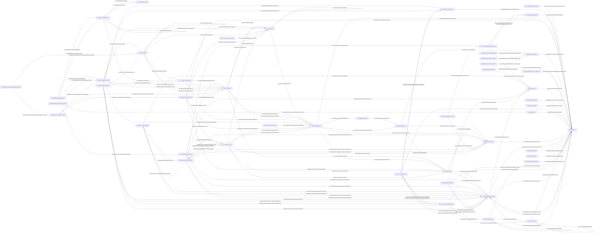

# CPK Operations Table Atlas

<!-- current-schema-contract: sha256=79111df594db6043e5bb5ef042b3934f3852675e00d1f907c38ef360ee0049f8 relations=49 columns=624 constraints=496 indexes=162 foreign-keys=136 -->

This atlas explains the durable operational truth owned by CPK. The frozen
contract header, foreign-key ledger, and dependency graph below are checked
against the same current-schema contract used by the installer. The prose adds
ownership, transaction, lifecycle, and security meaning that cannot be learned
from catalog facts alone.

The installer creates these objects only in an **object-free owned namespace**.
An existing namespace must already be the **exact current schema**; any other
shape receives a bounded **reset-required** installation error and no DDL. This
document has **no runtime behavior changes** and does not authorize schema
repair, data conversion, or inference from an older layout.

## Reading The Atlas

- A foreign key is described as a proof obligation, not merely a join hint.
- Restrictive deletion is intentional unless a table section says otherwise.
- JSON columns hold validated domain documents at store boundaries; the
  database does not replace their domain codecs.
- Credential and secret references are durable identifiers, never authority to
  disclose or resolve private material.
- Writers run through caller-owned units of work unless a section identifies a
  single-statement append or compare-and-set operation.

## Dependency Shape

<!-- multi-table-scc: cpk_graph_versions,cpk_realized_graph_projections,cpk_workspaces -->
<!-- draft-catalogue-scc: cpk_desired_topology_draft_revisions,cpk_desired_topology_drafts -->
<!-- receiver-storage-scc: cpk_graph_receiver_bindings,cpk_graph_receiver_introductions -->
<!-- configuration-protection-scc: cpk_configuration_claims,cpk_effect_configuration_refs -->
<!-- self-reference: cpk_activity_runs,cpk_effect_attempts,cpk_effect_configuration_refs,cpk_secret_providers,cpk_secret_references -->
<!-- outcome-aggregate: cpk_effect_attempt_outcomes,cpk_effect_attempt_outcome_observations -->
<!-- future-impact: 1553,1554,1555,1556,1243,1244 -->

The first multi-table strongly connected component is the workspace lineage
aggregate. A graph version belongs to a workspace; a realized projection pins
its source graph and workspace; and the workspace selects current and desired
projections while pinning both their source graph and workspace. This is an
accepted aggregate invariant, not an accidental defect. It makes selected
lineage resistant to direct projection rebinding and keeps the current/desired
pair plus desired revision under one workspace-row lock and compare-and-set.

Restore that aggregate in phases: create the workspace with nullable lineage
heads, restore authored graphs, restore realized projections, then select the
current and desired heads. Physical deletion reverses that order or clears the
heads first. The public stores do not expose a general physical workspace
delete operation.

The second component is the saved draft/head aggregate. Each revision references
its owning draft, while the draft head references an exact local revision through
a deferred composite foreign key. Insert draft and revisions together, then verify
the final head at commit. Saved graphs must already exist in the same workspace.
This cycle preserves draft identity and history without selecting desired truth.
There is no public physical deletion or automatic restore procedure.

The receiver storage component retains an immutable introduction and its original
binding together. Insert the introduction, then its bindings in the same transaction;
the original-binding foreign key is deferred until commit. All references use
restrictive deletion. Restore owning graphs, projections, sessions/actions and any
saved draft revision first, then introductions and bindings together. This is a
restore ordering constraint, not a migration or deletion API. Acceptance and
retirement witnesses are paired write-once store transitions; retained retirement
keeps the globally unique receiver identity reserved.

Receiver reentry verifies every retained indexed projection and introduction
origin. Generic unindexed graphs keep their existing meaning. An entirely absent
later non-origin binding set is not discoverable from these retained indices;
direct receiver member reads still refuse it. C owns atomic initial membership
at supported publication entries and the joint acceptance gate.

The configuration protection component pairs every immutable original ref with
its protective claim through deferred reciprocal foreign keys. Restore the pair
together after its original intent evidence, with direct birth roots before
reuses. Acceptance headers and slots depend on these retained facts without
joining this cycle. Slots reference immutable source/birth refs and direct
outcomes, not mutable historical attempts. Initialization receipts likewise
depend on existing workspace/graph/projection truth without introducing another
cycle. The four multi-table components above remain unchanged.

Self-references express retry ancestry for activity runs, immediate retry
ancestry for effect attempts, direct configuration birth links, and supersession
chains for provider and secret-reference registrations. Restore roots before
their descendants and reject missing or cyclic application-level histories.

## Deterministic Assembly And Logical Restore

### Fresh install

The installer serializes installation, proves the owned namespace contains no
objects, executes the checked-in current SQL in its fixed statement order, and
verifies the complete current contract before commit. Table creation, indexes,
and the later `ALTER TABLE ... ADD CONSTRAINT` statements are one atomic
assembly. A failed statement or failed verification rolls the entire assembly
back. An existing exact schema is verification-only; any other existing shape
is reset-required and receives no DDL.

### Logical data restore

The deterministic whole-database restore order is staged to respect every
foreign key and the accepted lineage cycle:

1. Insert bare `cpk_workspaces` rows with both graph/projection heads null.
2. Restore workspace-owned roots: `cpk_graph_versions`,
   `cpk_registered_products`, `cpk_image_pull_authorities`,
   `cpk_ingress_authorities`, `cpk_runtime_authorities`,
   `cpk_runtime_authority_deliveries`, `cpk_delegation_signing_keys`,
   `cpk_gateway_key_rotations`, `cpk_observations`,
   `cpk_operation_sessions`, and root `cpk_secret_providers`.
3. Restore `cpk_realized_graph_projections`, then the retained original
   `cpk_workspace_initializations` receipts after their exact initial graphs and
   projections exist. Restore provider supersession descendants, then root and
   descendant `cpk_secret_references`.
4. Set each workspace's paired current/desired graph and projection heads and
   desired revision after every selected projection exists.
5. Restore draft heads and all retained draft revisions in one transaction after
   their saved graphs, allowing the deferred head reference to resolve at commit.
   Restore ordinary session actions and plans; gateway probe attempts; rotation
   transitions and revocations; and approval requests. Defer typed original
   advancement actions until their plan/request/run parents exist.
6. Restore approval decisions, then execution requests.
7. Restore root activity runs before retry descendants, then execution-command
   receipts and activity events in run/ordinal order. Typed original advancement
   actions/events additionally require their exact plan revision, request and run
   identities; restore them after those parents, preserving their original
   ordinals and payloads. Restore immutable start-intent evidence after its
   original event, and effect attempts in attempt order after all of their
   intent/original/latest commitments exist. Restore direct effect
   outcomes after their attempts and both referenced event coordinates, then
   restore ordered outcome membership after its observation rows. Restore
   compensation action/event rows before compensation programs, then restore
   their reverse-ordered steps after the referenced successful outcomes.
   Restore configuration refs and their reciprocal claims together, with direct
   birth roots before reuse refs. Restore `cpk_configuration_acceptances` only
   after both original advancement records and the exact projection exist, then
   `cpk_configuration_accepted_slots` after their header, source/birth refs and
   source outcome. Header/slot completeness and current-pointer agreement must
   pass owner validation; foreign keys alone do not prove accepted use.
8. Restore secret-use authorizations, rotation deployments,
   `cpk_cloudflare_ingress_resources`, and
   `cpk_generated_ingress_secret_references` after any optional
   operation/session/run/activity/effect/probe or graph/approval/execution
   provenance they retain, even where only aggregate ownership is enforced by
   foreign key.
9. Restore `cpk_health_effect_preparations` after its original event, immutable intent, effect attempt, both explicit graph projections, signing-key registrations and secret-use authorizations. Restore `cpk_node_control_attempts` only after its exact graph projection,
   transit and workload signing-key registrations, and transit and workload
   secret-use authorizations exist.

Within each phase, preserve primary, candidate, ordinal, revision, and
supersession identities exactly. This is a logical ordering account, not a
database import command: validation and one caller-controlled transaction are
still required, and externally held custody or provider state is not recreated
from these rows. Before commit, verify each restored current pointer against its
latest paired original acceptance and complete membership, or its exact original
empty initialization when both advancement streams are absent. Never synthesize
a missing initialization, header, original record or claim to make a restore
pass. Accepted membership does not authorize deletion of protective history.

## Aggregate Views

### Workspace-centered truth

`cpk_workspaces` is the ownership root for almost every durable aggregate. Its
row directly owns lifecycle and the current/desired lineage heads. Authored
graphs and realized projections form the lineage aggregate around it. Product,
authority, ingress, secret-reference, delegation-key, probe, rotation,
observation, and operation-session rows are independently identified children,
not fields of the workspace document. Activity events and runs are indirect
workspace descendants through requests, plans, and sessions; their lack of a
repeated workspace FK is deliberate because that path already has composite
workspace/session/plan proofs.

### Activity, operation, and history

The main intent-to-evidence chain is:

`workspace -> operation session -> action and plan -> approval request ->`
`approval decision -> execution request -> activity run -> activity event`.

Original advancement actions/events additionally carry typed workspace,
request, plan, run and numeric revision coordinates. Their closed locator
constraints and composite foreign keys preserve the original execution context;
owner/reader checks correlate those columns with the bounded payloads. They are
selected independently by workspace and descending revision before source joins,
so a missing or corrupt newest occurrence cannot fall back to an older matching
projection.

Plans additionally pin base and desired graph projections. Execution requests
use composite candidate keys to prove that workspace, session, plan, approval
request, and decision agree. Runs append retry attempts; events append ordered
evidence. `cpk_observations` is a separate observed-state stream because it
describes runtime subjects and freshness, not execution history. Gateway probe
attempts are likewise a dedicated authorization/result aggregate with their
own request and JTI replay boundaries.

### Authority, policy, key, secret-reference, and rotation truth

Authority declarations are separated by domain: image pull, ingress, runtime,
runtime delivery, delegation signing, secret provider, and secret reference.
The tables persist registrations and opaque references, never resolved private
material. `cpk_secret_use_authorizations` binds one workspace, provider,
reference, intent, and correlation before provider I/O. Delegation keys retain
public verification material plus an opaque private-key reference. Compact
grants and signatures are not durable operations-table truth.

Gateway rotation is its own aggregate: `cpk_gateway_key_rotations` owns current
state and compare-and-set version; deployments and revocation rows are exact
phase evidence; transitions are the append-only lifecycle log. Approval rows
may point at a rotation, but provider custody remains external and secret use
still requires a separate committed authorization.

### Graph, projection, plan, runtime, and descriptor truth

`cpk_registered_products` preserves admitted descriptor artifacts. Authored
`cpk_graph_versions` compose those declarations into immutable workspace
topology. `cpk_realized_graph_projections` preserve exact realized forms of an
authored graph and may legitimately be non-identity projections. Workspaces
select current and desired projections; plans snapshot base and desired
lineage. Runtime and ingress authority/delivery registrations tell
interpreters which admitted public declarations and opaque references may be
used, while actual provider/runtime resources remain outside this database.

### Configuration protection and accepted use

Creation records one immutable empty initialization alongside the actual original
graph, identity projection and workspace pointer. Advancement records its complete
acceptance header and immutable slot manifest in the same transaction as the
current-pointer CAS and original action/event. The existing workspace pointer
remains the current-state selector; receipts preserve the evidence for that
selection rather than owning a second current registry.

Each selected slot retains its exact original installation source and direct
allocation birth. Unchanged carry retains those links; a new installation using
an existing allocation proves its own direct success. All original protective
claims remain, including staged, failed or uncertain uses and allocations no
longer present in current membership. Neither successful acceptance nor an empty
inverse read proves writer quiescence or grants cleanup authority.

Bounded public observations validate complete current material before proving
requested sources. Advancement and retained-current verification prove every
selected source; all actual work shares the logical-operation budget, including
cold-consumer and publication preflight. Missing or excessive evidence refuses
without partial proof, provider I/O, repair or claim release. Completion language
and inspectable closure planning belong to C; admitted linkage, dispositions and
reservation/retirement belong to D; I177 owns terminal producer proof and provider
activation. Those future owners must consume this evidence without treating its
presence as authorization.

## Factoring Review

The schema is substantially factored around durable identities and
relationships. Separate tables exist where facts have independent lifecycle,
cardinality, concurrency, retention, or audit meaning. The following apparent
duplication is intentional:

- Workspace IDs recur on independently owned aggregates to enforce tenant
  ownership without decoding JSON. Composite candidate keys such as
  `(session_id, workspace_id)`, `(projection_id, workspace_id)`, and
  `(registration_id, workspace_id)` let FKs prove cross-table agreement.
- Graph/projection pairs recur on workspaces and plans as lineage witnesses.
  They pin the projection's authored source and workspace, preventing coherent
  source rebinding through direct SQL and preserving one-row workspace CAS.
- Request/decision, request/plan, and plan/session pairs are repeated witnesses
  whose composite keys and FKs make substitution errors relationally
  impossible. They are not independently editable copies of the same fact.
- Correlation, idempotency, JTI, ordinal, version, and semantic descriptor keys
  are candidate identities. Their unique constraints define replay,
  sequencing, or content identity in the owning aggregate; primary keys alone
  would not express those laws.

JSONB remains an intentional leaf where one closed algebra value is validated
and consumed atomically:

- topology and descriptor leaves: workspace metadata, authored/realized graph
  descriptors, product reference/source/descriptor documents, and metadata;
- authority leaves: image-pull, ingress, runtime, and runtime-delivery
  declarations, credential/secret-reference lists, and metadata;
- intent and evidence leaves: session metadata, action and plan payloads, run
  metadata, activity-event payloads, approval subject payloads, observations,
  gateway-probe evidence, ingress metadata, and secret allowed-intent/prefix
  policy.

Relational decomposition stops at those leaves because their inner fields are
versioned domain-language structure with no independently mutable row identity.
Extracting them would duplicate domain codecs, fragment atomic values, and turn
descriptor evolution into table ownership. Fields that participate in joins,
ownership, lifecycle, replay, or concurrency remain relational instead.

The genuine normalization questions are visible rather than hidden:

- The workspace/graph/projection cycle is deliberate denormalization for
  pinned lineage and one-row CAS. #1564/#1565 evaluated extracting it and were
  closed without changes because the alternatives weakened the source pin or
  moved the same aggregate complexity elsewhere.
- Rotation phase rows repeat graph, approval, plan, request, run, provider, and
  secret-reference witnesses but do not FK every witness. Their identity
  witnesses are stable while guarded status/acceptance fields may advance.
  Ingress and generated secret provenance, observations' graph identity, and
  authority-reference columns make similar retention-decoupled references.
  These are immutable evidence snapshots or cross-domain opaque identities,
  but direct SQL could make them semantically inconsistent. A future issue
  should add an FK only if stronger database enforcement outweighs tighter
  retention coupling; the atlas does not claim constraints that do not exist.
- Secret-use authorizations retain both provider and reference registrations.
  Independent composite FKs prove that each exact registration exists in the
  same workspace, but no composite FK proves that the selected reference names
  the selected provider. `_authorize_secret_use` verifies that association
  before insert. This is a service-enforced witness and a genuine future
  normalization question, not a relational impossibility claim.
- JSON leaves are not efficiently relationally queryable below their typed
  boundary. That is accepted while stores read whole values; a real need for
  independently indexed subfacts would justify a new table and owner, not an
  ad hoc projection of every JSON field.

No unresolved defect is inferred from this review. The current shape favors
explicit aggregate invariants and immutable evidence over maximal normal form,
and the exact contract makes every future factoring change visible.

## Future Impact Map

- **#1564 and #1565:** closed not planned. The proposed workspace graph-state
  extraction and its proof child made no table, store, record, or API change;
  the accepted lineage aggregate remains documented here.
- **Rewritten #1553:** adds closed node-control scopes, signing purpose, and
  secret-use intent to the direct current constraints. It adds no table and
  must leave approval scopes independently owned.
- **#1554:** adds pure transit grant language and verification. It adds no
  operations table and persists no compact grant or signature.
- **Rewritten #1555:** adds one insert-only durable node-control intended-attempt
  table. It reuses workspace lineage, delegation-key registration, and
  secret-use authorization truth without adding result, status, completion, or
  mutable-workspace-head ownership.
- **#1556:** composes graph-bound authorization and operations workflow. No new
  table is expected beyond the accepted #1555 persistence shape.
- **#1243:** interprets gateway transit and relay outside operations
  persistence; no operations table is expected.
- **#1244:** may fold terminal attempt/result evidence into the #1555-owned
  persistence, but must not invent a second activity or command-history system.
- **Secrets-provider admission/provisioning child:** the unnumbered pre-#1244
  handoff recorded on #1242 owns provider contract, key provisioning, and
  custody. That truth remains outside operations; these tables may retain only
  opaque registrations, references, and committed use authorization.

<!-- foreign-key-graph:start -->

```mermaid
flowchart LR
cpk_activity_events -->|cpk_activity_events_run_id_fkey| cpk_activity_runs
cpk_activity_events -->|cpk_event_advancement_request_plan_fk| cpk_execution_requests
cpk_activity_events -->|cpk_event_advancement_request_workspace_fk| cpk_execution_requests
cpk_activity_events -->|cpk_event_advancement_revision_fk| cpk_activity_plans
cpk_activity_events -->|cpk_event_advancement_run_fk| cpk_activity_runs
cpk_activity_plans -->|cpk_activity_plans_base_projection_source_fk| cpk_realized_graph_projections
cpk_activity_plans -->|cpk_activity_plans_desired_projection_source_fk| cpk_realized_graph_projections
cpk_activity_plans -->|cpk_activity_plans_session_id_fkey| cpk_operation_sessions
cpk_activity_runs -->|cpk_activity_runs_prior_run_id_fkey| cpk_activity_runs
cpk_activity_runs -->|cpk_activity_runs_request_plan_fk| cpk_execution_requests
cpk_approval_decisions -->|cpk_approval_decisions_request_id_fkey| cpk_approval_requests
cpk_approval_requests -->|cpk_approval_requests_plan_id_fkey| cpk_activity_plans
cpk_approval_requests -->|cpk_approval_requests_rotation_fk| cpk_gateway_key_rotations
cpk_approval_requests -->|cpk_approval_requests_session_id_fkey| cpk_operation_sessions
cpk_cloudflare_ingress_resources -->|cpk_cloudflare_ingress_resources_workspace_id_fkey| cpk_workspaces
cpk_configuration_acceptances -->|cpk_configuration_acceptances_action_fk| cpk_operation_actions
cpk_configuration_acceptances -->|cpk_configuration_acceptances_event_fk| cpk_activity_events
cpk_configuration_acceptances -->|cpk_configuration_acceptances_projection_source_fk| cpk_realized_graph_projections
cpk_configuration_acceptances -->|cpk_configuration_acceptances_projection_workspace_fk| cpk_realized_graph_projections
cpk_configuration_accepted_slots -->|cpk_configuration_accepted_slots_acceptance_fk| cpk_configuration_acceptances
cpk_configuration_accepted_slots -->|cpk_configuration_accepted_slots_birth_fk| cpk_effect_configuration_refs
cpk_configuration_accepted_slots -->|cpk_configuration_accepted_slots_outcome_fk| cpk_effect_attempt_outcomes
cpk_configuration_accepted_slots -->|cpk_configuration_accepted_slots_source_fk| cpk_effect_configuration_refs
cpk_configuration_claims -->|cpk_configuration_claims_ref_fk| cpk_effect_configuration_refs
cpk_delegation_signing_keys -->|cpk_delegation_signing_keys_workspace_id_fkey| cpk_workspaces
cpk_desired_topology_draft_revisions -->|cpk_desired_topology_draft_revisions_draft_fkey| cpk_desired_topology_drafts
cpk_desired_topology_draft_revisions -->|cpk_desired_topology_draft_revisions_graph_fkey| cpk_graph_versions
cpk_desired_topology_drafts -->|cpk_desired_topology_drafts_head_fkey| cpk_desired_topology_draft_revisions
cpk_desired_topology_drafts -->|cpk_desired_topology_drafts_workspace_fkey| cpk_workspaces
cpk_effect_attempt_intents -->|cpk_effect_attempt_intents_original_event_fk| cpk_activity_events
cpk_effect_attempt_intents -->|cpk_effect_attempt_intents_request_workspace_fk| cpk_execution_requests
cpk_effect_attempt_intents -->|cpk_effect_attempt_intents_run_request_fk| cpk_activity_runs
cpk_effect_attempt_outcome_observations -->|cpk_effect_attempt_outcome_observations_observation_fk| cpk_observations
cpk_effect_attempt_outcome_observations -->|cpk_effect_attempt_outcome_observations_outcome_fk| cpk_effect_attempt_outcomes
cpk_effect_attempt_outcomes -->|cpk_effect_attempt_outcomes_attempt_fk| cpk_effect_attempts
cpk_effect_attempt_outcomes -->|cpk_effect_attempt_outcomes_direct_event_fk| cpk_activity_events
cpk_effect_attempt_outcomes -->|cpk_effect_attempt_outcomes_original_event_fk| cpk_activity_events
cpk_effect_attempt_outcomes -->|cpk_effect_attempt_outcomes_request_workspace_fk| cpk_execution_requests
cpk_effect_attempt_outcomes -->|cpk_effect_attempt_outcomes_run_request_fk| cpk_activity_runs
cpk_effect_attempts -->|cpk_effect_attempts_intent_evidence_fk| cpk_effect_attempt_intents
cpk_effect_attempts -->|cpk_effect_attempts_latest_event_fk| cpk_activity_events
cpk_effect_attempts -->|cpk_effect_attempts_original_event_fk| cpk_activity_events
cpk_effect_attempts -->|cpk_effect_attempts_prior_fkey| cpk_effect_attempts
cpk_effect_attempts -->|cpk_effect_attempts_run_id_fkey| cpk_activity_runs
cpk_effect_configuration_refs -->|cpk_configuration_refs_birth_fk| cpk_effect_configuration_refs
cpk_effect_configuration_refs -->|cpk_configuration_refs_claim_fk| cpk_configuration_claims
cpk_effect_configuration_refs -->|cpk_configuration_refs_intent_fk| cpk_effect_attempt_intents
cpk_execution_command_receipts -->|cpk_execution_command_receipts_run_id_fkey| cpk_activity_runs
cpk_execution_receiver_scopes -->|cpk_execution_receiver_scopes_request_workspace_fk| cpk_execution_requests
cpk_execution_requests -->|cpk_execution_requests_approval_identity_fk| cpk_approval_decisions
cpk_execution_requests -->|cpk_execution_requests_approval_request_id_fkey| cpk_approval_requests
cpk_execution_requests -->|cpk_execution_requests_plan_session_fk| cpk_activity_plans
cpk_execution_requests -->|cpk_execution_requests_workspace_id_fkey| cpk_workspaces
cpk_execution_requests -->|cpk_execution_requests_workspace_session_fk| cpk_operation_sessions
cpk_failed_run_compensation_attempt_bindings -->|cpk_failed_run_compensation_attempt_bindings_inverse_attempt_fk| cpk_effect_attempts
cpk_failed_run_compensation_attempt_bindings -->|cpk_failed_run_compensation_attempt_bindings_source_step_fk| cpk_failed_run_compensation_steps
cpk_failed_run_compensation_steps -->|cpk_failed_run_compensation_steps_completion_event_fk| cpk_activity_events
cpk_failed_run_compensation_steps -->|cpk_failed_run_compensation_steps_program_fk| cpk_failed_run_compensations
cpk_failed_run_compensation_steps -->|cpk_failed_run_compensation_steps_source_outcome_fk| cpk_effect_attempt_outcomes
cpk_failed_run_compensations -->|cpk_failed_run_compensations_action_fk| cpk_operation_actions
cpk_failed_run_compensations -->|cpk_failed_run_compensations_event_fk| cpk_activity_events
cpk_failed_run_compensations -->|cpk_failed_run_compensations_plan_session_fk| cpk_activity_plans
cpk_failed_run_compensations -->|cpk_failed_run_compensations_request_workspace_fk| cpk_execution_requests
cpk_failed_run_compensations -->|cpk_failed_run_compensations_run_request_fk| cpk_activity_runs
cpk_failed_run_compensations -->|cpk_failed_run_compensations_workspace_fk| cpk_workspaces
cpk_gateway_key_rotation_deployments -->|cpk_gateway_key_rotation_deployments_rotation_id_fkey| cpk_gateway_key_rotations
cpk_gateway_key_rotation_revocations -->|cpk_gateway_key_rotation_revocations_rotation_id_fkey| cpk_gateway_key_rotations
cpk_gateway_key_rotation_transitions -->|cpk_gateway_key_rotation_transitions_rotation_id_fkey| cpk_gateway_key_rotations
cpk_gateway_key_rotations -->|cpk_gateway_key_rotations_workspace_id_fkey| cpk_workspaces
cpk_gateway_probe_attempts -->|cpk_gateway_probe_attempts_current_graph_id_fkey| cpk_graph_versions
cpk_gateway_probe_attempts -->|cpk_gateway_probe_attempts_workspace_id_fkey| cpk_workspaces
cpk_generated_ingress_secret_references -->|cpk_generated_ingress_secret_references_workspace_id_fkey| cpk_workspaces
cpk_graph_receiver_bindings -->|cpk_graph_receiver_bindings_graph_fkey| cpk_graph_versions
cpk_graph_receiver_bindings -->|cpk_graph_receiver_bindings_projection_source_fkey| cpk_realized_graph_projections
cpk_graph_receiver_bindings -->|cpk_graph_receiver_bindings_projection_workspace_fkey| cpk_realized_graph_projections
cpk_graph_receiver_bindings -->|cpk_graph_receiver_bindings_scope_fkey| cpk_graph_receiver_introductions
cpk_graph_receiver_introductions -->|cpk_graph_receiver_introductions_accepted_action_fkey| cpk_operation_actions
cpk_graph_receiver_introductions -->|cpk_graph_receiver_introductions_accepted_workspace_fkey| cpk_operation_sessions
cpk_graph_receiver_introductions -->|cpk_graph_receiver_introductions_draft_fkey| cpk_desired_topology_draft_revisions
cpk_graph_receiver_introductions -->|cpk_graph_receiver_introductions_graph_fkey| cpk_graph_versions
cpk_graph_receiver_introductions -->|cpk_graph_receiver_introductions_origin_action_fkey| cpk_operation_actions
cpk_graph_receiver_introductions -->|cpk_graph_receiver_introductions_origin_workspace_fkey| cpk_operation_sessions
cpk_graph_receiver_introductions -->|cpk_graph_receiver_introductions_original_binding_fkey| cpk_graph_receiver_bindings
cpk_graph_receiver_introductions -->|cpk_graph_receiver_introductions_projection_source_fkey| cpk_realized_graph_projections
cpk_graph_receiver_introductions -->|cpk_graph_receiver_introductions_projection_workspace_fkey| cpk_realized_graph_projections
cpk_graph_receiver_introductions -->|cpk_graph_receiver_introductions_retired_action_fkey| cpk_operation_actions
cpk_graph_receiver_introductions -->|cpk_graph_receiver_introductions_retired_workspace_fkey| cpk_operation_sessions
cpk_graph_versions -->|cpk_graph_versions_workspace_id_fkey| cpk_workspaces
cpk_health_effect_preparations -->|cpk_health_effect_preparations_attempt_fk| cpk_effect_attempts
cpk_health_effect_preparations -->|cpk_health_effect_preparations_base_projection_fk| cpk_realized_graph_projections
cpk_health_effect_preparations -->|cpk_health_effect_preparations_desired_projection_fk| cpk_realized_graph_projections
cpk_health_effect_preparations -->|cpk_health_effect_preparations_intent_fk| cpk_effect_attempt_intents
cpk_health_effect_preparations -->|cpk_health_effect_preparations_transit_authorization_fk| cpk_secret_use_authorizations
cpk_health_effect_preparations -->|cpk_health_effect_preparations_transit_key_fk| cpk_delegation_signing_keys
cpk_health_effect_preparations -->|cpk_health_effect_preparations_workload_authorization_fk| cpk_secret_use_authorizations
cpk_health_effect_preparations -->|cpk_health_effect_preparations_workload_key_fk| cpk_delegation_signing_keys
cpk_image_pull_authorities -->|cpk_image_pull_authorities_workspace_id_fkey| cpk_workspaces
cpk_ingress_authorities -->|cpk_ingress_authorities_workspace_id_fkey| cpk_workspaces
cpk_node_control_attempts -->|cpk_node_control_attempts_projection_source_fk| cpk_realized_graph_projections
cpk_node_control_attempts -->|cpk_node_control_attempts_projection_workspace_fk| cpk_realized_graph_projections
cpk_node_control_attempts -->|cpk_node_control_attempts_transit_authorization_workspace_fk| cpk_secret_use_authorizations
cpk_node_control_attempts -->|cpk_node_control_attempts_transit_key_workspace_fk| cpk_delegation_signing_keys
cpk_node_control_attempts -->|cpk_node_control_attempts_workload_authorization_workspace_fk| cpk_secret_use_authorizations
cpk_node_control_attempts -->|cpk_node_control_attempts_workload_key_workspace_fk| cpk_delegation_signing_keys
cpk_node_control_attempts -->|cpk_node_control_attempts_workspace_id_fkey| cpk_workspaces
cpk_observations -->|cpk_observations_workspace_id_fkey| cpk_workspaces
cpk_operation_actions -->|cpk_action_advancement_plan_session_fk| cpk_activity_plans
cpk_operation_actions -->|cpk_action_advancement_request_plan_fk| cpk_execution_requests
cpk_operation_actions -->|cpk_action_advancement_request_workspace_fk| cpk_execution_requests
cpk_operation_actions -->|cpk_action_advancement_revision_fk| cpk_activity_plans
cpk_operation_actions -->|cpk_action_advancement_run_fk| cpk_activity_runs
cpk_operation_actions -->|cpk_operation_actions_session_id_fkey| cpk_operation_sessions
cpk_operation_sessions -->|cpk_operation_sessions_workspace_id_fkey| cpk_workspaces
cpk_realized_graph_projections -->|cpk_realized_graph_projection_source| cpk_graph_versions
cpk_realized_graph_projections -->|cpk_realized_graph_projections_workspace_id_fkey| cpk_workspaces
cpk_registered_products -->|cpk_registered_products_workspace_id_fkey| cpk_workspaces
cpk_runtime_authorities -->|cpk_runtime_authorities_workspace_id_fkey| cpk_workspaces
cpk_runtime_authority_deliveries -->|cpk_runtime_authority_deliveries_workspace_id_fkey| cpk_workspaces
cpk_saved_preparation_sources -->|cpk_saved_preparation_sources_revision_fkey| cpk_desired_topology_draft_revisions
cpk_saved_preparation_sources -->|cpk_saved_preparation_sources_session_fkey| cpk_operation_sessions
cpk_secret_providers -->|cpk_secret_providers_supersedes_fk| cpk_secret_providers
cpk_secret_providers -->|cpk_secret_providers_workspace_id_fkey| cpk_workspaces
cpk_secret_references -->|cpk_secret_references_provider_fk| cpk_secret_providers
cpk_secret_references -->|cpk_secret_references_supersedes_fk| cpk_secret_references
cpk_secret_references -->|cpk_secret_references_workspace_id_fkey| cpk_workspaces
cpk_secret_use_authorizations -->|cpk_secret_use_authorizations_provider_fk| cpk_secret_providers
cpk_secret_use_authorizations -->|cpk_secret_use_authorizations_reference_fk| cpk_secret_references
cpk_secret_use_authorizations -->|cpk_secret_use_authorizations_workspace_id_fkey| cpk_workspaces
cpk_workspace_initializations -->|cpk_workspace_initializations_graph_fk| cpk_graph_versions
cpk_workspace_initializations -->|cpk_workspace_initializations_projection_fk| cpk_realized_graph_projections
cpk_workspace_initializations -->|cpk_workspace_initializations_projection_source_fk| cpk_realized_graph_projections
cpk_workspace_initializations -->|cpk_workspace_initializations_workspace_fk| cpk_workspaces
cpk_workspaces -->|cpk_workspaces_current_projection_source_fk| cpk_realized_graph_projections
cpk_workspaces -->|cpk_workspaces_current_realized_projection_fk| cpk_realized_graph_projections
cpk_workspaces -->|cpk_workspaces_desired_projection_source_fk| cpk_realized_graph_projections
cpk_workspaces -->|cpk_workspaces_desired_realized_projection_fk| cpk_realized_graph_projections
```
<!-- foreign-key-graph:end -->

## Exact Foreign-Key Ledger

The row order follows the current schema contract. Local and referenced column
order is semantically significant for every composite identity.

<!-- foreign-key-ledger:start -->
| Constraint | Local relation | Local columns | Referenced relation | Referenced columns | Meaning |
| --- | --- | --- | --- | --- | --- |
| `cpk_action_advancement_plan_session_fk` | `cpk_operation_actions` | `advancement_plan_id, session_id` | `cpk_activity_plans` | `plan_id, session_id` | The original advancement plan belongs to the action session. |
| `cpk_action_advancement_request_plan_fk` | `cpk_operation_actions` | `advancement_request_id, advancement_plan_id` | `cpk_execution_requests` | `request_id, plan_id` | The original advancement action identifies the plan of its exact execution request. |
| `cpk_action_advancement_request_workspace_fk` | `cpk_operation_actions` | `advancement_request_id, advancement_workspace_id` | `cpk_execution_requests` | `request_id, workspace_id` | The original advancement action identifies the workspace of its exact execution request. |
| `cpk_action_advancement_revision_fk` | `cpk_operation_actions` | `advancement_plan_id, advancement_revision` | `cpk_activity_plans` | `plan_id, desired_graph_revision` | The original advancement action pins the desired revision recorded by its plan. |
| `cpk_action_advancement_run_fk` | `cpk_operation_actions` | `advancement_run_id, advancement_request_id` | `cpk_activity_runs` | `run_id, request_id` | The original advancement run belongs to the action's exact execution request. |
| `cpk_activity_events_run_id_fkey` | `cpk_activity_events` | `run_id` | `cpk_activity_runs` | `run_id` | Every event belongs to one durable execution attempt. |
| `cpk_activity_plans_base_projection_source_fk` | `cpk_activity_plans` | `base_realized_projection_id, base_graph_id` | `cpk_realized_graph_projections` | `projection_id, source_authored_graph_id` | The base projection must realize the plan's named base graph. |
| `cpk_activity_plans_desired_projection_source_fk` | `cpk_activity_plans` | `desired_realized_projection_id, desired_graph_id` | `cpk_realized_graph_projections` | `projection_id, source_authored_graph_id` | The desired projection must realize the plan's named desired graph. |
| `cpk_activity_plans_session_id_fkey` | `cpk_activity_plans` | `session_id` | `cpk_operation_sessions` | `session_id` | Every plan belongs to one operator-intent session. |
| `cpk_activity_runs_prior_run_id_fkey` | `cpk_activity_runs` | `prior_run_id` | `cpk_activity_runs` | `run_id` | A retry names its prior execution attempt. |
| `cpk_activity_runs_request_plan_fk` | `cpk_activity_runs` | `request_id, plan_id` | `cpk_execution_requests` | `request_id, plan_id` | A run executes the same plan named by its request. |
| `cpk_approval_decisions_request_id_fkey` | `cpk_approval_decisions` | `request_id` | `cpk_approval_requests` | `request_id` | A decision resolves one existing approval request. |
| `cpk_approval_requests_plan_id_fkey` | `cpk_approval_requests` | `plan_id` | `cpk_activity_plans` | `plan_id` | A plan approval remains attached to its inspected plan. |
| `cpk_approval_requests_rotation_fk` | `cpk_approval_requests` | `rotation_id` | `cpk_gateway_key_rotations` | `rotation_id` | A rotation approval remains attached to its rotation intent. |
| `cpk_approval_requests_session_id_fkey` | `cpk_approval_requests` | `session_id` | `cpk_operation_sessions` | `session_id` | Every approval request belongs to an operation session. |
| `cpk_cloudflare_ingress_resources_workspace_id_fkey` | `cpk_cloudflare_ingress_resources` | `workspace_id` | `cpk_workspaces` | `workspace_id` | Observed ingress resources are owned by a workspace. |
| `cpk_configuration_acceptances_action_fk` | `cpk_configuration_acceptances` | `action_id` | `cpk_operation_actions` | `action_id` | The complete acceptance header retains its immutable original advancement action; owner validation proves its kind and payload. |
| `cpk_configuration_acceptances_event_fk` | `cpk_configuration_acceptances` | `event_id` | `cpk_activity_events` | `event_id` | The complete acceptance header retains its immutable original advancement event; owner validation proves its pairing and payload. |
| `cpk_configuration_acceptances_projection_source_fk` | `cpk_configuration_acceptances` | `projection_id, graph_id` | `cpk_realized_graph_projections` | `projection_id, source_authored_graph_id` | The accepted projection realizes the exact authored graph named by the header. |
| `cpk_configuration_acceptances_projection_workspace_fk` | `cpk_configuration_acceptances` | `projection_id, workspace_id` | `cpk_realized_graph_projections` | `projection_id, workspace_id` | The accepted projection belongs to the header workspace. |
| `cpk_configuration_accepted_slots_acceptance_fk` | `cpk_configuration_accepted_slots` | `workspace_id, pinned_revision` | `cpk_configuration_acceptances` | `workspace_id, pinned_revision` | Every selected slot belongs to one exact workspace/revision acceptance header. |
| `cpk_configuration_accepted_slots_birth_fk` | `cpk_configuration_accepted_slots` | `birth_run_id, birth_activity_id, birth_attempt, birth_artifact_id` | `cpk_effect_configuration_refs` | `run_id, activity_id, attempt, artifact_id` | The slot retains an immutable direct allocation birth ref; readers prove self-rooted birth and full-ref equality. |
| `cpk_configuration_accepted_slots_outcome_fk` | `cpk_configuration_accepted_slots` | `source_run_id, source_activity_id, source_attempt` | `cpk_effect_attempt_outcomes` | `run_id, activity_id, attempt` | The selected source retains its immutable direct outcome without a late mutable-attempt FK; readers prove qualifying success. |
| `cpk_configuration_accepted_slots_source_fk` | `cpk_configuration_accepted_slots` | `source_run_id, source_activity_id, source_attempt, source_artifact_id` | `cpk_effect_configuration_refs` | `run_id, activity_id, attempt, artifact_id` | The slot retains the immutable original ref for its exact installation use. |
| `cpk_configuration_claims_ref_fk` | `cpk_configuration_claims` | `run_id, activity_id, attempt, artifact_id` | `cpk_effect_configuration_refs` | `run_id, activity_id, attempt, artifact_id` | Every immutable protective claim identifies one exact original ref; deferred until the caller commits both facts. |
| `cpk_configuration_refs_birth_fk` | `cpk_effect_configuration_refs` | `birth_run_id, birth_activity_id, birth_attempt, birth_artifact_id` | `cpk_effect_configuration_refs` | `run_id, activity_id, attempt, artifact_id` | Every use points directly to retained birth evidence; complete readers reject chains or a mismatched root. |
| `cpk_configuration_refs_claim_fk` | `cpk_effect_configuration_refs` | `run_id, activity_id, attempt, artifact_id` | `cpk_configuration_claims` | `run_id, activity_id, attempt, artifact_id` | Reciprocal deferred protection prevents committing a ref without its claim. |
| `cpk_configuration_refs_intent_fk` | `cpk_effect_configuration_refs` | `run_id, activity_id, attempt, request_fingerprint, original_event_id` | `cpk_effect_attempt_intents` | `run_id, activity_id, attempt, request_fingerprint, original_event_id` | The ref commits to the original attempt intent and start event. |
| `cpk_delegation_signing_keys_workspace_id_fkey` | `cpk_delegation_signing_keys` | `workspace_id` | `cpk_workspaces` | `workspace_id` | Delegation signing-key registrations are workspace scoped. |
| `cpk_desired_topology_draft_revisions_draft_fkey` | `cpk_desired_topology_draft_revisions` | `workspace_id, draft_id` | `cpk_desired_topology_drafts` | `workspace_id, draft_id` | Every immutable revision belongs to the exact workspace-scoped draft. |
| `cpk_desired_topology_draft_revisions_graph_fkey` | `cpk_desired_topology_draft_revisions` | `workspace_id, graph_id` | `cpk_graph_versions` | `workspace_id, graph_id` | Saved graph evidence belongs to the same workspace as its revision. |
| `cpk_desired_topology_drafts_head_fkey` | `cpk_desired_topology_drafts` | `workspace_id, draft_id, head_revision` | `cpk_desired_topology_draft_revisions` | `workspace_id, draft_id, revision` | The deferred head reference must resolve to one local immutable revision at commit. |
| `cpk_desired_topology_drafts_workspace_fkey` | `cpk_desired_topology_drafts` | `workspace_id` | `cpk_workspaces` | `workspace_id` | Named draft identity belongs to one durable workspace. |
| `cpk_effect_attempt_intents_original_event_fk` | `cpk_effect_attempt_intents` | `original_event_id, original_event_run_id, original_event_ordinal` | `cpk_activity_events` | `event_id, run_id, ordinal` | Start intent evidence names the exact immutable event that begins the attempt. |
| `cpk_effect_attempt_intents_request_workspace_fk` | `cpk_effect_attempt_intents` | `request_id, workspace_id` | `cpk_execution_requests` | `request_id, workspace_id` | Intent evidence derives workspace ownership from its execution request. |
| `cpk_effect_attempt_intents_run_request_fk` | `cpk_effect_attempt_intents` | `run_id, request_id` | `cpk_activity_runs` | `run_id, request_id` | Intent evidence and activity run name the same execution request. |
| `cpk_effect_attempt_outcome_observations_observation_fk` | `cpk_effect_attempt_outcome_observations` | `observation_id, workspace_id` | `cpk_observations` | `observation_id, workspace_id` | Every ordered member names an immutable observation in the same workspace. |
| `cpk_effect_attempt_outcome_observations_outcome_fk` | `cpk_effect_attempt_outcome_observations` | `run_id, activity_id, attempt, workspace_id, observation_count` | `cpk_effect_attempt_outcomes` | `run_id, activity_id, attempt, workspace_id, observation_count` | Membership belongs to one exact outcome and copies its bounded expected count. |
| `cpk_effect_attempt_outcomes_attempt_fk` | `cpk_effect_attempt_outcomes` | `run_id, activity_id, attempt` | `cpk_effect_attempts` | `run_id, activity_id, attempt` | Every historical direct outcome belongs to an existing effect attempt. |
| `cpk_effect_attempt_outcomes_direct_event_fk` | `cpk_effect_attempt_outcomes` | `direct_event_id, direct_event_run_id, direct_event_ordinal` | `cpk_activity_events` | `event_id, run_id, ordinal` | The copied direct post-transition state is committed by one immutable event. |
| `cpk_effect_attempt_outcomes_original_event_fk` | `cpk_effect_attempt_outcomes` | `original_event_id, original_event_run_id, original_event_ordinal` | `cpk_activity_events` | `event_id, run_id, ordinal` | The historical snapshot retains its exact immutable start event. |
| `cpk_effect_attempt_outcomes_request_workspace_fk` | `cpk_effect_attempt_outcomes` | `request_id, workspace_id` | `cpk_execution_requests` | `request_id, workspace_id` | Outcome workspace ownership is derived from the run's execution request. |
| `cpk_effect_attempt_outcomes_run_request_fk` | `cpk_effect_attempt_outcomes` | `run_id, request_id` | `cpk_activity_runs` | `run_id, request_id` | Outcome run and request coordinates must name the same durable run. |
| `cpk_effect_attempts_intent_evidence_fk` | `cpk_effect_attempts` | `run_id, activity_id, attempt, request_fingerprint, original_event_id` | `cpk_effect_attempt_intents` | `run_id, activity_id, attempt, request_fingerprint, original_event_id` | Every attempt requires matching immutable start-intent evidence. |
| `cpk_effect_attempts_latest_event_fk` | `cpk_effect_attempts` | `latest_event_id, latest_event_run_id, latest_event_ordinal` | `cpk_activity_events` | `event_id, run_id, ordinal` | The retained state is committed by one exact latest activity event. |
| `cpk_effect_attempts_original_event_fk` | `cpk_effect_attempts` | `original_event_id, original_event_run_id, original_event_ordinal` | `cpk_activity_events` | `event_id, run_id, ordinal` | Every attempt retains its exact immutable start event. |
| `cpk_effect_attempts_prior_fkey` | `cpk_effect_attempts` | `prior_run_id, prior_activity_id, prior_attempt` | `cpk_effect_attempts` | `run_id, activity_id, attempt` | A retry names the immediately preceding attempt for the same run and activity. |
| `cpk_effect_attempts_run_id_fkey` | `cpk_effect_attempts` | `run_id` | `cpk_activity_runs` | `run_id` | Every effect attempt belongs to one durable activity run. |
| `cpk_event_advancement_request_plan_fk` | `cpk_activity_events` | `advancement_request_id, advancement_plan_id` | `cpk_execution_requests` | `request_id, plan_id` | The original advancement event identifies the plan of its exact execution request. |
| `cpk_event_advancement_request_workspace_fk` | `cpk_activity_events` | `advancement_request_id, advancement_workspace_id` | `cpk_execution_requests` | `request_id, workspace_id` | The original advancement event identifies the workspace of its exact execution request. |
| `cpk_event_advancement_revision_fk` | `cpk_activity_events` | `advancement_plan_id, advancement_revision` | `cpk_activity_plans` | `plan_id, desired_graph_revision` | The original advancement event pins the desired revision recorded by its plan. |
| `cpk_event_advancement_run_fk` | `cpk_activity_events` | `run_id, advancement_request_id` | `cpk_activity_runs` | `run_id, request_id` | The event run belongs to the original advancement request. |
| `cpk_execution_command_receipts_run_id_fkey` | `cpk_execution_command_receipts` | `run_id` | `cpk_activity_runs` | `run_id` | Every admitted command receipt belongs to the exact run it may advance. |
| `cpk_execution_receiver_scopes_request_workspace_fk` | `cpk_execution_receiver_scopes` | `request_id, workspace_id` | `cpk_execution_requests` | `request_id, workspace_id` | Immutable scope coverage belongs to the exact original request and workspace. |
| `cpk_execution_requests_approval_identity_fk` | `cpk_execution_requests` | `approval_decision_id, approval_request_id` | `cpk_approval_decisions` | `decision_id, request_id` | The selected decision must resolve the selected request. |
| `cpk_execution_requests_approval_request_id_fkey` | `cpk_execution_requests` | `approval_request_id` | `cpk_approval_requests` | `request_id` | An approved execution names an existing request. |
| `cpk_execution_requests_plan_session_fk` | `cpk_execution_requests` | `plan_id, session_id` | `cpk_activity_plans` | `plan_id, session_id` | The execution request and plan share one session. |
| `cpk_execution_requests_workspace_id_fkey` | `cpk_execution_requests` | `workspace_id` | `cpk_workspaces` | `workspace_id` | Every execution request is workspace scoped. |
| `cpk_execution_requests_workspace_session_fk` | `cpk_execution_requests` | `session_id, workspace_id` | `cpk_operation_sessions` | `session_id, workspace_id` | The request workspace must match its session workspace. |
| `cpk_failed_run_compensation_attempt_bindings_inverse_attempt_fk` | `cpk_failed_run_compensation_attempt_bindings` | `inverse_run_id, inverse_activity_id, inverse_attempt` | `cpk_effect_attempts` | `run_id, activity_id, attempt` | Every compensation step binds one fresh inverse effect attempt. |
| `cpk_failed_run_compensation_attempt_bindings_source_step_fk` | `cpk_failed_run_compensation_attempt_bindings` | `program_id, position, source_run_id, source_activity_id, source_attempt` | `cpk_failed_run_compensation_steps` | `program_id, position, source_run_id, source_activity_id, source_attempt` | A binding must retain the exact admitted program step and successful source identity. |
| `cpk_failed_run_compensation_steps_completion_event_fk` | `cpk_failed_run_compensation_steps` | `source_completion_event_id, source_run_id, source_completion_ordinal` | `cpk_activity_events` | `event_id, run_id, ordinal` | Every compensation step cites the exact direct success event that admitted its inverse. |
| `cpk_failed_run_compensation_steps_program_fk` | `cpk_failed_run_compensation_steps` | `program_id` | `cpk_failed_run_compensations` | `program_id` | Every ordered inverse belongs to one immutable compensation program. |
| `cpk_failed_run_compensation_steps_source_outcome_fk` | `cpk_failed_run_compensation_steps` | `source_run_id, source_activity_id, source_attempt` | `cpk_effect_attempt_outcomes` | `run_id, activity_id, attempt` | A compensation step is admitted only from one durable direct effect outcome. |
| `cpk_failed_run_compensations_action_fk` | `cpk_failed_run_compensations` | `action_id` | `cpk_operation_actions` | `action_id` | The program is authorized by one exact durable operator action. |
| `cpk_failed_run_compensations_event_fk` | `cpk_failed_run_compensations` | `event_id` | `cpk_activity_events` | `event_id` | The program names the event that starts the compensating run fold. |
| `cpk_failed_run_compensations_plan_session_fk` | `cpk_failed_run_compensations` | `plan_id, session_id` | `cpk_activity_plans` | `plan_id, session_id` | The compensation program preserves the exact admitted plan and session. |
| `cpk_failed_run_compensations_request_workspace_fk` | `cpk_failed_run_compensations` | `request_id, workspace_id` | `cpk_execution_requests` | `request_id, workspace_id` | Recovery request ownership remains bound to the original workspace. |
| `cpk_failed_run_compensations_run_request_fk` | `cpk_failed_run_compensations` | `run_id, request_id` | `cpk_activity_runs` | `run_id, request_id` | The compensated failed run belongs to the exact original execution request. |
| `cpk_failed_run_compensations_workspace_fk` | `cpk_failed_run_compensations` | `workspace_id` | `cpk_workspaces` | `workspace_id` | Every compensation program is scoped to one durable workspace. |
| `cpk_gateway_key_rotation_deployments_rotation_id_fkey` | `cpk_gateway_key_rotation_deployments` | `rotation_id` | `cpk_gateway_key_rotations` | `rotation_id` | Deployment-phase evidence belongs to one key rotation. |
| `cpk_gateway_key_rotation_revocations_rotation_id_fkey` | `cpk_gateway_key_rotation_revocations` | `rotation_id` | `cpk_gateway_key_rotations` | `rotation_id` | Old-secret revocation evidence belongs to one key rotation. |
| `cpk_gateway_key_rotation_transitions_rotation_id_fkey` | `cpk_gateway_key_rotation_transitions` | `rotation_id` | `cpk_gateway_key_rotations` | `rotation_id` | Every lifecycle transition belongs to one key rotation. |
| `cpk_gateway_key_rotations_workspace_id_fkey` | `cpk_gateway_key_rotations` | `workspace_id` | `cpk_workspaces` | `workspace_id` | A key rotation is scoped to one workspace. |
| `cpk_gateway_probe_attempts_current_graph_id_fkey` | `cpk_gateway_probe_attempts` | `current_graph_id` | `cpk_graph_versions` | `graph_id` | A probe records the exact accepted current graph. |
| `cpk_gateway_probe_attempts_workspace_id_fkey` | `cpk_gateway_probe_attempts` | `workspace_id` | `cpk_workspaces` | `workspace_id` | A gateway probe is scoped to one workspace. |
| `cpk_generated_ingress_secret_references_workspace_id_fkey` | `cpk_generated_ingress_secret_references` | `workspace_id` | `cpk_workspaces` | `workspace_id` | Generated ingress secret references are workspace scoped. |
| `cpk_graph_receiver_bindings_graph_fkey` | `cpk_graph_receiver_bindings` | `workspace_id, graph_id` | `cpk_graph_versions` | `workspace_id, graph_id` | The exact authored graph belongs to this workspace. |
| `cpk_graph_receiver_bindings_projection_source_fkey` | `cpk_graph_receiver_bindings` | `realized_projection_id, graph_id` | `cpk_realized_graph_projections` | `projection_id, source_authored_graph_id` | The selected realized projection derives from this exact authored graph. |
| `cpk_graph_receiver_bindings_projection_workspace_fkey` | `cpk_graph_receiver_bindings` | `realized_projection_id, workspace_id` | `cpk_realized_graph_projections` | `projection_id, workspace_id` | The selected realized projection belongs to this workspace. |
| `cpk_graph_receiver_bindings_scope_fkey` | `cpk_graph_receiver_bindings` | `workspace_id, receiver_id, runtime_id, node_id, provider_socket_name` | `cpk_graph_receiver_introductions` | `workspace_id, receiver_id, runtime_id, node_id, provider_socket_name` | Each binding preserves its introduction's workspace, receiver, runtime, node and socket. |
| `cpk_graph_receiver_introductions_accepted_action_fkey` | `cpk_graph_receiver_introductions` | `first_accepted_action_id, first_accepted_session_id` | `cpk_operation_actions` | `action_id, session_id` | First acceptance retains the exact action/session pair. |
| `cpk_graph_receiver_introductions_accepted_workspace_fkey` | `cpk_graph_receiver_introductions` | `first_accepted_session_id, workspace_id` | `cpk_operation_sessions` | `session_id, workspace_id` | The acceptance session belongs to this workspace. |
| `cpk_graph_receiver_introductions_draft_fkey` | `cpk_graph_receiver_introductions` | `workspace_id, introducing_draft_id, introducing_graph_id` | `cpk_desired_topology_draft_revisions` | `workspace_id, draft_id, graph_id` | Optional draft provenance names the same workspace and saved authored graph. |
| `cpk_graph_receiver_introductions_graph_fkey` | `cpk_graph_receiver_introductions` | `workspace_id, introducing_graph_id` | `cpk_graph_versions` | `workspace_id, graph_id` | The exact authored graph belongs to this workspace. |
| `cpk_graph_receiver_introductions_origin_action_fkey` | `cpk_graph_receiver_introductions` | `introducing_action_id, introducing_session_id` | `cpk_operation_actions` | `action_id, session_id` | Original provenance pairs an existing action with its exact session. |
| `cpk_graph_receiver_introductions_origin_workspace_fkey` | `cpk_graph_receiver_introductions` | `introducing_session_id, workspace_id` | `cpk_operation_sessions` | `session_id, workspace_id` | The introducing session belongs to the introduction's workspace. |
| `cpk_graph_receiver_introductions_original_binding_fkey` | `cpk_graph_receiver_introductions` | `workspace_id, introducing_graph_id, introducing_realized_projection_id, receiver_id` | `cpk_graph_receiver_bindings` | `workspace_id, graph_id, realized_projection_id, receiver_id` | The original projection must contain this receiver at commit; this alone is deferred. |
| `cpk_graph_receiver_introductions_projection_source_fkey` | `cpk_graph_receiver_introductions` | `introducing_realized_projection_id, introducing_graph_id` | `cpk_realized_graph_projections` | `projection_id, source_authored_graph_id` | The selected realized projection derives from this exact authored graph. |
| `cpk_graph_receiver_introductions_projection_workspace_fkey` | `cpk_graph_receiver_introductions` | `introducing_realized_projection_id, workspace_id` | `cpk_realized_graph_projections` | `projection_id, workspace_id` | The selected realized projection belongs to this workspace. |
| `cpk_graph_receiver_introductions_retired_action_fkey` | `cpk_graph_receiver_introductions` | `retired_action_id, retired_session_id` | `cpk_operation_actions` | `action_id, session_id` | Retirement retains the exact action/session pair. |
| `cpk_graph_receiver_introductions_retired_workspace_fkey` | `cpk_graph_receiver_introductions` | `retired_session_id, workspace_id` | `cpk_operation_sessions` | `session_id, workspace_id` | The retirement session belongs to this workspace. |
| `cpk_graph_versions_workspace_id_fkey` | `cpk_graph_versions` | `workspace_id` | `cpk_workspaces` | `workspace_id` | Every authored graph belongs to one workspace. |
| `cpk_health_effect_preparations_attempt_fk` | `cpk_health_effect_preparations` | `run_id, activity_id, attempt` | `cpk_effect_attempts` | `run_id, activity_id, attempt` | The immutable health preparation retains this exact owner commitment in its workspace; presence grants no current authority. |
| `cpk_health_effect_preparations_base_projection_fk` | `cpk_health_effect_preparations` | `base_realized_projection_id, workspace_id` | `cpk_realized_graph_projections` | `projection_id, workspace_id` | The immutable health preparation retains this exact owner commitment in its workspace; presence grants no current authority. |
| `cpk_health_effect_preparations_desired_projection_fk` | `cpk_health_effect_preparations` | `desired_realized_projection_id, workspace_id` | `cpk_realized_graph_projections` | `projection_id, workspace_id` | The immutable health preparation retains this exact owner commitment in its workspace; presence grants no current authority. |
| `cpk_health_effect_preparations_intent_fk` | `cpk_health_effect_preparations` | `run_id, activity_id, attempt, request_fingerprint, original_event_id` | `cpk_effect_attempt_intents` | `run_id, activity_id, attempt, request_fingerprint, original_event_id` | The immutable health preparation retains this exact owner commitment in its workspace; presence grants no current authority. |
| `cpk_health_effect_preparations_transit_authorization_fk` | `cpk_health_effect_preparations` | `transit_authorization_id, workspace_id` | `cpk_secret_use_authorizations` | `authorization_id, workspace_id` | The immutable health preparation retains this exact owner commitment in its workspace; presence grants no current authority. |
| `cpk_health_effect_preparations_transit_key_fk` | `cpk_health_effect_preparations` | `transit_key_registration_id, workspace_id` | `cpk_delegation_signing_keys` | `registration_id, workspace_id` | The immutable health preparation retains this exact owner commitment in its workspace; presence grants no current authority. |
| `cpk_health_effect_preparations_workload_authorization_fk` | `cpk_health_effect_preparations` | `workload_authorization_id, workspace_id` | `cpk_secret_use_authorizations` | `authorization_id, workspace_id` | The immutable health preparation retains this exact owner commitment in its workspace; presence grants no current authority. |
| `cpk_health_effect_preparations_workload_key_fk` | `cpk_health_effect_preparations` | `workload_key_registration_id, workspace_id` | `cpk_delegation_signing_keys` | `registration_id, workspace_id` | The immutable health preparation retains this exact owner commitment in its workspace; presence grants no current authority. |
| `cpk_image_pull_authorities_workspace_id_fkey` | `cpk_image_pull_authorities` | `workspace_id` | `cpk_workspaces` | `workspace_id` | Image-pull authority registrations are workspace scoped. |
| `cpk_ingress_authorities_workspace_id_fkey` | `cpk_ingress_authorities` | `workspace_id` | `cpk_workspaces` | `workspace_id` | Ingress authority registrations are workspace scoped. |
| `cpk_node_control_attempts_projection_source_fk` | `cpk_node_control_attempts` | `current_realized_projection_id, current_graph_id` | `cpk_realized_graph_projections` | `projection_id, source_authored_graph_id` | The intended command is pinned to the exact accepted graph realized by its projection. |
| `cpk_node_control_attempts_projection_workspace_fk` | `cpk_node_control_attempts` | `current_realized_projection_id, workspace_id` | `cpk_realized_graph_projections` | `projection_id, workspace_id` | The selected projection belongs to the intended command's workspace. |
| `cpk_node_control_attempts_transit_authorization_workspace_fk` | `cpk_node_control_attempts` | `transit_authorization_id, workspace_id` | `cpk_secret_use_authorizations` | `authorization_id, workspace_id` | Transit signing custody was authorized in the same workspace before intent became durable. |
| `cpk_node_control_attempts_transit_key_workspace_fk` | `cpk_node_control_attempts` | `transit_key_registration_id, workspace_id` | `cpk_delegation_signing_keys` | `registration_id, workspace_id` | The exact transit signing-key registration belongs to the intended command's workspace. |
| `cpk_node_control_attempts_workload_authorization_workspace_fk` | `cpk_node_control_attempts` | `workload_authorization_id, workspace_id` | `cpk_secret_use_authorizations` | `authorization_id, workspace_id` | Workload signing custody was authorized in the same workspace before intent became durable. |
| `cpk_node_control_attempts_workload_key_workspace_fk` | `cpk_node_control_attempts` | `workload_key_registration_id, workspace_id` | `cpk_delegation_signing_keys` | `registration_id, workspace_id` | The exact workload signing-key registration belongs to the intended command's workspace. |
| `cpk_node_control_attempts_workspace_id_fkey` | `cpk_node_control_attempts` | `workspace_id` | `cpk_workspaces` | `workspace_id` | Every intended node-control command belongs to one durable workspace. |
| `cpk_observations_workspace_id_fkey` | `cpk_observations` | `workspace_id` | `cpk_workspaces` | `workspace_id` | Runtime observations are workspace scoped. |
| `cpk_operation_actions_session_id_fkey` | `cpk_operation_actions` | `session_id` | `cpk_operation_sessions` | `session_id` | Every recorded action belongs to an operation session. |
| `cpk_operation_sessions_workspace_id_fkey` | `cpk_operation_sessions` | `workspace_id` | `cpk_workspaces` | `workspace_id` | Every operation session belongs to one workspace. |
| `cpk_realized_graph_projection_source` | `cpk_realized_graph_projections` | `source_authored_graph_id, workspace_id` | `cpk_graph_versions` | `graph_id, workspace_id` | A projection's authored source belongs to the same workspace. |
| `cpk_realized_graph_projections_workspace_id_fkey` | `cpk_realized_graph_projections` | `workspace_id` | `cpk_workspaces` | `workspace_id` | Every realized projection belongs to one workspace. |
| `cpk_registered_products_workspace_id_fkey` | `cpk_registered_products` | `workspace_id` | `cpk_workspaces` | `workspace_id` | Product descriptor registrations are workspace scoped. |
| `cpk_runtime_authorities_workspace_id_fkey` | `cpk_runtime_authorities` | `workspace_id` | `cpk_workspaces` | `workspace_id` | Runtime authority registrations are workspace scoped. |
| `cpk_runtime_authority_deliveries_workspace_id_fkey` | `cpk_runtime_authority_deliveries` | `workspace_id` | `cpk_workspaces` | `workspace_id` | Runtime authority delivery records are workspace scoped. |
| `cpk_saved_preparation_sources_revision_fkey` | `cpk_saved_preparation_sources` | `workspace_id, draft_id, revision` | `cpk_desired_topology_draft_revisions` | `workspace_id, draft_id, revision` | Saved admission names one immutable same-workspace revision. |
| `cpk_saved_preparation_sources_session_fkey` | `cpk_saved_preparation_sources` | `session_id, workspace_id` | `cpk_operation_sessions` | `session_id, workspace_id` | Source and preparation session belong to the same workspace. |
| `cpk_secret_providers_supersedes_fk` | `cpk_secret_providers` | `supersedes_registration_id, workspace_id` | `cpk_secret_providers` | `registration_id, workspace_id` | A provider replacement can supersede only a same-workspace registration. |
| `cpk_secret_providers_workspace_id_fkey` | `cpk_secret_providers` | `workspace_id` | `cpk_workspaces` | `workspace_id` | Secret-provider registrations are workspace scoped. |
| `cpk_secret_references_provider_fk` | `cpk_secret_references` | `provider_registration_id, workspace_id` | `cpk_secret_providers` | `registration_id, workspace_id` | A secret reference names a provider in the same workspace. |
| `cpk_secret_references_supersedes_fk` | `cpk_secret_references` | `supersedes_registration_id, workspace_id` | `cpk_secret_references` | `registration_id, workspace_id` | A reference replacement can supersede only a same-workspace registration. |
| `cpk_secret_references_workspace_id_fkey` | `cpk_secret_references` | `workspace_id` | `cpk_workspaces` | `workspace_id` | Secret-reference registrations are workspace scoped. |
| `cpk_secret_use_authorizations_provider_fk` | `cpk_secret_use_authorizations` | `provider_registration_id, workspace_id` | `cpk_secret_providers` | `registration_id, workspace_id` | A use authorization binds the exact same-workspace provider registration. |
| `cpk_secret_use_authorizations_reference_fk` | `cpk_secret_use_authorizations` | `reference_registration_id, workspace_id` | `cpk_secret_references` | `registration_id, workspace_id` | A use authorization binds the exact same-workspace secret reference. |
| `cpk_secret_use_authorizations_workspace_id_fkey` | `cpk_secret_use_authorizations` | `workspace_id` | `cpk_workspaces` | `workspace_id` | Secret use is authorized within one workspace. |
| `cpk_workspace_initializations_graph_fk` | `cpk_workspace_initializations` | `workspace_id, initial_graph_id` | `cpk_graph_versions` | `workspace_id, graph_id` | The original initialization graph belongs to the receipt workspace. |
| `cpk_workspace_initializations_projection_fk` | `cpk_workspace_initializations` | `initial_projection_id, workspace_id` | `cpk_realized_graph_projections` | `projection_id, workspace_id` | The original initialization projection belongs to the receipt workspace. |
| `cpk_workspace_initializations_projection_source_fk` | `cpk_workspace_initializations` | `initial_projection_id, initial_graph_id` | `cpk_realized_graph_projections` | `projection_id, source_authored_graph_id` | The original initialization projection realizes its exact original graph. |
| `cpk_workspace_initializations_workspace_fk` | `cpk_workspace_initializations` | `workspace_id` | `cpk_workspaces` | `workspace_id` | One original empty initialization receipt belongs to the existing workspace. |
| `cpk_workspaces_current_projection_source_fk` | `cpk_workspaces` | `current_realized_projection_id, current_graph_id` | `cpk_realized_graph_projections` | `projection_id, source_authored_graph_id` | The current projection realizes the workspace's current graph. |
| `cpk_workspaces_current_realized_projection_fk` | `cpk_workspaces` | `current_realized_projection_id, workspace_id` | `cpk_realized_graph_projections` | `projection_id, workspace_id` | The current projection belongs to the selected workspace. |
| `cpk_workspaces_desired_projection_source_fk` | `cpk_workspaces` | `desired_realized_projection_id, desired_graph_id` | `cpk_realized_graph_projections` | `projection_id, source_authored_graph_id` | The desired projection realizes the workspace's desired graph. |
| `cpk_workspaces_desired_realized_projection_fk` | `cpk_workspaces` | `desired_realized_projection_id, workspace_id` | `cpk_realized_graph_projections` | `projection_id, workspace_id` | The desired projection belongs to the selected workspace. |
<!-- foreign-key-ledger:end -->

## Table Atlas

### `cpk_activity_events`
- **Durable meaning and owner:** `PostgresExecutionStore` owns the ordered, bounded event stream emitted by one activity run.
- **Identity and cardinality:** `event_id` is primary; `(run_id, ordinal)` permits exactly one event at each run position, and the validated immediate run foreign key derives the canonical run-identity law from `cpk_activity_runs`.
- **Outgoing foreign keys:** `run_id` requires the owning run. Typed original advancement locators additionally bind that run/request, request/plan, request/workspace and the plan's exact desired revision.
- **Inbound dependents:** Effect attempts, immutable intent/outcome evidence and compensation evidence retain original event commitments. `cpk_configuration_acceptances` retains its exact original advancement event. Generated ingress-secret records may cite event identifiers without a database foreign key.
- **Writers and transactions:** `PostgresExecutionStore.add_event` inserts ordinary events in the caller's run transaction without replay equivalence. Original advancement inserts require the exact prepared owner and publish atomically with the action, header, complete slots and current-pointer CAS; standalone advancement writes refuse.
- **Readers and projections:** Activity-history queries read by run/ordinal. Historical receipt readers retain their run-scoped lookup; current acceptance independently selects up to two original events by workspace and descending numeric advancement revision through its partial index, then validates exact typed/payload scope and the paired action/header.
- **Mutation, locks, retries, and idempotency:** Append-only event identity and run/ordinal uniqueness reject duplicate inserts. Advancement locators are all present only for current_graph_advanced and all null for other kinds. Command owners handle replay; current discovery never filters by a matching projection to skip malformed newest history.
- **Lifecycle, retention, deletion, and restore:** Restore runs before events; typed advancement events also require exact request/plan/revision parents. Preserve ordinals and original commitments. Restrictive references retain the event while acceptance or other evidence depends on it.
- **JSON boundary:** `_activity_event` requires an object and reconstructs `ActivityEventRecord`, `BoundedEvidence`, and optional `FailureEvidence` directly from `payload`.
- **Sensitive material:** Payloads must remain bounded and redacted; they may describe effects but must not contain private keys, credentials, or secret values.
- **Future impact:** Node-control dispatch in #1555 and #1556 may add event kinds, but must preserve ordered secret-free history.

### `cpk_activity_plans`

`cpk_activity_plans_base_graph` and `cpk_activity_plans_desired_graph` are separate
leading graph indexes for unused-draft retention proofs. Each EXISTS arm targets
one index, including cancelled and superseded plans. No plan status permits
deleting its retained draft history.

- **Durable meaning and owner:** `PostgresActivityHistoryStore` owns the inspectable plan connecting operator intent to exact base and desired graph realizations.
- **Identity and cardinality:** `plan_id` is primary; `(plan_id, session_id)` binds execution context, and `(plan_id, desired_graph_revision)` binds original advancement locators to the pinned revision.
- **Outgoing foreign keys:** The session must exist, and both base and desired `(projection_id, graph_id)` pairs must name projections of the stated authored graphs.
- **Inbound dependents:** Approval and execution requests, and failed-run compensation programs, retain plan identity. Typed original advancement actions bind plan/session and plan/revision; advancement events bind plan/revision. Activity runs reach the plan through their execution request.
- **Writers and transactions:** Planning inserts one immutable plan inside the operation unit of work after graph lineage validation.
- **Readers and projections:** Approval, execution, history, and planner services read the plan payload and exact graph pointers.
- **Mutation, locks, retries, and idempotency:** `add_plan` directly inserts immutable plan material; duplicate primary/composite identity is rejected, while session/workflow idempotency is owned outside this table.
- **Lifecycle, retention, deletion, and restore:** Restore sessions and graph projections before plans, then approvals and execution records; retained plans prevent removal of their lineage.
- **JSON boundary:** `payload` is the canonical activity plan document; graph pointers remain relational rather than inferred from it.
- **Sensitive material:** Plans expose intended operational actions, so payloads are bounded and secret-free even when they reference later protected effects.
- **Future impact:** #1555 may create node-control attempt plans or adjacent durable intent, but must preserve exact graph and session binding.

### `cpk_activity_runs`
- **Durable meaning and owner:** `PostgresExecutionStore` owns each execution attempt, its status, timing, retry ancestry, and bounded metadata.
- **Identity and cardinality:** Canonical ASCII `run_id` is primary and constrained directly; `attempt` and the self-FK-derived `prior_run_id` describe a retry chain without replacing earlier attempts.
- **Outgoing foreign keys:** `(request_id, plan_id)` binds the run to the exact execution request, and `prior_run_id` may bind a predecessor run.
- **Inbound dependents:** Activity events belong to runs; typed original advancement actions/events bind the exact run/request pair. Execution-command receipts, intent/attempt/outcome aggregates, compensation programs and retry descendants retain run provenance. Accepted configuration slots refer to immutable ref/outcome evidence rather than adding a historical run lock dependency.
- **Writers and transactions:** Claiming and settling a run occur in explicit execution transactions with status predicates.
- **Readers and projections:** Execution workers, activity history, ingress workflows, and retry logic inspect run status and ancestry.
- **Mutation, locks, retries, and idempotency:** Status transitions use guarded updates; a retry appends a new row and never rewrites its predecessor's identity.
- **Lifecycle, retention, deletion, and restore:** Restore retry roots before descendants and runs before events; self-reference and dependent events make deletion restrictive.
- **JSON boundary:** `metadata` carries bounded run context and is not the source of request, plan, or approval identity.
- **Sensitive material:** Metadata and failure summaries must omit credentials, private material, raw provider responses, and unbounded logs.
- **Future impact:** #1556 may execute committed node-control attempts and attach bounded run evidence while retaining the same retry model.

### `cpk_approval_decisions`
- **Durable meaning and owner:** `PostgresActivityHistoryStore` owns the single actor decision that resolves an approval request.
- **Identity and cardinality:** `decision_id` is primary; `request_id` is unique; `(decision_id, request_id)` supports exact execution authorization.
- **Outgoing foreign keys:** `request_id` must name the approval request being resolved.
- **Inbound dependents:** Execution requests bind both decision and request so a decision cannot be substituted across requests.
- **Writers and transactions:** Approval policy records one decision per request in the caller's unit of work.
- **Readers and projections:** Execution admission and activity-history views read the decision, actor, scope, and decision timestamp.
- **Mutation, locks, retries, and idempotency:** Repeated decision intent must match the stored fingerprint and outcome; a conflicting second decision is rejected.
- **Lifecycle, retention, deletion, and restore:** Restore requests before decisions and decisions before execution requests; accepted history is retained rather than edited.
- **JSON boundary:** None; the decision contract is represented by bounded typed scalar columns.
- **Sensitive material:** Comments and actor identifiers are operationally sensitive and must be bounded; no credential or secret material belongs here.
- **Future impact:** Node-control command scopes are not approval scopes, so #1553 must not widen this table's accepted scope contract implicitly.

### `cpk_approval_requests`
- **Durable meaning and owner:** `PostgresActivityHistoryStore` owns requests for human or policy approval over a plan or gateway-key rotation subject.
- **Identity and cardinality:** `request_id` is primary; idempotency and intent fingerprints distinguish same intent from conflict.
- **Outgoing foreign keys:** The request belongs to a session and may point to one plan or one key rotation according to its subject kind.
- **Inbound dependents:** One approval decision resolves the request, and approved execution requests retain its identity.
- **Writers and transactions:** Approval-request creation is committed with the subject's operation history before any approved effect.
- **Readers and projections:** Approval queues, history views, and execution admission read request risk, subject, digest, and required scope.
- **Mutation, locks, retries, and idempotency:** Requests are immutable after creation; repeated idempotency keys must reproduce the same subject fingerprint.
- **Lifecycle, retention, deletion, and restore:** Restore sessions and subject rows before requests, then decisions and executions; unresolved and resolved requests remain historical truth.
- **JSON boundary:** `subject_payload` is a strict subject-specific document whose digest is checked independently.
- **Sensitive material:** Subject payloads and comments are bounded and redacted; references may identify protected objects but never contain their private values.
- **Future impact:** #1553 introduces command authority outside this approval vocabulary; any future approval subject requires its own explicit schema decision.

### `cpk_cloudflare_ingress_resources`
- **Durable meaning and owner:** `IngressResourceStore` owns observed Cloudflare ingress resource identity and lifecycle evidence for a workspace.
- **Identity and cardinality:** `(workspace_id, ingress_id, epoch)` is primary, preserving successive observed epochs without identity collapse; independent `source_run_id` and optional `removed_by_run_id` provenance obey the canonical ASCII run grammar through direct checks.
- **Outgoing foreign keys:** `workspace_id` must name the owning workspace.
- **Inbound dependents:** No current table references these rows; workflows correlate source run, activity, and event identifiers as provenance values.
- **Writers and transactions:** Ingress effects record observations and removals after provider outcomes in explicit operations transactions.
- **Readers and projections:** Ingress reconciliation, cleanup, and operational projections read status, lifecycle, provider identifiers, and source provenance.
- **Mutation, locks, retries, and idempotency:** Epoch identity and lifecycle predicates make repeated observation or removal deterministic; conflicting provider facts fail.
- **Lifecycle, retention, deletion, and restore:** Rows are retained across observed lifecycle changes; restore the workspace first and preserve provider epoch order.
- **JSON boundary:** `metadata` contains bounded provider metadata that supplements, but does not replace, typed resource identifiers.
- **Sensitive material:** Hostnames, authority references, tunnel and DNS identifiers are protected network metadata; credentials and tokens are never stored.
- **Future impact:** Gateway relay work in #1243 and #1244 may consume ingress identity but must not turn this table into caller-supplied routing authority.

### `cpk_configuration_acceptances`

- **Durable meaning and owner:** `CurrentGraphAdvancementCommandService`, through `ConfigurationAcceptanceStore`, owns the immutable complete receipt for one accepted workspace occurrence. The workspace pointer remains the current selector; this table preserves its original evidence.
- **Identity and cardinality:** `(workspace_id, pinned_revision)` is primary; original `action_id` and `event_id` are individually unique. `slot_count` is 0 through 256, with a digest of the complete ordered slot set. Zero membership is explicit, including accepted graphs with configuration-free nodes.
- **Outgoing foreign keys:** The original action and event must exist. Projection/workspace and projection/source composites bind the accepted graph to its workspace. Copied run/request/plan fields are correlated by owner/read validation with the typed originals; they are not additional direct foreign keys from this header.
- **Inbound dependents:** `cpk_configuration_accepted_slots` belongs to the exact workspace/revision header. No workspace current pointer references this table as a second registry.
- **Writers and transactions:** Only the exact store-issued preparation in the caller's active UoW and lifecycle lock L may insert. The header, complete slots, paired original action/event and current-pointer CAS commit together; the store does not commit independently.
- **Readers and projections:** Current reads discover the highest original action and event independently by numeric revision, require their agreement with this header and the workspace pointer, and verify complete material and slot digest. Historical replay verifies its own original occurrence; advancement and retained-current verification prove all selected sources, while public narrowed reads prove requested sources after complete material coverage.
- **Mutation, locks, retries, and idempotency:** Insert-only original evidence; no update, replacement or adoption. Pre-CAS checks admit the cold consumer and publication footprint within the shared logical-operation budget. Exact replay validates retained originals without publishing a second receipt; missing or malformed newest evidence never falls back to an older matching graph.
- **Lifecycle, retention, deletion, and restore:** Retain historical headers after pointer movement. Restore exact projection and both original advancement records first, then the header and all slots. Restrictive references preserve dependencies; no public delete, backfill or repair API exists. SQL count/digest fields alone do not establish complete accepted membership.
- **JSON boundary:** None. Scalar identities, projection digest, count and slot digest bind retained facts; the domain documents remain with their graph, original history and source owners.
- **Sensitive material:** Workspace, graph and execution identifiers are protected operational context. The header stores no configuration content, resolved secret, credential, private key, token or provider response.
- **Future impact:** C may consume accepted-use evidence for completion/correlation and bounded closure planning; D owns admitted dispositions and reservation/retirement. Membership or direct success alone never proves writer quiescence or releases protective claims; I177 provider activation remains separate.

### `cpk_configuration_accepted_slots`

- **Durable meaning and owner:** `ConfigurationAcceptanceStore` records each immutable selected configuration slot of an original acceptance, retaining its exact installation source, direct allocation birth and full-ref digest.
- **Identity and cardinality:** `(workspace_id, pinned_revision, runtime_id, node_id, artifact_id)` is primary. Owner/read validation requires the complete slot set, count and digest to match the header and selected graph material; PostgreSQL does not enforce that aggregate equality itself.
- **Outgoing foreign keys:** The workspace/revision pair names its acceptance header. Separate exact source and birth keys name immutable `cpk_effect_configuration_refs`; the source attempt identity names its immutable direct `cpk_effect_attempt_outcomes` row. Readers additionally prove self-rooted birth, identical full ref, correlated original intent and qualifying direct success. There is no new FK to a mutable historical attempt, request or run.
- **Inbound dependents:** No current relation references slot rows. Accepted-use and original-source proofs consume exact retained slots through bounded queries.
- **Writers and transactions:** The prepared advancement owner inserts the complete manifest in the same UoW as its header, paired originals and current-pointer CAS. Unchanged carry retains original source/birth keys; a new installation, including reuse, supplies its own qualifying advancing-run source. Removed desired slots are omitted from the new manifest without deleting prior rows or claims.
- **Readers and projections:** Forward reads validate the full current manifest/material before requested provenance. Inverse reads locate exact full refs within that proven manifest; unknown or conflicting candidates refuse, while known staged allocations may be absent without granting cleanup permission. The `(workspace_id, pinned_revision, full_ref_digest)` index supports bounded inverse lookup, not independent authority from a digest.
- **Mutation, locks, retries, and idempotency:** Insert-only under the issued advancement guard; header/slot/original uniqueness and owner replay preserve one complete publication. Immutable source/birth/outcome parents avoid late locks on mutable historical attempts. Actual repeated reads share the command budget; unavailable/capacity observations carry no partial proof.
- **Lifecycle, retention, deletion, and restore:** Restore header, immutable direct source/birth refs with reciprocal claims, and source outcome before slots. Retain old manifests and all protective claims across pointer departure. Restrictive FKs do not implement cleanup, claim retirement or a deletion API.
- **JSON boundary:** None. Full ref material, canonical original intent and outcome documents remain with their existing owners; slot scalars and digest are verified against those records.
- **Sensitive material:** Slot and source identities are protected infrastructure context. No configuration bytes, secret values, addresses, private credentials or provider responses are copied into this table.
- **Future impact:** C/D must distinguish accepted membership from protection and terminal completion authority. Destructive cleanup requires its own approved exact plan and evidence; I177 owns provider interpretation, not this manifest writer.

### `cpk_configuration_claims`

- **Durable meaning and owner:** `ConfigurationPreparationStore` owns immutable protection for every original configuration ref.
- **Identity and cardinality:** `(run_id, activity_id, attempt, artifact_id)` identifies one claim, with workspace/allocation lookup retaining all uses.
- **Outgoing foreign keys:** The deferred exact-ref FK requires the corresponding `cpk_effect_configuration_refs` row at commit.
- **Inbound dependents:** Each ref reciprocally requires its claim; this is a caller-transactional protection aggregate.
- **Writers and transactions:** Only prepared first-start writes append claims alongside event, intent, attempt and refs; the store never commits.
- **Readers and projections:** Allocation evidence independently discovers every claim and every ref, compares their complete key sets and validates the direct birth and original source.
- **Mutation, locks, retries, and idempotency:** Fresh starts hold lifecycle L before request/run/attempt/session locks. Primary uniqueness resolves concurrent starts; exact replay performs no insertion.
- **Lifecycle, retention, deletion, and restore:** Claims are retained protection, not accepted-current or release state. Restore refs and claims in one transaction after their original intent/attempt. No public delete or repair operation is introduced.
- **JSON boundary:** None; the exact canonical ref and protected original source are owned by the linked relations.
- **Sensitive material:** Only identities are retained; no secret values or provider payloads.
- **Future impact:** B2 requires authoritative accepted-use evidence for supported reuse while retaining every claim. Completion evidence, admitted cleanup and release belong to C/D/I177 at their separate boundaries; neither pointer departure nor accepted membership is writer-quiescence evidence.

### `cpk_delegation_signing_keys`
- **Durable meaning and owner:** `DelegationSigningKeyStore` owns workspace-scoped public signing-key registrations and lifecycle state.
- **Identity and cardinality:** `registration_id` is primary; `(workspace_id, purpose, issuer, key_id)` uniquely identifies one authority key.
- **Outgoing foreign keys:** `workspace_id` binds the registration to its workspace.
- **Inbound dependents:** `cpk_health_effect_preparations` and `cpk_node_control_attempts` retain exact same-workspace signing-key registrations through foreign keys. Signed grants also carry issuer and key identifiers resolved through this store.
- **Writers and transactions:** Admission, activation, retirement, and revocation use explicit guarded store operations in caller-owned transactions.
- **Readers and projections:** Grant admission and key-rotation workflows read immutable public key snapshots and lifecycle status.
- **Mutation, locks, retries, and idempotency:** Lifecycle changes are compare-and-set; registration identity prevents cross-purpose or cross-issuer substitution.
- **Lifecycle, retention, deletion, and restore:** Retired and revoked registrations remain for audit and verification; restore workspaces before registrations.
- **JSON boundary:** None; public key material and references use bounded typed text columns.
- **Sensitive material:** `public_key_pem` and its fingerprint are public material; `private_key_reference` is a sensitive locator, never a private key or signing result.
- **Future impact:** #1842 admits both health purposes with exact reference intents; health generation and deployment rotation remain refused. #1846 must preserve purpose separation and reload immediate-use authority before private-key resolution.

### `cpk_desired_topology_draft_revisions`
- **Durable meaning and owner:** `PostgresDesiredTopologyDraftStore` owns append-only saved topology revisions; Core owns the referenced graph language.
- **Identity and cardinality:** `(workspace_id, draft_id, revision)` is primary; `(workspace_id, graph_id)` is unique so a saved graph has one revision identity.
- **Outgoing foreign keys:** Composite draft and graph references preserve workspace and immutable graph identity.
- **Inbound dependents:** A draft head references its exact revision through a deferred composite foreign key.
- **Writers and transactions:** Catalogue create/revise append a graph version, revision, head and operation action on one caller-owned unit of work.
- **Readers and projections:** Exact revision reads apply graph redaction; history uses revision/graph identity keysets with at most 100 exposed rows.
- **Mutation, locks, retries, and idempotency:** Store publication is insert-only; command-key, session, workspace and draft locks precede CAS and action allocation. Replay verifies immutable revision and graph evidence before current-state admission.
- **Lifecycle, retention, deletion, and restore:** Retain prior revisions. Restore saved graphs first, then draft and revisions together with the head FK deferred until commit; no graph/runtime cleanup is authorized.
- **JSON boundary:** No graph blob is duplicated here; `graph_id` references the existing graph descriptor and codec boundary.
- **Sensitive material:** Bounded graph coordinates are history evidence; exact graph reads use existing redaction and never resolve secret references.
- **Future impact:** #1764 prepares the exact selected revision; selection does not change its immutable graph identity.

### `cpk_desired_topology_drafts`
- **Durable meaning and owner:** `PostgresDesiredTopologyDraftStore` owns named workspace design alternatives and their head/retirement evidence.
- **Identity and cardinality:** `(workspace_id, draft_id)` is primary; head revision is positive and title is bounded. A workspace may retain multiple independent drafts.
- **Outgoing foreign keys:** Workspace ownership and deferred `(workspace_id, draft_id, head_revision)` revision identity are explicit relational proofs.
- **Inbound dependents:** Immutable revision rows reference this draft through their composite tenant key.
- **Writers and transactions:** Create/revise save intent in one unit of work with graph/revision/action evidence; neither operation changes current/desired pointers or plans.
- **Readers and projections:** Draft summaries use the `(workspace_id, created_at, draft_id)` chronology index and bounded independent cursors. Overview exposes only exact selected/head coordinates through the unique workspace/graph revision mapping.
- **Mutation, locks, retries, and idempotency:** Revision requires expected-head CAS after session/workspace/draft locks. Selection holds the workspace row lock, checks the exact desired graph/projection/generation tuple, then updates and increments generation even for the same graph; it reuses the immutable identity projection. Delete uses separate indexed EXISTS checks for any revision referenced by workspace current/desired truth or any plan status. Planning holds the same workspace lock through commit. Exact replay validates retained evidence before current-state admission; changed intent conflicts.
- **Lifecycle, retention, deletion, and restore:** Creation starts live at revision one. Paired retirement actor/time fields are written only for unused drafts at an exact expected head; tombstones and revision reads remain visible. Restore head and revisions atomically with saved graphs already present.
- **JSON boundary:** No JSON payload; graph intent remains in immutable graph versions. Create/revise actions retain four coordinates; select actions add projection/generation, and delete actions retain exact head/actor/time evidence.
- **Sensitive material:** Title is operator-authored bounded text and must not hold credentials; action payloads omit title and graph bodies.
- **Future impact:** #1764 owns saved preparation from the exact selected revision. Schema changes require an explicit reset boundary, never an inferred in-place migration.

### `cpk_effect_attempt_intents`

- **Durable meaning and owner:** `EffectAttemptIntentStore` owns one immutable protected runtime-effect intent for the exact original start event of an effect attempt.
- **Identity and cardinality:** `(run_id, activity_id, attempt)` is primary through `cpk_effect_attempt_intents_pkey`; `cpk_effect_attempt_intents_original_event_key` makes the original event triple independently unique, and `cpk_effect_attempt_intents_commitment_key` commits attempt identity, request fingerprint, and original event identity.
- **Outgoing foreign keys:** Composite run/request and request/workspace references derive ownership, while the original event triple names the immutable start event.
- **Inbound dependents:** `cpk_health_effect_preparations` and `cpk_effect_configuration_refs` retain exact historical ownership from this table. Every `cpk_effect_attempts` row must cite matching intent evidence through the reduced commitment key, making a started attempt without evidence unrepresentable.
- **Writers and transactions:** `EffectAttemptIntentStore.insert` appends on the caller connection after the event and before the attempt; it never commits, rolls back, locks, updates, deletes, or upserts.
- **Readers and projections:** Exact identity lookup reconstructs the full public intent record; current verification scans primary-key pages of at most eight rows and rejects orphan evidence.
- **Mutation, locks, retries, and idempotency:** Rows are immutable; primary/event uniqueness exposes races, while exact start replay reads and compares the protected evidence without rewriting it.
- **Lifecycle, retention, deletion, and restore:** Restore runs and requests, then the exact relation sequence `cpk_activity_events,cpk_effect_attempt_intents,cpk_effect_attempts`. Configuration refs and reciprocal claims restore together after this original chain and must be removed together before their owners in authorized disposable fixture teardown. Logical and fixture teardown of the original chain reverses that sequence as `cpk_effect_attempts,cpk_effect_attempt_intents,cpk_activity_events`; this ordering grants no runtime delete, drop, migration, or repair authority. Restrictive references retain the complete chain.
- **JSON boundary:** `preimage` contains exact canonical Core intent descriptor bytes, bounded to 1..1048576 octets and decoded, re-encoded, fingerprinted, and reconstructed through public values.
- **Sensitive material:** The protected descriptor may contain lawful opaque secret references and endpoint topology but excludes grants, resolved secrets, request envelopes, and effect/event identifiers; errors and reprs do not disclose it.
- **Future impact:** #1708 and #1694 may consume the verified intent during runtime authority and observation, but cannot rewrite it or move recovery authority from #1107.

### `cpk_effect_attempt_outcome_observations`
- **Durable meaning and owner:** `EffectAttemptOutcomeStore` owns ordered membership between one direct outcome and its exact immutable endpoint observations.
- **Identity and cardinality:** `(run_id, activity_id, attempt, position)` is primary; `observation_id` is relation-wide unique, and every row copies the aggregate's bounded observation count.
- **Outgoing foreign keys:** The aggregate identity, workspace, and copied count bind one outcome; observation identity plus workspace bind one immutable observation row.
- **Inbound dependents:** No current relation references membership rows.
- **Writers and transactions:** `EffectAttemptOutcomeStore.insert` appends membership after its outcome in the same caller-owned transaction and never commits independently.
- **Readers and projections:** Exact restart reads order by position with `LIMIT observation_count + 1`; current verification performs the same bounded completeness check for each outcome.
- **Mutation, locks, retries, and idempotency:** Rows are immutable, never locked or upserted, and relation-wide observation uniqueness rejects reuse across outcomes.
- **Lifecycle, retention, deletion, and restore:** Restrictive references retain both outcome and observation; restore outcomes and observations before their ordered membership.
- **JSON boundary:** None; membership contains only normalized identity, count, ordinal, and observation coordinates.
- **Sensitive material:** No endpoint body is duplicated here; only bounded observation identifiers and workspace ownership are retained.
- **Future impact:** #1699 may append this membership atomically with a direct fold, while #1107 must define distinct recovery evidence rather than reuse direct membership authority.

### `cpk_effect_attempt_outcomes`
- **Durable meaning and owner:** `EffectAttemptOutcomeStore` owns one immutable direct post-transition outcome and a copied historical effect-attempt state snapshot for exact restart reconstruction.
- **Identity and cardinality:** `(run_id, activity_id, attempt)` permits zero or one direct outcome per attempt; the direct event triple is independently unique, and a candidate key binds workspace plus copied observation count.
- **Outgoing foreign keys:** The row binds its attempt, run/request, request/workspace, and exact original/direct immutable activity-event triples through restrictive composite references.
- **Inbound dependents:** Ordered outcome-observation membership cites aggregate identity, workspace and count. Compensation evidence retains exact direct outcomes. Accepted configuration slots cite the source outcome identity; owner/read validation proves correlated direct success without a new mutable-attempt FK.
- **Writers and transactions:** `EffectAttemptOutcomeStore.insert` derives request/workspace ownership from durable run truth and inserts on the caller connection without commit, rollback, lock, update, delete, or upsert authority.
- **Readers and projections:** Exact attempt-plus-direct-event lookup reconstructs strict Core preimage values, copied state, immutable events, and ordered observations; current verification scans identity keyset pages of at most 64 rows.
- **Mutation, locks, retries, and idempotency:** The aggregate is immutable and uniqueness exposes conflicting direct outcomes as raw database integrity diagnostics; replay selection belongs to #1699.
- **Lifecycle, retention, deletion, and restore:** Restore requests, runs, events, attempts, and observations first; later recovery may change current attempt truth without changing this historical direct snapshot.
- **JSON boundary:** `preimage` stores only exact canonical RFC 8785 bytes for the inner Core result or observation, bounded to 1..8192 octets and decoded, re-encoded, fingerprinted, and reconstructed through public constructors.
- **Sensitive material:** Stored preimages use the accepted bounded and redacted Core language; errors do not disclose candidate bytes, fingerprints, endpoint material, or driver parameters.
- **Future impact:** #1699 owns atomic direct fold plus append order. Recovery selection and exact recovery evidence remain #1107 and cannot mutate or reinterpret this direct row.

### `cpk_effect_attempts`
- **Durable meaning and owner:** `EffectAttemptStore` owns the exact retained Operations representation of one Core effect-attempt state and the activity events that commit its beginning and latest transition.
- **Identity and cardinality:** `(run_id, activity_id, attempt)` is primary. Original and latest event triples are independently unique, so one event cannot silently commit two attempt roles.
- **Outgoing foreign keys:** `run_id` names the activity run; the reduced intent-evidence commitment requires exact immutable start evidence; an optional predecessor triple names the immediately prior same-run/activity attempt; original and latest event triples name exact activity events.
- **Inbound dependents:** `cpk_health_effect_preparations` retains exact historical ownership from this table. Retry descendants may cite a row through the self-reference, and direct outcome evidence may cite its exact attempt identity.
- **Writers and transactions:** `insert_absent` and complete-prior `compare_and_set` execute within the caller's transaction after the caller has appended the referenced event; the store never commits or appends events itself.
- **Readers and projections:** Exact reads and row-locking reads reconstruct typed Core state plus authoritative event records. Current-schema verification scans every row in bounded deterministic primary-key pages.
- **Mutation, locks, retries, and idempotency:** Identity-targeted insert is first-write-wins. Compare-and-set matches the complete physical prior row with null-safe equality; retry appends a new attempt linked to its immediate predecessor.
- **Lifecycle, retention, deletion, and restore:** Restore runs, original events, and immutable intent evidence first, then attempts in ascending attempt order. Restrictive intent, event, run, and predecessor references retain the evidence chain.
- **JSON boundary:** None; state, fence, recovery, predecessor, and event coordinates are represented as bounded typed columns and reconstructed through the existing record algebra.
- **Sensitive material:** Only fingerprints, bounded worker/decision identifiers, and event coordinates are retained. Provider payloads, exception text, credentials, addresses, and secret values are excluded.
- **Future impact:** #1684 and #1685 may read and mutate this representation through explicit transaction programs; they must preserve store-owned exact decoding, complete-prior CAS, and caller-owned effect authority.

### `cpk_effect_configuration_refs`

- **Durable meaning and owner:** `ConfigurationPreparationStore` owns exact immutable original configuration selections tied to an attempt's protected start intent.
- **Identity and cardinality:** `(run_id, activity_id, attempt, artifact_id)` is primary. A partial unique index admits one birth per workspace/allocation; each use names its direct birth key.
- **Outgoing foreign keys:** The original intent commitment retains request fingerprint and event identity. Deferred birth and reciprocal claim references resolve together at commit.
- **Inbound dependents:** `cpk_configuration_claims` retains each ref, historical refs retain their direct birth, and accepted slots retain exact installation-source and direct-birth keys.
- **Writers and transactions:** The first-start owner rederives the whole selected material under L before IDs, then writes refs and claims in the same transaction as event, intent and attempt. Private writes require exact owner preparation.
- **Readers and projections:** Compact source reads verify canonical original commitments before projection. Allocation reads validate complete ref/claim sets and a self-rooted birth; current verification rejects missing protection and malformed roots without repair.
- **Mutation, locks, retries, and idempotency:** Birth IDs are deterministic from original attempt and selected material. Fresh selection proves authoritative current/E7 and approved base under L. Reuse retains the accepted allocation and direct root while adding the new use/claim; accepted departure may permit a new birth in the supported same-runtime subset. Missing/unaccepted/uncertain historical evidence refuses; exact original replay preserves every row.
- **Lifecycle, retention, deletion, and restore:** Refs and claims form one deferred aggregate. Restore both after the original event/intent/attempt in one transaction. No mutation, release, provider cleanup, migration or backfill API is added.
- **JSON boundary:** `ref_preimage` retains canonical Core ref bytes with SHA-256; the source codec validates the complete closed selection. Indexed identities must agree with decoded evidence.
- **Sensitive material:** Refs contain configuration digests and identities; compact reads do not transport product/configuration bodies. Errors remain bounded and redacted.
- **Future impact:** B1/B2 provide immutable allocation protection and accepted-use provenance. C owns completion/correlation values and closure planning; D owns admitted linkage, dispositions and reservation/retirement. I177 owns terminal producer proof and provider activation; accepted use alone never releases a claim.

### `cpk_execution_command_receipts`
- **Durable meaning and owner:** `PostgresExecutionStore` owns admission and exact completed replay truth for one `ExecutionCoordinator` command.
- **Identity and cardinality:** `(run_id, idempotency_key)` is primary. The canonical intent fingerprint binds worker, the complete normalized `PolicyScope` set, claim generation, and the positive decimal effect bound without retaining the key inside the fingerprint. Optional managed intent adds a separate fingerprint domain binding command kind, authenticated actor identity and workspace scopes, and exact predecessor/successor coordinates for an explicit next read. Retained identity is provenance, not current execution authority.
- **Outgoing foreign keys:** `run_id` must name the activity run the command was admitted to advance.
- **Inbound dependents:** No table depends on a receipt; public command replay reads it through the coordinator.
- **Writers and transactions:** Admission locks the command key, validates request/run authority in the established request-before-run order, and inserts `incomplete` before progress. Completion compare-and-sets that row to `completed` in a later transaction after execution returns normally.
- **Readers and projections:** A completed replay returns the exact stored bounded result. An incomplete replay uses a fresh locked current-run read and returns uncertainty without progress or effect dispatch; the initial run snapshot is correlation evidence only.
- **Mutation, locks, retries, and idempotency:** State is one-way `incomplete` to `completed`; changed intent conflicts, and neither escaped execution nor completion-persistence failure authorizes redispatch.
- **Lifecycle, retention, deletion, and restore:** Restore runs before receipts. Restrictive run ownership retains receipts with their operational history; there is no public reset or delete path.
- **JSON boundary:** Normalized scopes, initial run correlation, optional bounded `managed_intent`, and the exact completed result are closed typed documents validated at the store boundary. Reconstruction recomputes the intent fingerprint and rejects actor, scope, predecessor/successor, effect-count, run-lineage, or completion-time drift. Null managed intent preserves legacy receipt decoding and its original fingerprint domain. Join and command identity remain relational.
- **Sensitive material:** Receipts contain bounded operational coordinates only, never provider payloads, exception text, credentials, tokens, or secret values.
- **Future impact:** A future command family needs a distinct domain-separated fingerprint and explicit result codec rather than widening this receipt implicitly.

### `cpk_execution_receiver_scopes`
- **Durable meaning and owner:** Execution-owned immutable receiver footprint derived from the exact stored plan and original material; `PostgresExecutionStore` composes its persistence and bounded evidence reader.
- **Identity and cardinality:** `(request_id, scope_ordinal)` is primary; zero to 1,024 canonical distinct node/runtime scopes agree with the request's count and source digest.
- **Outgoing foreign keys:** The immediate restrictive `(request_id, workspace_id)` foreign key binds the exact request owner; no cascade fabricates disposal.
- **Inbound dependents:** No current relation references scope rows; admission, current verification and evidence retrieval require the complete set.
- **Writers and transactions:** Real admission writes request, scope rows and action under the existing lifecycle guard in one caller transaction. The bare writer refuses affecting requests without admission context.
- **Readers and projections:** Three ordered partial prefix indexes cover runtime-wide, exact-node and all historical nodes on a runtime. Complete bounded retrieval precedes the internal nonauthorizing classification.
- **Mutation, locks, retries, and idempotency:** Coverage is immutable. Exact replay preserves original rows and witness; current verification refuses drift without repair, and scope reads require the existing transaction's lifecycle guard.
- **Lifecycle, retention, deletion, and restore:** Retain original plans, projections, requests and coverage together. Restore request before rows; no migration, backfill, pruning or recovery policy is introduced.
- **JSON boundary:** None; bounded scope fields are relational. The request digest covers original encoded plan/profile, original material identity and canonical coverage.
- **Sensitive material:** Only bounded operational identifiers are stored, never configuration bodies, addresses, credentials or provider payloads. Refusals are candidate-free.
- **Future impact:** #1903 consumes the single classifier; #1904 owns fresh-gate closure. Scope membership, accepted history and cancellation evidence do not grant present mutation authority.

### `cpk_execution_requests`
- **Durable meaning and owner:** `PostgresExecutionStore` owns durable requests to execute an approved activity plan, including database-timed, generation-fenced claim leases.
- **Identity and cardinality:** `request_id` is primary; workspace idempotency is unique; `(request_id, plan_id)` binds downstream runs. Immutable receiver-scope count and digest bind complete derived original coverage.
- **Outgoing foreign keys:** The workspace, session, plan, approval request, and approval decision must all agree through composite identities.
- **Inbound dependents:** Activity runs bind `(request_id, plan_id)`; receiver-scope rows bind `(request_id, workspace_id)`. Intent/outcome evidence and compensation programs retain exact request provenance. Original advancement actions/events bind both request/plan and request/workspace, with their run/request identities separately constrained.
- **Writers and transactions:** Admission creates request, derived scope rows and action atomically; claim transitions remain short caller-owned transactions and run settlement belongs to `cpk_activity_runs`.
- **Readers and projections:** Workers query claimable requests; history projections expose bounded status and ownership facts.
- **Mutation, locks, retries, and idempotency:** Workspace idempotency distinguishes replay from conflict; request-row locks serialize claim and lease observation, and generation one gives the initial claim an exact fence identity. #1656 owns monotonic generation changes during renewal or takeover.
- **Lifecycle, retention, deletion, and restore:** Restore workspace, session, plan, request, decision, then execution request and runs; settled requests remain durable history.
- **JSON boundary:** None; intent identity is a digest and all relationships are relational.
- **Sensitive material:** Worker and actor identifiers are bounded operational metadata; no effect payload, credential, or secret value is stored.
- **Future impact:** #1555 must decide whether node-control attempts reuse this approved-plan queue or own a distinct intent table without weakening approval identity.

### `cpk_failed_run_compensation_attempt_bindings`
- **Durable meaning and owner:** `FailedRunCompensationAttemptStore` owns the immutable relation between one admitted compensation step and its fresh inverse attempt.
- **Identity and cardinality:** `(program_id, position)` is primary and the inverse attempt identity is independently unique, making the relation bidirectional and one-to-one.
- **Outgoing foreign keys:** The row names the exact ordered source step and the exact newly started inverse effect attempt.
- **Inbound dependents:** No current relation depends on a binding; later execution reads it as durable admission truth.
- **Writers and transactions:** `FailedRunCompensationAttemptStartService` appends the start event, protected intent, attempt, and binding in one caller-owned transaction.
- **Readers and projections:** Exact replay reads by program position or reverse attempt identity and reconstructs the same typed binding.
- **Mutation, locks, retries, and idempotency:** Rows are immutable; the program row serializes first-incomplete-step selection, and exact replay performs no writes.
- **Lifecycle, retention, deletion, and restore:** Restore programs and steps, source outcomes, start events, protected intents, and attempts before restoring bindings.
- **JSON boundary:** None; both identities and the ordered program coordinate are bounded relational columns.
- **Sensitive material:** The relation contains only durable topology identities; no protected intent payload, authority material, diagnostics, address, or secret value is copied into it.
- **Future impact:** #1729 may dispatch only the exact bound attempt and must not infer a different inverse or synthesize a replacement binding.

### `cpk_failed_run_compensation_steps`
- **Durable meaning and owner:** `FailedRunCompensationStore` owns the exact reverse-ordered inverse operations admitted from proven successful effects.
- **Identity and cardinality:** `(program_id, position)` is primary; one source effect identity may occur only once in a program.
- **Outgoing foreign keys:** Each step binds its program, immutable direct effect outcome, and exact direct success event coordinate.
- **Inbound dependents:** Compensation-attempt bindings cite the exact ordered step and successful source identity.
- **Writers and transactions:** The failed-run compensation command appends every step in the same caller-owned transaction as its program, action, start event, and run fold.
- **Readers and projections:** Restart reconstruction reads positions in ascending order and verifies the closed Core program fingerprint.
- **Mutation, locks, retries, and idempotency:** Steps are immutable; replay reads the existing program without allocating identifiers or rewriting rows.
- **Lifecycle, retention, deletion, and restore:** Restore successful outcomes and events, then the program, then its steps; restrictive references preserve source evidence.
- **JSON boundary:** `operation` is one closed Core activity-operation descriptor; source identities, fingerprints, and material source remain relational.
- **Sensitive material:** Steps contain topology operation identifiers and fingerprints only; provider diagnostics, credentials, addresses, and secret values are forbidden.
- **Future impact:** #1729 may interpret these values only through their exact binding; it cannot reorder, broaden, or infer additional external actions.

### `cpk_failed_run_compensations`
- **Durable meaning and owner:** `FailedRunCompensationStore` owns one authorized immutable compensation decision and complete exact program preimage for a failed run.
- **Identity and cardinality:** `program_id` is primary; run, action, and start event are each unique so one failed run admits at most one program.
- **Outgoing foreign keys:** Workspace, request, run, plan/session, operator action, and compensation-start event must all exist and agree with the original durable lineage.
- **Inbound dependents:** Ordered compensation steps cite the program; no provider or public-interface table derives authority from it.
- **Writers and transactions:** `FailedRunCompensationCommandService` appends the program with its action/event and atomically folds FAILED to COMPENSATING in one unit of work.
- **Readers and projections:** Exact idempotent replay reconstructs the stored Core program and compares command, evidence, authority-reference, and program fingerprints.
- **Mutation, locks, retries, and idempotency:** Rows are immutable and one run is unique; action idempotency serializes first admission and exact replay is write-free.
- **Lifecycle, retention, deletion, and restore:** Restore original plan/request/run/effects, then action and start event, then program and steps; the original outcomes remain unchanged.
- **JSON boundary:** `source_failure` is a closed bounded Operations failure and `program_preimage` is canonical closed Core descriptor bytes bounded to one MiB.
- **Sensitive material:** Only the authority-reference SHA-256 is stored; raw authority material, provider messages, logs, commands, paths, addresses, and secret values are excluded.
- **Future impact:** #1726 owns interpretation and completion; #1107 retains uncertainty resolution and must not mutate this admission preimage.

### `cpk_gateway_key_rotation_deployments`
- **Durable meaning and owner:** `GatewayKeyRotationStore` owns prepared and accepted graph-deployment evidence for each rotation phase.
- **Identity and cardinality:** `(rotation_id, phase)` is primary, allowing one exact record per lifecycle phase; its independent deployment `run_id` obeys the canonical ASCII run grammar through a direct check.
- **Outgoing foreign keys:** `rotation_id` must name the owning gateway-key rotation.
- **Inbound dependents:** No current relation references deployments; rotation workflows read them as phase evidence.
- **Writers and transactions:** Preparation and acceptance evidence is committed atomically with the corresponding rotation transition.
- **Readers and projections:** Rotation orchestration and status projections compare authored graphs, realized projections, revision, approvals, requests, and runs.
- **Mutation, locks, retries, and idempotency:** Identity witnesses remain fixed; a guarded upsert may advance prepared status to accepted and add accepted graph/time evidence, while changed identity rejects conflict.
- **Lifecycle, retention, deletion, and restore:** Restore rotations before phase evidence and retain records after completion or failure.
- **JSON boundary:** None; graph and operation identities are explicit bounded scalar columns.
- **Sensitive material:** Approval and execution identifiers are operationally sensitive; no graph document, credential, or private key is stored.
- **Future impact:** The node-control chain does not own rotation deployment evidence and must not repurpose it for command transit.

### `cpk_gateway_key_rotation_revocations`
- **Durable meaning and owner:** `GatewayKeyRotationStore` owns prepared evidence for revoking the old provider secret after rotation.
- **Identity and cardinality:** `rotation_id` is the primary key, permitting one revocation record per rotation.
- **Outgoing foreign keys:** `rotation_id` must name the owning rotation.
- **Inbound dependents:** No current relation references the row; the rotation workflow consumes it directly.
- **Writers and transactions:** Revocation preparation is recorded before external revocation and coordinated with lifecycle transitions.
- **Readers and projections:** Rotation orchestration reads provider registration, version, action digest, and correlation evidence.
- **Mutation, locks, retries, and idempotency:** The row is immutable once prepared; correlation and action digest distinguish replay from a different revocation intent.
- **Lifecycle, retention, deletion, and restore:** Restore rotations before revocation evidence; retain after old-secret revocation for audit.
- **JSON boundary:** None; provider and secret references are bounded typed strings.
- **Sensitive material:** `secret_reference` and provider version identifiers are sensitive locators, never secret values or provider responses.
- **Future impact:** #1554 and #1556 must keep signing-resolution references similarly opaque and immediate to I/O.

### `cpk_gateway_key_rotation_transitions`
- **Durable meaning and owner:** `GatewayKeyRotationStore` owns the append-only lifecycle transition log for a rotation aggregate.
- **Identity and cardinality:** `(rotation_id, transition_id)` is primary and `(rotation_id, to_version)` prevents duplicate version advances.
- **Outgoing foreign keys:** `rotation_id` must name the aggregate being advanced.
- **Inbound dependents:** No current relation points to transitions; rotation readers reconstruct lifecycle from the aggregate plus ordered transitions.
- **Writers and transactions:** Each transition is inserted in the same transaction as the guarded aggregate status/version update.
- **Readers and projections:** Rotation status and audit projections read from/to states, versions, actor, failure code, and fingerprint.
- **Mutation, locks, retries, and idempotency:** Transitions are immutable; aggregate version compare-and-set plus transition fingerprint serializes concurrent advancement.
- **Lifecycle, retention, deletion, and restore:** Restore the rotation before transitions and preserve ascending target version; completed history is retained.
- **JSON boundary:** None; transition facts are normalized scalar values.
- **Sensitive material:** Failure codes are categorical and bounded; no provider error body, credential, or secret material is retained.
- **Future impact:** #1555 may need an analogous attempt lifecycle but must not couple command replay to rotation versions.

### `cpk_gateway_key_rotations`
- **Durable meaning and owner:** `GatewayKeyRotationStore` owns each workspace gateway signing-key rotation aggregate and its current lifecycle state.
- **Identity and cardinality:** `rotation_id` is primary and `(workspace_id, correlation_id)` makes command replay workspace-local.
- **Outgoing foreign keys:** `workspace_id` binds the rotation to the workspace.
- **Inbound dependents:** Approval requests, deployments, revocations, and transitions retain rotation identity.
- **Writers and transactions:** Creation and lifecycle compare-and-set updates occur with related transition or evidence writes in one unit of work.
- **Readers and projections:** Rotation services and operational status views read lifecycle, graph/key references, timing, and bounded failure facts.
- **Mutation, locks, retries, and idempotency:** `version`, status predicates, intent fingerprint, and correlation identity serialize concurrent work and reject conflicting replay.
- **Lifecycle, retention, deletion, and restore:** Restore workspace then rotation, followed by approval and phase evidence; terminal aggregates remain for audit.
- **JSON boundary:** None; the aggregate deliberately stores typed references and digests rather than provider documents.
- **Sensitive material:** Secret references, provider registrations, key identifiers, and issuer are protected metadata; private keys and compact grants are never stored.
- **Future impact:** #1553 may extend purpose vocabulary in the direct schema, while #1554-#1556 must keep command signing distinct from rotation execution.

### `cpk_gateway_probe_attempts`
- **Durable meaning and owner:** `GatewayProbeStore` owns authorized gateway probe intent, replay identity, status, and bounded result evidence.
- **Identity and cardinality:** `probe_id` is primary; `grant_jti` and `(workspace_id, request_id)` are each unique replay boundaries.
- **Outgoing foreign keys:** The workspace and accepted `current_graph_id` must exist.
- **Inbound dependents:** No current relation references probe attempts; secret-use authorizations may retain a probe identifier as provenance without a database FK.
- **Writers and transactions:** Admission records the attempt before network I/O; completion updates status and evidence in a later explicit transaction.
- **Readers and projections:** Probe services and history views inspect exact target, gateway, graph, grant, timing, and result category.
- **Mutation, locks, retries, and idempotency:** Unique request and JTI identities distinguish same-intent observation from conflict and prevent double admission.
- **Lifecycle, retention, deletion, and restore:** Restore workspace and graph before attempts; intended, completed, and failed attempts remain durable audit facts.
- **JSON boundary:** `_row_to_attempt` reconstructs `GatewayProbeAttempt` directly and validates `evidence` with `BoundedEvidence.from_mapping`.
- **Sensitive material:** Access path, authority identifiers, and evidence are protected; no raw response body, token, credential, or private address disclosure is allowed.
- **Future impact:** #1244 owns gateway ambiguity and relay outcomes; #1555 should reuse the durable-before-I/O posture without conflating probe and command replay.

### `cpk_generated_ingress_secret_references`
- **Durable meaning and owner:** `GeneratedIngressSecretReferenceStore` owns references to secrets created by ingress activity and their exact source provenance.
- **Identity and cardinality:** `(workspace_id, purpose, source_run_id, source_activity_id, source_event_id)` is the primary provenance identity, with `source_run_id` independently constrained to the canonical ASCII run grammar.
- **Outgoing foreign keys:** `workspace_id` must name the owning workspace.
- **Inbound dependents:** No current relation references these rows; ingress reconciliation resolves them through store APIs.
- **Writers and transactions:** Effects record the opaque reference after successful generation, with source provenance in the caller's unit of work.
- **Readers and projections:** Ingress cleanup and composition read references by workspace and purpose without resolving secret contents.
- **Mutation, locks, retries, and idempotency:** The composite source identity makes repeated recording deterministic; an existing row must match exactly.
- **Lifecycle, retention, deletion, and restore:** Restore workspaces before references and preserve source provenance even when external secret lifecycle later changes.
- **JSON boundary:** `metadata` is bounded effect metadata and is not authority to resolve the referenced secret.
- **Sensitive material:** `secret_ref` and metadata are sensitive locators; secret values and provider credentials are forbidden.
- **Future impact:** #1556 should use the same reference-only discipline when requesting immediate signing effects.

### `cpk_graph_receiver_bindings`
- **Durable meaning and owner:** The graph store owns the complete derived receiver set for one stored authored/realized graph pair.
- **Identity and cardinality:** Workspace, graph, projection, node and socket form the primary key; a receiver occurs at most once per exact graph/projection through an independent unique key.
- **Outgoing foreign keys:** Restrictive references pin the same-workspace graph, projection source and exact immutable introduction scope.
- **Inbound dependents:** Each introduction must retain its original binding through the sole deferred receiver-storage foreign key.
- **Writers and transactions:** The private graph-store writer derives from stored material under the owning workspace lifecycle guard; the caller commits introductions and all bindings atomically.
- **Readers and projections:** Workspace-scoped reads rederive the complete set and require exact membership, slot identity, selected raw artifact digest and declaration identity. Exact-current verification uses the same reconstruction.
- **Mutation, locks, retries, and idempotency:** Exact replay preserves rows; partial, extra or conflicting membership refuses. The transaction-bound guard is required before any write.
- **Lifecycle, retention, deletion, and restore:** Restore owners, then introductions and bindings together before deferred validation at commit. Retirement retains history; there is no automatic cleanup or backfill.
- **JSON boundary:** No JSON columns. Immutable stored Core graph descriptors supply selected configuration and declaration values through public codecs.
- **Sensitive material:** Rows contain bounded identifiers and public digests; no credentials, secret payloads or provider responses. Reads and translated errors are bounded.
- **Future impact:** #1898 owns current admission, continuation and retirement eligibility; storage membership grants no command or execution permission.

### `cpk_graph_receiver_introductions`
- **Durable meaning and owner:** The graph store retains original receiver provenance plus paired first-acceptance and retirement witnesses.
- **Identity and cardinality:** The workspace/receiver primary key supports scoped reads; a global receiver unique key prevents reuse across workspaces, and a scope key supports binding integrity.
- **Outgoing foreign keys:** Restrictive references retain the original graph/projection, action/session workspace, optional saved draft revision, acceptance and retirement pairs, and the deferred original binding.
- **Inbound dependents:** Every receiver binding pins this introduction's complete immutable scope.
- **Writers and transactions:** Private guarded graph-store writers reserve sorted receiver identities and record paired witnesses within one caller-owned transaction; no store commits independently.
- **Readers and projections:** Point reads require workspace and receiver. Current verification bounds keyset transport and rechecks original binding membership. No foreign-owner provenance is disclosed on collision.
- **Mutation, locks, retries, and idempotency:** Immutable origin replay must match exactly; conflicting origins refuse. Acceptance and retirement are write-once pairs, exact replay is stable, and retirement requires distinct prior acceptance.
- **Lifecycle, retention, deletion, and restore:** Globally reserved identities remain reserved after retirement. Restore structural owners first, then the introduction/binding cycle atomically. No deletion API, migration, repair or temporal trigger is introduced.
- **JSON boundary:** No JSON columns or opaque lifecycle payloads; all fields are typed structural facts.
- **Sensitive material:** Bounded opaque identities and public provenance only. Cross-workspace collisions produce one fixed detached error without inspecting foreign rows.
- **Future impact:** #1898 must compose semantically authorized witnesses and all entry points; these structural rows do not prove current actor authority.

### `cpk_graph_versions`
- **Durable meaning and owner:** `PostgresGraphTopologyStore` owns immutable authored graph versions for each workspace.
- **Identity and cardinality:** `graph_id` is primary; `(workspace_id, version)` orders authored history; `(graph_id, workspace_id)` supports lineage proof.
- **Outgoing foreign keys:** `workspace_id` binds every graph to its workspace.
- **Inbound dependents:** Projections cite source graph/workspace; initialization receipts bind their exact original graph/workspace. Workspaces select graph heads through projections; plans, saved drafts, receivers and probes retain graph lineage.
- **Writers and transactions:** Authoring appends a validated graph document and advances workspace desired lineage in a coordinated transaction.
- **Readers and projections:** Graph stores, planners, topology queries, and node-control authorization decode exact authored graph documents.
- **Mutation, locks, retries, and idempotency:** Authored rows are immutable; workspace version uniqueness and graph digest validation reject conflicting identity reuse.
- **Lifecycle, retention, deletion, and restore:** Create the workspace first, restore graph versions before projections, then select workspace heads; selected lineage prevents premature deletion.
- **JSON boundary:** `graph_descriptor` is canonical graph language; `metadata` is bounded workspace authoring context.
- **Sensitive material:** Graph topology can expose provider sockets and operational structure; codecs enforce public-material rules and exclude credentials and secret values.
- **Future impact:** #1555 authorizes node-control only against the accepted current graph and selected gateway identity; it must not infer routing from metadata.

### `cpk_health_effect_preparations`
- **Durable meaning and owner:** `HealthEffectPreparationStore` retains one exact unsigned health request and grant pair bound to its original health step start. It verifies historical evidence without admitting current authority.
- **Identity and cardinality:** `(run_id, activity_id, attempt)` is primary. Workspace/logical request and each grant family's issuer/JTI pair are independently unique. Unrelated attempts need no preparation.
- **Outgoing foreign keys:** The exact attempt and original intent commitment, both same-workspace executable projections, both signing-key registrations and both secret-use authorizations must already exist.
- **Inbound dependents:** None. #1852 will compose this insert into genuine first-start admission; #1846 will consume a fresh retained read before dispatch authority checks.
- **Writers and transactions:** `insert_absent` validates the closed value before SQL and retained joins before insertion. Only this table changes; one caller-owned unit of work owns commit and rollback.
- **Readers and projections:** `get` rechecks every copied column, original event and intent, request/run/plan ownership, explicit authored/projection lineage, rederived health graph pins, keys, reference/provider joins and deterministic authorization identities. Current validation scans at most eight rows per keyset page through the same reconstruction.
- **Mutation, locks, retries, and idempotency:** No update, renewal, deletion, public lock or repair exists. An existing attempt returns `None`; competing new inserts use PostgreSQL uniqueness. Other logical request or grant collisions are bounded conflicts. No external effects occur inside the transaction.
- **Lifecycle, retention, deletion, and restore:** Expired grants, revoked references and keys, settled attempts and advanced workspace heads preserve readable history. Missing or corrupted retained owners refuse reconstruction. Restore all owners first and remove preparation dependents first under a separately authorized retention policy.
- **JSON boundary:** A closed versioned envelope is canonical RFC 8785 bytes, bounded to 16,384 bytes before transport and parsing. Copied text columns are CASE-bounded before transfer; every witness must match the decoded value.
- **Sensitive material:** The protected preimage contains unsigned request/grant material. Records omit payloads from repr and translated errors are fixed and detached. No private key, resolved secret, bearer, signature or provider address is stored or returned by this surface.
- **Future impact:** #1852 owns current actor/scopes, first-start authority and shared transaction composition. Retained pair congruence does not prove current caller permission; #1846 owns later fresh authority and signing composition.

### `cpk_image_pull_authorities`
- **Durable meaning and owner:** `ImagePullAuthorityStore` owns admitted registry/repository authority declarations for workspace image pulls.
- **Identity and cardinality:** `authority_id` is primary; domain validation governs any stronger semantic uniqueness.
- **Outgoing foreign keys:** `workspace_id` binds the authority to its workspace.
- **Inbound dependents:** No current relation references these registrations; planners and effects resolve them through the store.
- **Writers and transactions:** Admission records a validated authority and credential reference before image-pull planning or effects.
- **Readers and projections:** Product planning and runtime composition read active authority declarations by workspace and image scope.
- **Mutation, locks, retries, and idempotency:** Registrations are immutable except guarded status changes; duplicate semantic authority is rejected by store policy.
- **Lifecycle, retention, deletion, and restore:** Restore workspaces before registrations; revoked registrations remain for operational history.
- **JSON boundary:** `authority` is the canonical authority document and `metadata` is bounded admission context.
- **Sensitive material:** `credential_reference` is sensitive but opaque; registry and repository names are protected topology, and credential values are never stored.
- **Future impact:** Node-control issues do not own image-pull authority and must not treat it as command or signing authority.

### `cpk_ingress_authorities`
- **Durable meaning and owner:** `IngressAuthorityStore` owns admitted provider authority and hostname policy for workspace ingress.
- **Identity and cardinality:** `registration_id` is primary; authority identity and status are validated by the ingress domain.
- **Outgoing foreign keys:** `workspace_id` binds the registration to its workspace.
- **Inbound dependents:** No current relation points here; ingress planning resolves registrations by authority reference.
- **Writers and transactions:** Admission and status change are explicit store operations before provider mutation.
- **Readers and projections:** Ingress planners and effects read provider kind, allowed hostname policy, authority document, and credential references.
- **Mutation, locks, retries, and idempotency:** Registration identity and validated authority references make replay deterministic; conflicting replacement requires a new registration.
- **Lifecycle, retention, deletion, and restore:** Restore workspaces before authority rows; inactive history remains available for audit.
- **JSON boundary:** `authority`, `credential_references`, and `metadata` are strict bounded documents.
- **Sensitive material:** Credential references and allowed hostnames are protected routing metadata; no credential body or provider token is persisted.
- **Future impact:** #1243 may interpret an accepted ingress authority for gateway relay but cannot accept caller-selected host, path, or URL truth.

### `cpk_node_control_attempts`
- **Durable meaning and owner:** `NodeControlAttemptStore` owns the immutable statement that one exact graph-bound node-control request, transit grant, workload grant, and custody authorization set became intended before external relay.
- **Identity and cardinality:** `attempt_id` is primary; `(workspace_id, request_id)`, transit `(issuer, jti)`, and workload `(issuer, jti)` are independently unique. Row membership means only INTENDED; it does not mean relayed, accepted, applied, observed, completed, or failed.
- **Outgoing foreign keys:** The workspace, exact `(projection, source graph)`, exact `(projection, workspace)`, both same-workspace signing-key registrations, and both same-workspace secret-use authorizations must already exist. No foreign key points at mutable workspace heads.
- **Inbound dependents:** No current relation references an intended attempt. #1556 may use `attempt_id` as the durable handoff into orchestration; #1244 owns any later terminal result or ambiguity evidence.
- **Writers and transactions:** `NodeControlAttemptStore.add` performs one insert in the caller-owned transaction after graph, key, authorization, canonical-wire, digest, and cross-value validation. The transaction must commit before any gateway or workload I/O.
- **Readers and projections:** Exact identity and `(workspace_id, request_id)` reads reconstruct all three canonical language values and revalidate every digest, duplicate scalar, signing purpose, issuer/key identity, authorization intent, actor, correlation, and private-reference association.
- **Mutation, locks, retries, and idempotency:** A transaction-scoped advisory lock serializes one workspace/request identity; immutable uniqueness rejects conflicting request or JTI reuse. There is no update, status transition, completion marker, retry counter, or deletion method in this store.
- **Lifecycle, retention, deletion, and restore:** Restore all referenced graph, key, and authorization truth first. Restrictive foreign keys retain the evidence while referenced authority exists; physical removal requires a separate future retention decision and is not part of dispatch.
- **JSON boundary:** None. The request and both grants are bounded canonical RFC 8785 byte strings with independent SHA-256 digests, then decoded through their strict public codecs on read.
- **Sensitive material:** Canonical request and unsigned grants are protected command material. The row stores only opaque key and authorization registrations, never private references, private keys, secret values, resolved credentials, endpoint addresses, signatures, or transport responses.
- **Future impact:** #1556 must compose authorization and durable intent before relay without treating row presence as success. #1244 may add disjoint result evidence, but must not mutate INTENDED into an overloaded lifecycle row or create a parallel command-history language.

### `cpk_observations`
- **Durable meaning and owner:** `PostgresObservedStateStore` owns bounded observations of runtime subjects against a workspace graph.
- **Identity and cardinality:** `observation_id` is primary; freshness and observation time characterize evidence rather than overwrite identity.
- **Outgoing foreign keys:** `workspace_id` must name the observed workspace; `graph_id` is retained as observed context without a database FK.
- **Inbound dependents:** No current relation references observations.
- **Writers and transactions:** Observation effects append validated evidence after a probe or runtime inspection.
- **Readers and projections:** Status and reconciliation queries read subject, graph, outcome, freshness, and bounded evidence.
- **Mutation, locks, retries, and idempotency:** Observations are append-only facts; repeated collection creates a new identity instead of rewriting prior evidence.
- **Lifecycle, retention, deletion, and restore:** Restore workspaces before observations; retention policy may prune old evidence only through an explicit operational decision.
- **JSON boundary:** `evidence` is a strict redacted observation document; `endpoint_context` is a bounded categorical context.
- **Sensitive material:** Evidence may include operational failure detail and must exclude secrets, credentials, unbounded logs, and raw private endpoints.
- **Future impact:** #1556 command results may inform later observations, but live registry and execution truth must not be invented in this table.

### `cpk_operation_actions`
- **Durable meaning and owner:** `PostgresActivityHistoryStore` owns the ordered operator or system actions recorded within an operation session.
- **Identity and cardinality:** `action_id` is primary and `(session_id, ordinal)` permits one action at each session position.
- **Outgoing foreign keys:** `session_id` names the owning session. Original advancement locators additionally bind plan/session, request/plan, request/workspace, run/request and the plan's pinned desired revision.
- **Inbound dependents:** Configuration acceptance headers, receiver introductions and failed-run compensation programs retain exact original actions through foreign keys. Other action identifiers may remain uncoupled provenance.
- **Writers and transactions:** Ordinary actions append with session state in the caller's activity-history transaction. Original advancement writes require the exact issued preparation and commit with the event, complete acceptance and current-pointer CAS; stores do not commit independently.
- **Readers and projections:** Timelines read session/ordinal and decode typed payloads. Historical receipt readers retain their session/run lookup; current acceptance independently selects up to two original actions by workspace and descending numeric advancement revision, then correlates typed locators, payload, event and header. Current mutable worker claims do not determine historical receipt validity.
- **Mutation, locks, retries, and idempotency:** Append-only ordering and idempotency fingerprints distinguish original intent from conflicts. Advancement locator columns are all present only for advance-current-graph and all null for other actions; guarded original writers and readers prove correspondence with the exact plan/run context.
- **Lifecycle, retention, deletion, and restore:** Restore ordinary actions after their sessions. Original advancement actions additionally require their exact plans, requests and runs; retain original ordinals and payloads. Restore acceptance headers afterward; restrictive dependents prevent deleting referenced history.
- **JSON boundary:** `payload` is the canonical action-specific document.
- **Sensitive material:** Payloads and actor identifiers are bounded and redacted; private effect material must remain outside history.
- **Future impact:** #1555 may record node-control authorization intent as a new action only if its durable ownership remains explicit and secret-free.

### `cpk_operation_sessions`
- **Durable meaning and owner:** `PostgresActivityHistoryStore` owns the workspace-scoped envelope for grouped operator intent and its lifecycle.
- **Identity and cardinality:** `session_id` is primary and `(session_id, workspace_id)` supports exact cross-table workspace agreement.
- **Outgoing foreign keys:** `workspace_id` binds the session to its workspace.
- **Inbound dependents:** Actions, plans, approval requests, and execution requests retain session identity.
- **Writers and transactions:** Session create, append, and close operations use explicit status predicates inside the activity unit of work.
- **Readers and projections:** Operational history and approval/execution services query session status, actor, title, and bounded metadata.
- **Mutation, locks, retries, and idempotency:** Session idempotency and intent fingerprint reject conflicting creation; closure is a guarded one-way transition.
- **Lifecycle, retention, deletion, and restore:** Restore workspaces before sessions and sessions before their actions, plans, approvals, and executions.
- **JSON boundary:** `metadata` is bounded session context and does not define action or plan semantics.
- **Sensitive material:** Actor, title, and metadata are protected operational history and must not include credentials or secret values.
- **Future impact:** #1555 must either attach node-control intent to a valid session or document a distinct durable aggregate; route handlers do not invent this truth.

### `cpk_realized_graph_projections`
- **Durable meaning and owner:** `PostgresRealizedGraphProjectionStore` owns immutable realized representations of authored workspace graphs.
- **Identity and cardinality:** `projection_id` is primary; workspace/source/kind/key is unique; composite identities pin source graph and workspace.
- **Outgoing foreign keys:** `(source_authored_graph_id, workspace_id)` must name one authored graph in the same workspace, and `workspace_id` must exist.
- **Inbound dependents:** Workspaces select current/desired projections through source and workspace composites; plans retain base/desired source composites. Initialization receipts and configuration acceptance headers each bind exact projection/workspace and projection/source pairs. Health preparations, receiver introductions/bindings and node-control attempts retain their own explicit projection references.
- **Writers and transactions:** Projection creation validates source graph, workspace, kind, key, descriptor, and digest before one immutable insert.
- **Readers and projections:** Workspace graph state, planners, advancement workflows, and current topology queries decode selected projection documents.
- **Mutation, locks, retries, and idempotency:** Projection rows are immutable; semantic unique identity permits exact replay and rejects digest or descriptor collision.
- **Lifecycle, retention, deletion, and restore:** Restore workspace and authored source before projection, then select heads; selected or planned projections cannot be deleted prematurely.
- **JSON boundary:** `graph_descriptor` is the canonical realized graph document and `projection_digest` independently binds it.
- **Sensitive material:** Realized topology can contain network-facing public material but must exclude credentials, private key material, and secret values.
- **Future impact:** #1555 validates target and gateway membership against selected realized/current topology without mutating projection identity.

### `cpk_registered_products`
- **Durable meaning and owner:** `RegisteredProductStore` owns admitted product descriptor artifacts and their canonical content identity per workspace.
- **Identity and cardinality:** `registration_id` is primary and `(workspace_id, descriptor_sha256)` prevents duplicate descriptor content.
- **Outgoing foreign keys:** `workspace_id` binds the product registration to its workspace.
- **Inbound dependents:** No current relation references registrations; graph authoring and product queries resolve them through store APIs.
- **Writers and transactions:** Import validates reference, source, canonical document, content bytes, and digest before insertion.
- **Readers and projections:** Product catalog, graph authoring, and composition workflows query active registrations and decode descriptors.
- **Mutation, locks, retries, and idempotency:** Digest uniqueness makes repeated import deterministic; conflicting content under an existing identity is rejected.
- **Lifecycle, retention, deletion, and restore:** Restore workspaces before product registrations; status changes preserve imported provenance.
- **JSON boundary:** `product_reference`, `source`, `descriptor_document`, and `metadata` are strict documents; `descriptor_content` is the canonical byte representation.
- **Sensitive material:** Product descriptors are public deployment language only after validation; metadata must not contain credentials, secret values, or private endpoints.
- **Future impact:** #1553 and #1555 consume graph-declared control surfaces, not product-name or metadata inference from this table.

### `cpk_runtime_authorities`
- **Durable meaning and owner:** `RuntimeAuthorityStore` owns admitted runtime authority declarations for workspace runtime providers.
- **Identity and cardinality:** `registration_id` is primary; domain validation governs authority reference uniqueness.
- **Outgoing foreign keys:** `workspace_id` binds the authority to its workspace.
- **Inbound dependents:** No current relation references registrations; runtime planning resolves them by accepted authority reference.
- **Writers and transactions:** Admission and status change occur through explicit store operations before runtime effects.
- **Readers and projections:** Runtime planners and interpreters read authority kind, runtime kind, document, credential references, and status.
- **Mutation, locks, retries, and idempotency:** Registration identity is immutable and conflicting semantic authority is rejected; status transitions are guarded.
- **Lifecycle, retention, deletion, and restore:** Restore workspace before registrations and retain inactive authority history.
- **JSON boundary:** `authority`, `credential_references`, and `metadata` are bounded validated documents.
- **Sensitive material:** Credential references are opaque and sensitive; authority documents must not embed credentials or private secret material.
- **Future impact:** Node-control transit cannot treat runtime authority metadata as a route selector or substitute for explicit graph identity.

### `cpk_runtime_authority_deliveries`
- **Durable meaning and owner:** `RuntimeAuthorityDeliveryStore` owns admitted delivery instructions that project runtime authority into a workspace runtime.
- **Identity and cardinality:** `delivery_id` is primary; domain validation binds delivery kind and authority reference.
- **Outgoing foreign keys:** `workspace_id` binds the delivery to its workspace.
- **Inbound dependents:** No current relation references deliveries; runtime composition reads them through the store.
- **Writers and transactions:** Admission records validated delivery and secret-reference declarations before any runtime effect.
- **Readers and projections:** Runtime planners and interpreters read active delivery shape, authority reference, and opaque secret references.
- **Mutation, locks, retries, and idempotency:** Delivery identity is immutable and status transitions are guarded; changed delivery requires a new identity.
- **Lifecycle, retention, deletion, and restore:** Restore workspace before delivery records; retain inactive registrations for audit.
- **JSON boundary:** `delivery`, `secret_references`, and `metadata` are strict bounded documents.
- **Sensitive material:** Secret references are sensitive locators only; resolved values, credentials, and delivery-time private material are never persisted.
- **Future impact:** #1556 must resolve signing material immediately at the effect boundary rather than borrowing runtime delivery storage.

### `cpk_saved_preparation_sources`
- **Durable meaning and owner:** `PostgresSavedPreparationSourceStore` owns the explicit immutable saved input of a preparation session, not deployment success.
- **Identity and cardinality:** Session primary key; many sessions may reference one `(workspace_id, draft_id, revision)`; reverse index follows that tuple then session ID.
- **Outgoing foreign keys:** Immediate NO ACTION composite references to same-workspace session and immutable revision. No redundant graph ID.
- **Inbound dependents:** None; plans and runs retain their existing session/plan relationships.
- **Writers and transactions:** Saved admission inserts source after the session/start action and before their shared UoW commit. No independent commit or upsert.
- **Readers and projections:** Tenant-scoped get supports replay and existing saved overview; current-data verification checks source/immutable commitment congruence.
- **Mutation, locks, retries, and idempotency:** Session-key -> workspace -> draft precedes fresh admission. Replay requires the original source and never repairs missing evidence. No update/delete methods.
- **Lifecycle, retention, deletion, and restore:** Retain source through head/selection/session changes. Fresh exact-schema installation only; older retained installations stay pinned, with no reset, transfer, import or backfill release.
- **JSON boundary:** Source has no JSON. Shared saved metadata/fingerprint validator checks the immutable session commitment and revision-derived graph. Install-time candidate traversal uses batches64 and SQL byte caps under existing schema transaction/SHARE locks; memory is bounded, total work and lock duration are not.
- **Sensitive material:** Only bounded identifiers and revision ordinal; no graph body, credentials or provider output. Errors omit malformed retained values.
- **Future impact:** #1773 may consume this fact for bounded history; it must distinguish saved input from target graph association and accepted advancement. No per-HTTP global scan or repair engine. Complete erased saved evidence plus missing source is inherently indistinguishable.

### `cpk_secret_providers`
- **Durable meaning and owner:** `SecretProviderStore` owns workspace-scoped provider registrations, allowed use policy, status, and supersession lineage.
- **Identity and cardinality:** `registration_id` is primary and `(registration_id, workspace_id)` is the exact composite referenced by secret records.
- **Outgoing foreign keys:** The workspace must exist, and a superseded provider must be another registration in the same workspace.
- **Inbound dependents:** Secret references and secret-use authorizations bind exact provider registration and workspace.
- **Writers and transactions:** Admission, revocation, and replacement are explicit unit-of-work operations before any provider I/O.
- **Readers and projections:** Secret policy and effect services read provider kind, endpoint and credential references, allowed intents/prefixes, and status.
- **Mutation, locks, retries, and idempotency:** Registrations are immutable policy snapshots; supersession appends a new row and guarded revocation closes old authority.
- **Lifecycle, retention, deletion, and restore:** Restore workspace and supersession roots before descendants, then references and use authorizations; revoked rows remain auditable.
- **JSON boundary:** Allowed intents, reference prefixes, and metadata are strict bounded documents.
- **Sensitive material:** Endpoint and credential references are sensitive locators; provider credentials, responses, and secret values are forbidden.
- **Future impact:** #1553 may extend secret-use intent vocabulary directly; #1556 still defers provider resolution to immediate authorized I/O.

### `cpk_secret_references`
- **Durable meaning and owner:** `SecretReferenceStore` owns admitted opaque secret references, allowed uses, provider binding, status, and supersession lineage.
- **Identity and cardinality:** `registration_id` is primary and `(registration_id, workspace_id)` is the composite used by authorizations.
- **Outgoing foreign keys:** Workspace and same-workspace provider must exist; a superseded reference must be in the same workspace.
- **Inbound dependents:** Secret-use authorizations bind the exact registered reference and workspace.
- **Writers and transactions:** Admission, replacement, and revocation are explicit store operations with provider and policy validation.
- **Readers and projections:** Secret policy and authorized effects read opaque reference identity, provider binding, allowed intents, and status.
- **Mutation, locks, retries, and idempotency:** Reference registrations are immutable; replacement appends a successor and revocation is guarded.
- **Lifecycle, retention, deletion, and restore:** Restore provider and supersession roots first, then descendants and use authorizations; revoked references remain audit truth.
- **JSON boundary:** `allowed_intents` and `metadata` are strict bounded documents.
- **Sensitive material:** `secret_reference` is sensitive even though opaque; no secret value, compact token, credential, or provider response is stored.
- **Future impact:** #1556 authorizes gateway and workload signing references in the same command-intent unit of work; later effect work resolves them only after commit.

### `cpk_secret_use_authorizations`
- **Durable meaning and owner:** `SecretUseAuthorizationStore` owns committed authorization to use one exact provider/reference pair for one bounded intent.
- **Identity and cardinality:** `authorization_id` is primary; workspace correlation is unique; `(authorization_id, workspace_id)` preserves exact audit identity.
- **Outgoing foreign keys:** Workspace, provider registration, and secret-reference registration must exist and agree on workspace.
- **Inbound dependents:** `cpk_health_effect_preparations` and `cpk_node_control_attempts` retain exact same-workspace authorizations through foreign keys. Effects consume committed authorization records by service contract.
- **Writers and transactions:** Authorization commits in its own authorization unit of work before resolution or external I/O; optional operation/session/run/activity/effect/probe columns retain correlation provenance without an atomic owning-intent insert, and optional `run_id` has a direct locale-stable canonical ASCII check.
- **Readers and projections:** Secret policy, effect execution, and audit projections read intent, references, actor, correlation, and operation provenance.
- **Mutation, locks, retries, and idempotency:** Authorizations are immutable; workspace correlation and intent fingerprint distinguish replay from conflicting secret use.
- **Lifecycle, retention, deletion, and restore:** Restore workspace, provider, and reference first; authorizations remain durable even after referenced registrations are revoked.
- **JSON boundary:** None; all authority facts are normalized scalar identities and digests.
- **Sensitive material:** Provider and secret references are sensitive; the row contains no resolved value, private key, compact token, signature, or provider response.
- **Future impact:** #1553 defines exact signing-use intents; #1556 commits both signing-use authorizations with command intent; later effect work resolves only after commit. #1842 adds the two health signing-use intents to fresh stores. #1845 owns atomic approved-attempt preparation and #1846 owns authority reload.

### `cpk_workspace_initializations`

- **Durable meaning and owner:** `WorkspaceCommandService.create`, through the guarded workspace/graph stores, owns the immutable original empty workspace receipt. It records the actual first graph and identity projection, their commitments, original creator and creation idempotency key.
- **Identity and cardinality:** `workspace_id` is primary: one receipt per workspace. The closed profile is `workspace-initialization.v1`; `configuration_slot_count` is exactly zero. Original graph and projection digests are validated against the actual canonical empty origin.
- **Outgoing foreign keys:** Workspace ownership, graph/workspace, projection/workspace and projection/source composites bind the original pair. A later graph with empty configuration membership cannot substitute for this original empty graph.
- **Inbound dependents:** No current relation references the receipt. Creation replay, accepted-current discovery and current-data verification consume its original evidence.
- **Writers and transactions:** Creation acquires lifecycle L and rechecks existence before IDs, then commits workspace, actual initial graph/identity projection, pointer and receipt in one UoW. Private inserts require the prepared creation owner; the receipt does not create a duplicate projection or independent transaction.
- **Readers and projections:** Creation replay verifies the original receipt while preserving the public response containing today's current graph. Accepted-use genesis is complete and empty only when both original advancement streams are absent and current exactly matches this verified pair; failed/staged claims may still exist independently.
- **Mutation, locks, retries, and idempotency:** Insert-only original evidence. Concurrent creators serialize through L and verify/reuse the retained origin while returning today's current graph through normal replay rules. Missing or corrupt origin refuses; metadata, name, graph version or an empty current slot set cannot authorize adoption, reset or backfill.
- **Lifecycle, retention, deletion, and restore:** Retain initialization after later advancements. Restore its workspace, exact initial graph and projection first, then the unchanged receipt. Restrictive references preserve original lineage; there is no public physical delete, receipt repair or conversion API.
- **JSON boundary:** None. Scalar identities and digests refer to the canonical graph/projection documents already owned by their stores.
- **Sensitive material:** Creator and idempotency coordinates are protected audit context. The receipt contains no configuration content, secret value, credential, private key, token or provider result.
- **Future impact:** B2 current-use proof depends on this origin without inferring historical acceptance. C/D/I177 must preserve it; its empty membership is never proof that all historical allocations are unused or safe to clean up.

### `cpk_workspaces`
- **Durable meaning and owner:** `PostgresWorkspaceStore` owns workspace identity, lifecycle, metadata, and the atomic current/desired graph-lineage heads.
- **Identity and cardinality:** `workspace_id` is primary; one row carries current and desired graph/projection pairs plus desired revision.
- **Outgoing foreign keys:** Each selected projection must both belong to this workspace and realize the paired current or desired authored graph.
- **Inbound dependents:** Workspace-scoped aggregates depend on this row, including original initialization, graphs, projections, sessions, authorities, secrets, probes and rotations. Configuration acceptance belongs to the workspace through its exact projection and original execution lineage.
- **Writers and transactions:** WorkspaceCommandService creates the actual empty graph, identity projection, paired pointer and immutable initialization receipt in one UoW under L, rechecking existence before IDs. Authoring/planning own desired changes. CurrentGraphAdvancement owns accepted current CAS together with original action/event, complete header and slots.
- **Readers and projections:** Graph state reads return paired current/desired lineage. Creation replay verifies the original initialization but returns today's current graph. Accepted-use readers prove the latest original pair/header, or exact original empty current when both advancement streams are absent.
- **Mutation, locks, retries, and idempotency:** Desired revision and exact head predicates reject stale writers. Prepared original-owner guards protect accepted current publication; legacy configuration-free pointer helpers do not fabricate initialization or acceptance authority. Missing history refuses without repair/backfill.
- **Lifecycle, retention, deletion, and restore:** Restore the bare workspace before graph/projection dependents, then retain its original initialization and all accepted history. Verify restored heads against that evidence before commit. Physical deletion requires clearing heads and removing restrictive dependents; no general cleanup/adoption API is provided.
- **JSON boundary:** `metadata` is bounded workspace context and never substitutes for graph, projection, lifecycle, or routing identity.
- **Sensitive material:** Workspace names and metadata are protected control-plane context; credentials, secret values, private keys, and caller-selected network routes are forbidden.
- **Future impact:** #1555 verifies explicit gateway and command targets against this workspace's accepted current lineage; #1556 executes only after that durable authorization.
